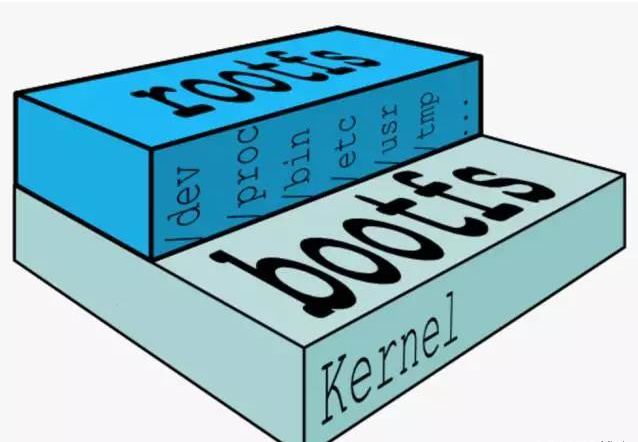

[Docker官网](https://docs.docker.com)
博客地址：https://www.cnblogs.com/fps2tao/p/17018482.html
## 1.镜像是什么

镜像是一种轻量级，可执行的独立软件包，用来打包软件运行环境和基于运行环境开发的软件。它包含运行某个软件所需的所有内容，包括代码、运行时、库、环境变量和配置文件。

**Docker镜像是由文件系统叠加而成**。最底端是一个引导文件系统，即bootfs，这很像典型的Linu/Unix的引导文件系统。Docker 用户几乎永远不会和引导文件系统有什么交互。实际上，当一个容器启动后，它将会被移到内存中，而引导文件系统则会被卸载（ummount），以留出更多的内存供initrd 磁盘镜像使用。到目前为止，Docker看起来还很像一个典型的Linux 虚拟化栈。实际上，Docker镜像的第二层是root文件系统 rootfs，它位于引导文件系统之上。rootfs可以是一种或多种操作系统（如Debian或者 Ubuntu文件系统）。在传统的Linux 引导过程中，root文件系统会最先以只读的方式加载，当引导结束并完成了完整性检查之后，它才会被切换为读写模式。但是**在 Docker里，root文件系统永远只能是只读状态**，并且Docker利用联合加载（union mount）技术又会在root文件系统层加载更多的只读文件系统。

>联合加载指的是一次同时加载多个文件系统，但是在外面看起来只能看到一个文件系统。联合加载会将各层文件系统叠加到一起，这样最终的文件系统会包含所有底层的文件和目录。

Docker 将这样的文件系统称为镜像。一个镜像可以放到另一个镜像的顶部。位于下面的镜像称为**父镜像**（parent image），可以依次类推，直到镜像栈的最底部，最底部的镜像称为**基础镜像**（base image）。最后，当从一个镜像启动容器时，Docker会在该镜像的最顶层加载一个读写文件系统。我们想在Docker中运行的程序就是在这个读写层中执行的。

当 Docker 第一次启动一个容器时，初始的读写层是空的。当文件系统发生变化时，这些变化都会应用到这一层上。比如，如果想修改一个文件，这个文件首先会从该读写层下面的只读层复制到该读写层。该文件的只读版本依然存在，但是已经被读写层中的该文件副本所隐藏。通常这种机制被称为**写时复制**（copy on wrte），这也是使Docker如此强大的技术之一。每个只读镜像层都是只读的，并且以后永远不会变化。当创建一个新容器时，Docker 会构建出一个镜像栈，并在栈的最顶端添加一个读写层。**这个读写层再加上其下面的镜像层以及一些配置数据，就构成了一个容器**。容器是可以修改的，它们都有自己的状态，并且是可以启动和停止的。容器的这种特点加上镜像分层框架（image-layering famework），使我们可以快速构建镜像并运行包含我们自己的应用程序和服务的容器。
## 2.Docker镜像加载原理

> UnionFS（联合文件系统）

UnionFs(联合文件系统)：Union文件系统(UnionFs)是一种分层、轻量级并且高性能的文件系统，它支持对文件系统的修改作为一次提交来一层层的叠加，同时可以将不同目录挂载到同一个虚拟文件系统下，UnionFs联合文件系统是Docker镜像的基础，镜像可以通过分层来进行继承，基于基础镜像（没有父镜像），可以制作各种具体的应用镜像特性：一次同时加载多个文件系统，但从外面看起来，只能看到一个文件系统，联合加载会把各层文件系统叠加起来，这样最终的文件系统会包含所有底层的文件和目录。

> 内核空间与用户空间

下面来了解下Linux 操作系统由内核空间和用户空间组成，如下图所示：

Kernel是内核空间，Linux在启动时会加载bootfs文件系统从而加载Kernel，等到Kernel加载完毕后，bootfs会卸载掉。
用户空间是rootfs，也就是我们熟悉的 /dev，/etc等根目录。
对于base镜像，底层直接使用Host的Kernel，自己只需要提供rootfs就行了。而rootfs可以很小，只需要包含最基本的命令，工具，程序库就可以了。
我们平时安装的 CentOS 除了 rootfs 还会选装很多软件、服务、图形桌面等，需要好几个 GB 就不足为奇了。

## 容器运行原理

Docker镜像都是可读的，只有容器是可写的。当容器启动时，一个新的可写层加载到镜像层的顶部，这一层被称为容器层，容器层之下都是镜像层。

**每个容器都会有自己的可写层，所有的改变都存储在该容器层中。多个容器可以共享对同一镜像层的访问，但可以拥有自己的数据状态。**

## 容器与镜像的区别

在Docker中，每个容器都有一个单独的容器层。容器层是由基础镜像层（Base Image Layer）和一系列读写层（Read-Write Layer）组成的。基础镜像层包含了容器所基于的操作系统和应用程序，而读写层则包含了容器运行时的变更和数据。

容器层的设计使得每个容器都可以独立运行，并且可以在不同的环境中移植和部署。这种隔离性和可移植性使得Docker成为一种流行的容器化解决方案。

需要注意的是，Docker容器的容器层是相对独立的，但它们可以共享相同的基础镜像层。这意味着当多个容器使用相同的基础镜像时，它们可以共享这个镜像的内容，从而节省存储空间和下载时间。**基础镜像层只在磁盘上存储一份，并且在内存中也只有一份。** 当创建一个新的容器时，Docker会在内存中加载基础镜像层，并在其上添加一个新的读写层，用于保存容器运行时的变更和数据。这种分层的结构允许容器之间共享相同的基础镜像，从而节省存储空间和内存消耗。

因此，尽管每个容器都有自己的读写层，但它们共享相同的基础镜像层，以提高效率和资源利用率。
## Copy-on-Write特性

当容器启动时，一个新的可写层被加载到镜像的顶部。这一层通常被称作“容器层”，“容器层”之下的都叫“镜像层”。
所有对容器的改动 - 无论添加、删除、还是修改文件都只会发生在容器层中。只有容器层是可写的，容器层下面的所有镜像层都是只读的。

镜像层数量可能会很多，所有镜像层会联合在一起组成一个统一的文件系统。如果不同层中有一个相同路径的文件，比如 /a，上层的 /a 会覆盖下层的 /a，也就是说用户只能访问到上层中的文件 /a。在容器层中，用户看到的是一个叠加之后的文件系统。

**添加文件**  ：在容器中创建文件时，新文件被添加到容器层中。

**读取文件**  ：在容器中读取某个文件时，Docker 会从上往下依次在各镜像层中查找此文件。一旦找到，打开并读入内存。

**修改文件**  ：在容器中修改已存在的文件时，Docker 会从上往下依次在各镜像层中查找此文件。一旦找到，立即将其复制到容器层，然后修改之。

**删除文件**  ：在容器中删除文件时，Docker 也是从上往下依次在镜像层中查找此文件。找到后，会在容器层中记录下此删除操作。

只有当需要修改时才复制一份数据，这种特性被称作 **Copy-on-Write**。可见，容器层保存的是镜像变化的部分，不会对镜像本身进行任何修改。
这样就解释了提出的问题：容器层记录对镜像的修改，所有镜像层都是只读的，不会被容器修改，所以镜像可以被多个容器共享。

