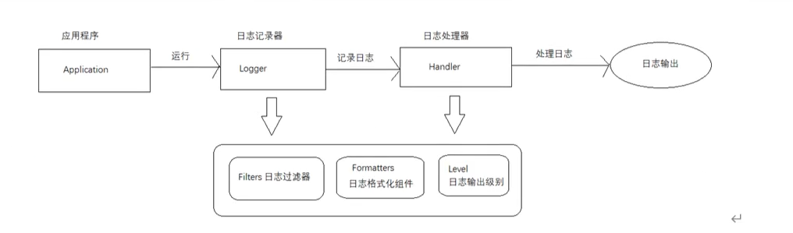

## 1.日志框架

> JUL，Logback，Log4J，Log4J2

日志门面

> JCL，SLF4j

**1.为什么要使用日志门面？**

​	每一种日志框架都有自己单独的API，要使用对应的框架就需要使用对应的API，这就大大增加了应用程序代码对日志框架的耦合性。

​	我们使用日志门面技术之后，对于应用程序来说，无论底层的日志框架如何改变，应用程序不需要修改任意一行代码，就可以直接上线了。

​	总结，日志门面技术将框架共有的特性行为进行抽取形成抽象的接口，由日志框架实现，自身不做实现。

## 2.JUL

**2.1 简介**

​	JUL全称是Java Util Logging，它是Java原生的日志框架，使用时不要引入第三方的类库，相对于其他框架使用方便，学习简单，主要使用在小型应用中。

**2.2 JUL组件介绍**

​	Logger：被称为记录器。应用程序通过获得logger对象，调用其api来发布日志信息。Logger通常被认为是访问日志系统的入口程序。

​	Handler：处理器。每个logger都会关联一个或者多个Handler，Logger会将日志交给关联的Handler进行处理，由Handler负责将日志做记录。Handler具体实现了日志的输出位置，比如可以输出到控制台或者文件中等等。

​	Filter：过滤器。根据需要定制哪些信息会被记录，哪些信息会被忽略。

​	Formatter：格式化组件。它负责对日志中的数据和信息进行转化和格式化，决定了最终日志的输出形式。

​	Level：日志的输出级别。每条日志信息都有一个关联的级别。我们根据输出级别的设置，用来展现最终所呈现的日志信息。根据不同的需求，去设置不同的级别。

**2.3 JUL实例**

**1.通过占位符{}打印日志**

