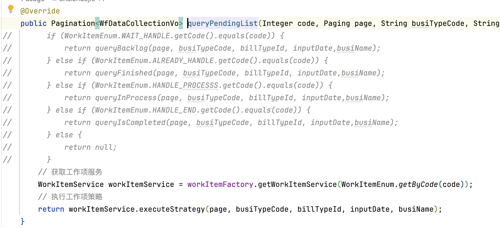
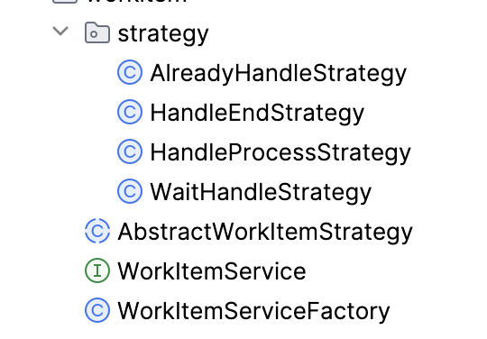
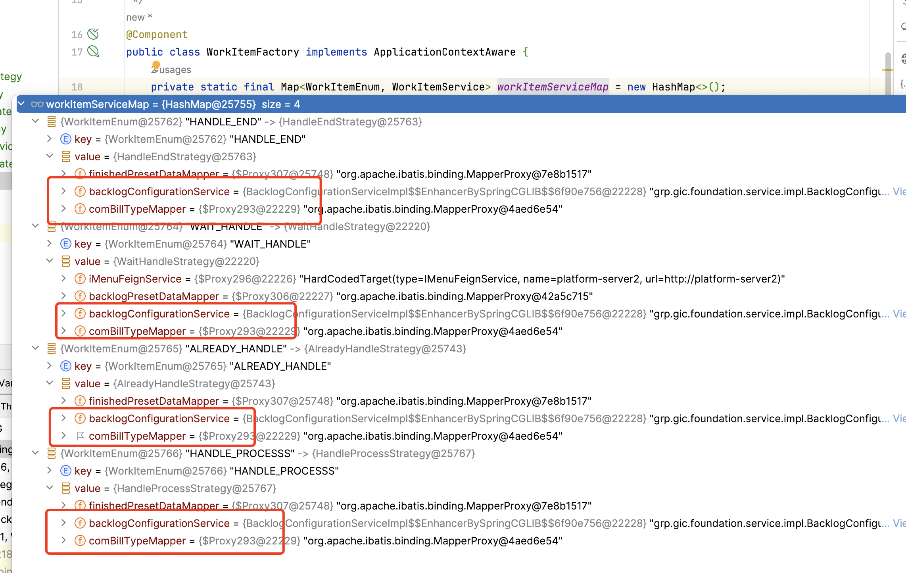
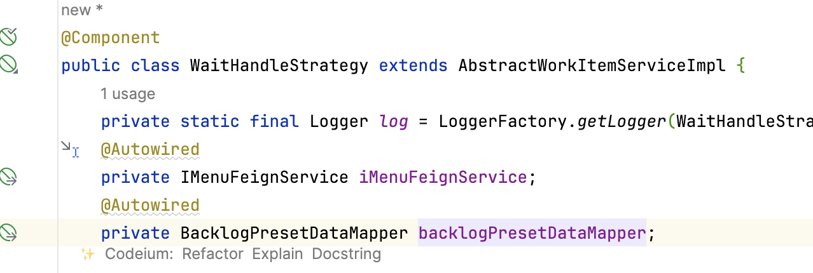
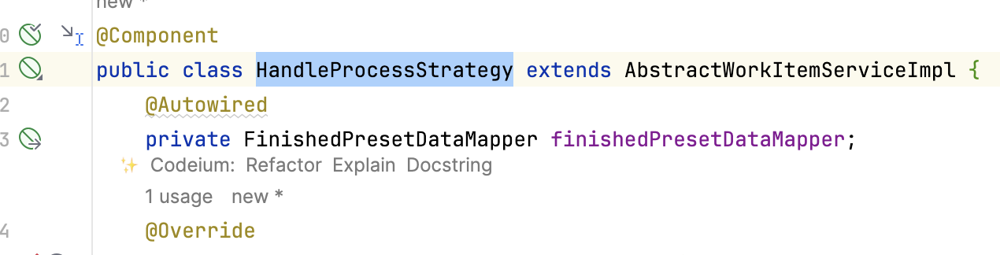
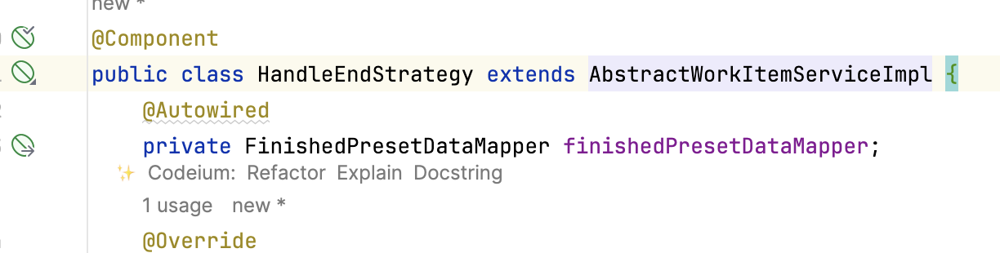
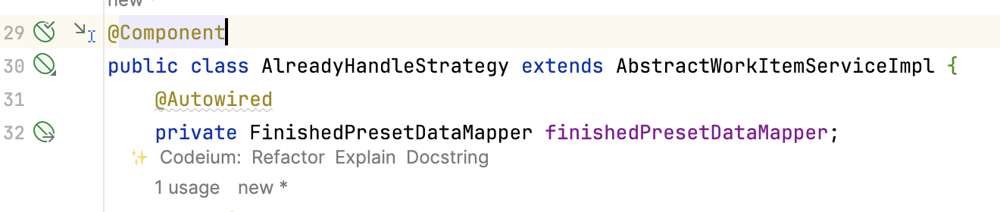
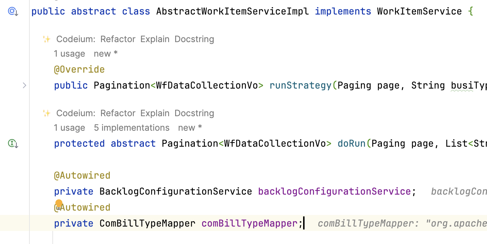

## 应用场景

策略模式主要应用场景为有多种类似的业务处理

场景：针对我的工作项业务进行策略模式进行重构，因目前存在大量if去判断查询已处理，未处理，未完结，处理中的业务逻辑

优化前后代码对比：



## 代码目录

​​

## 源代码实现

​`WorkItemServiceFactory.class`​策略工厂类

```java
package grp.gic.workflow.workitem;

/**
 * 工作项的bean工厂
 * @author chaizj
 * @date Created in 2023/12/11 10:09
 */
@Component
public class WorkItemServiceFactory implements ApplicationContextAware {
    private static final Map<WorkItemEnum, WorkItemService> workItemServiceMap = new HashMap<>();

    /**
     * 设置应用程序上下文并初始化
     *
     * @param applicationContext 应用程序上下文
     * @author chaizj
     * @date Created in 2023/12/11 14:28:33
     */
    @Override
    public void setApplicationContext(ApplicationContext applicationContext) throws BeansException {
        applicationContext.getBeansOfType(WorkItemService.class).forEach((beanName, beanInstance) -> {
            WorkItemEnum workItemEnum = beanInstance.supplyStrategy();
            if (workItemEnum != null) {
                workItemServiceMap.put(workItemEnum, beanInstance);
            }
        });
    }

    /**
     * 获取工作项服务策略
     *
     * @param workItemEnum 工作项枚举
     * @return {@link WorkItemService }
     * @author chaizj
     * @date Created in 2023/12/11 14:28:49
     */
    public WorkItemService getWorkItemService(WorkItemEnum workItemEnum) {
        return workItemServiceMap.get(workItemEnum);
    }
}
```

​`WorkItemService.class`​策略接口类，主要暴露两个方法，`supply()`​提供策略和`execute()`​执行策略.

```java
package grp.gic.workflow.workitem;

/**
 * 工作项服务Service
 * @author chaizj
 * @date Created in 2023/12/11 10:11
 */
public interface WorkItemService {

    /**
     * 供应策略
     *
     * @return {@link WorkItemEnum } 工作项枚举
     * @author chaizj
     * @date Created in 2023/12/11 14:44:20
     */
    WorkItemEnum supplyStrategy();

    /**
     * 执行策略
     *
     * @return {@link Pagination }<{@link WfDataCollectionVo }>
     * @author chaizj
     * @date Created in 2023/12/11 14:44:25
     */
    Pagination<WfDataCollectionVo> executeStrategy();
}
```

`AbstractWorkItemStrategy.class` 主要进行业务抽象，通过`doExectue()`具体执行业务逻辑

```java
package grp.gic.workflow.workitem;  
  
/**  
 * 抽象工作项策略  
 *  
 * @author chaizj * @date Created in 2023/12/11 14:48:25 
 */
@Slf4j  
public abstract class AbstractWorkItemStrategy implements WorkItemService {  
  
    @Override  
    public Pagination<WfDataCollectionVo> executeStrategy() {  
        // TODO 业务前置
        return doExecute(page, busiTypeCodeList, billTypeId, inputDate, busiName);  
    }  
  
    /**  
     * 执行业务逻辑  
     *  
     * @param page             分页对象  
     * @param busiTypeCodeList 业务类型code列表  
     * @param billTypeId       单据类型ID  
     * @param inputDate        输入日期  
     * @param busiName         业务名称  
     * @return {@link Pagination }<{@link WfDataCollectionVo }>  
     * @author chaizj     
	 * @date Created in 2023/12/11 14:47:32     
	 */    
	protected abstract Pagination<WfDataCollectionVo> doExecute();  
  
    @Autowired  
    private BacklogConfigurationService backlogConfigurationService;  
    @Autowired  
    private ComBillTypeMapper comBillTypeMapper;  
  
}
```

**具体策略实现**

`AlreadyHandleStrategy.class`

```java
package grp.gic.workflow.workitem.strategy;  
   
/**  
 * 已办工作项策略  
 * @author chaizj  
 * @date Created in 2023/12/11 10:20 */@Component  
public class AlreadyHandleStrategy extends AbstractWorkItemStrategy {  
    @Autowired  
    private FinishedPresetDataMapper finishedPresetDataMapper;  
    @Autowired  
    private FlowInstanceBusiRelationService flowInstanceBusiRelationService;  
    @Autowired  
    private ProcessInstanceDAO processInstanceDAO;  
  
    @Override  
    public Pagination<WfDataCollectionVo> doExecute() {  
        // TODO 业务
    }  
  
    @Override  
    public WorkItemEnum supplyStrategy() {  
        return WorkItemEnum.ALREADY_HANDLE;  
    }  
}
```

`HandleEndStrategy.class`

```java
package grp.gic.workflow.workitem.strategy;  
 
/**  
 * 已完结工作项策略  
 * @author chaizj  
 * @date Created in 2023/12/11 10:20 */
@Component  
public class HandleEndStrategy extends AbstractWorkItemStrategy {  
    @Autowired  
    private FinishedPresetDataMapper finishedPresetDataMapper;  
  
    @Override  
    public Pagination<WfDataCollectionVo> doExecute() {  
		// TODO 业务
    }  
  
    @Override  
    public WorkItemEnum supplyStrategy() {  
        return WorkItemEnum.HANDLE_END;  
    }  
}
```

`HandleProcessStrategy.class`

```java
package grp.gic.workflow.workitem.strategy;  

/**  
 * 办理中工作项策略  
 * @author chaizj  
 * @date Created in 2023/12/11 10:20 */@Component  
public class HandleProcessStrategy extends AbstractWorkItemStrategy {  
    @Autowired  
    private FinishedPresetDataMapper finishedPresetDataMapper;  
  
    @Override  
    public Pagination<WfDataCollectionVo> doExecute() {  
        // TODO 业务
    }  
  
    @Override  
    public WorkItemEnum supplyStrategy() {  
        return WorkItemEnum.HANDLE_PROCESSS;  
    }  
}
```

`WaitHandleStrategy.class`

```java
package grp.gic.workflow.workitem.strategy;  
 
/**  
 * 待处理工作项策略  
 * @author chaizj  
 * @date Created in 2023/12/11 10:20 */@Component  
public class WaitHandleStrategy extends AbstractWorkItemStrategy {  
    private static final Logger log = LoggerFactory.getLogger(WaitHandleStrategy.class);  
    @Autowired  
    private IMenuFeignService iMenuFeignService;  
    @Autowired  
    private BacklogPresetDataMapper backlogPresetDataMapper;  
  
    @Override  
    public Pagination<WfDataCollectionVo> doExecute() {  
        //TODO 业务逻辑
    }  
  
    @Override  
    public WorkItemEnum supplyStrategy() {  
        return WorkItemEnum.WAIT_HANDLE;  
    }  
}
```

## 代码调用

```java
    public Pagination<WfDataCollectionVo> queryPendingList(Integer code, Paging page, String busiTypeCode, String billTypeId, String inputDate,String busiName,String deviceType) throws ExecutionException, InterruptedException {  
//        if (WorkItemEnum.WAIT_HANDLE.getCode().equals(code)) {  
//            return queryBacklog(page, busiTypeCode, billTypeId, inputDate,busiName);  
//        } else if (WorkItemEnum.ALREADY_HANDLE.getCode().equals(code)) {  
//            return queryFinished(page, busiTypeCode, billTypeId, inputDate,busiName);  
//        } else if (WorkItemEnum.HANDLE_PROCESSS.getCode().equals(code)) {  
//            return queryInProcess(page, busiTypeCode, billTypeId, inputDate,busiName);  
//        } else if (WorkItemEnum.HANDLE_END.getCode().equals(code)) {  
//            return queryIsCompleted(page, busiTypeCode, billTypeId, inputDate,busiName);  
//        } else {  
//            return null;  
//        }  
        // 获取工作项服务  
        WorkItemService workItemService = workItemFactory.getWorkItemService(WorkItemEnum.getByCode(code));  
        // 执行工作项策略  
        return workItemService.executeStrategy(page, busiTypeCode, billTypeId, inputDate, busiName,deviceType);  
    }
```

**针对于抽象类有关属性Autowired的DEBUG**

​​

抽象类的实例实现

​​

基类的属性注入的实现，在抽象类不能实例化的情况下，Spring会将抽象类的属性注入到各个实例中



‍

‍
