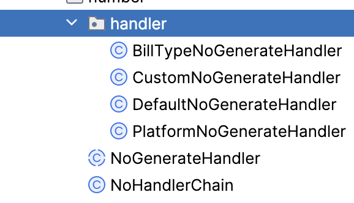

## 应用场景

适合需要通过每个具有优先级的处理策略去处理。例如单号规则，优先级为自定义-单据配置-平台配置-默认规则

## 代码目录

​​

抽象出一个公共的基类去规范方法，然后一个chain类去组织责任链的顺序

## 源代码实现

`NoHandlerChain.class`

```java
package grp.gic.basic.number;

@Component
public class NoHandlerChain implements ApplicationContextAware {

    private NoGenerateHandler.Builder builder;

	/*
		工厂模式+建造者模式
	*/
    @Override
    public void setApplicationContext(ApplicationContext applicationContext) throws BeansException {
        Map<String, NoGenerateHandler> beansOfType = applicationContext.getBeansOfType(NoGenerateHandler.class);
        builder = new NoGenerateHandler.Builder();
        beansOfType.values().stream().sorted(Comparator.comparing(NoGenerateHandler::order)).forEach(builder::addHandler);
    }
	/*
		预留责任链入口
	*/
    public NoGenerateHandler getNoGenerateHandler() {
        return builder.build();
    }
}
```

`NoGenerateHandler.class`

```java
package grp.gic.basic.number;

public abstract class NoGenerateHandler {

	/*
		执行顺序
	*/
    protected abstract int order();

    /**
     * 接受校验
     *
     * @param noGenerate 单号生成BO
     * @return boolean
     * @author chaizj
     * @date Created in 2024/01/18 16:43:21
     */
    public boolean accept(NoGenerateBO noGenerate) {
        return noGenerate != null;
    };

    /**
     * 处理方法
     *
     * @param noGenerate 单号生成对象
     * @return {@link String }
     * @author chaizj
     * @date Created in 2024/01/17 14:07:12
     */
    public abstract String process(NoGenerateBO noGenerate);

	// 下一处理器
    protected NoGenerateHandler handlerChain;

    protected void addHandler(NoGenerateHandler handler) {
        this.handlerChain = handler;
    }

	/*
		通过静态内部类去维护责任链的链表
	*/
    public static class Builder {
        private NoGenerateHandler head;
        private NoGenerateHandler tail;

        public void addHandler(NoGenerateHandler handler) {
            if (this.head == null) {
                this.head = handler;
                this.tail = handler;
            } else {
                this.tail.addHandler(handler);
                this.tail = handler;
            }
        }

        public NoGenerateHandler build() {
            return this.head;
        }
    }
}

```

`BillTypeNoGenerateHandler.class`

```java
package grp.gic.basic.number.handler;

@Service
public class BillTypeNoGenerateHandler extends NoGenerateHandler {
    private final static Logger log = LoggerFactory.getLogger(BillTypeNoGenerateHandler.class);

    @Autowired
    private ComNoConfigMapper comNoConfigMapper;
    @Autowired
    private ComNoSerialMapper comNoSerialMapper;

    @Override
    protected int order() {
        return 1;
    }

    @Override
    public boolean accept(NoGenerateBO noGenerate) {
        if (super.accept(noGenerate)) {
            return StringUtils.isNotBlank(noGenerate.getRuleId()) && StringUtils.isNotBlank(noGenerate.getExpression());
        }
        return false;
    }

    @Override
    @Transactional(rollbackFor = Exception.class)
    public String process(NoGenerateBO noGenerate) {
        if (!accept(noGenerate)) {
            return handlerChain.process(noGenerate);
        }
        String ruleId = noGenerate.getRuleId();
        String expression = noGenerate.getExpression();
        log.info("单号规则ID: ruleID: {}, 单号表达式：expression: {}",  ruleId, expression);
        // 获取流水号配置
        NoExpressionBO noExpression = dealExpression(expression);
        // 获取单号格式常量
        String ruleFormat = noExpression.getRuleFormat();
        // 获取流水号
        ComNoSerial comNoSerial = comNoSerialMapper.selectSerialByRuleIdAndFormatForUpdate(ruleId, ruleFormat);
        if (comNoSerial == null) {
            // 获取单号配置
            comNoConfigMapper.selectByIdForUpdate(ruleId);
            comNoSerial = comNoSerialMapper.selectSerialByRuleIdAndFormat(ruleId, ruleFormat);
            if (comNoSerial == null) {
                // 不存在则插入
                comNoSerial = buildComNoSerial(ruleId, ruleFormat, noExpression.getSerialBegin());
                comNoSerialMapper.insert(comNoSerial);
                return String.format(noExpression.getRuleFormat(), String.format(noExpression.getSerialFormat(), comNoSerial.getSerialNo()));
            }
        }
        // 存在则更新
        Long serialNo = comNoSerial.getSerialNo() + 1L;
        UpdateChain.of(ComNoSerial.class)
                .set(ComNoSerial::getSerialNo, serialNo)
                .set(ComNoSerial::getUpdateTime, DateUtil.formatDate(new Date()))
                .where(ComNoSerial::getId).eq(comNoSerial.getId())
                .update();
        return String.format(noExpression.getRuleFormat(), String.format(noExpression.getSerialFormat(), serialNo));
    }
}
```

`CustomNoGenerateHandler.class`

```java
package grp.gic.basic.number.handler;

@Service
public class CustomNoGenerateHandler extends NoGenerateHandler {
    private final static Logger log = LoggerFactory.getLogger(CustomNoGenerateHandler.class);

    @Override
    protected int order() {
        return 0;
    }

    @Override
    public boolean accept(NoGenerateBO noGenerate) {
        if (super.accept(noGenerate)) {
            return StringUtils.isNotBlank(noGenerate.getCustomerApi());
        }
        return false;
    }

    @Override
    public String process(NoGenerateBO noGenerate) {
        if (!accept(noGenerate)) {
            return handlerChain.process(noGenerate);
        }
        String customerApi = noGenerate.getCustomerApi();
        log.info("自定义API调用: customApi: {}", customerApi);
        if (StringUtils.isNotBlank(customerApi)) {
            //todo 反射调用
            return "";
        } else if (handlerChain != null) {
            return handlerChain.process(noGenerate);
        } else {
            return null;
        }
    }
}
```

`DefaultNoGenerateHandler.class`

```java
package grp.gic.basic.number.handler;

@Service
public class DefaultNoGenerateHandler extends NoGenerateHandler {
    private final static Logger log = LoggerFactory.getLogger(DefaultNoGenerateHandler.class);

    @Autowired
    private ComNoConfigMapper comNoConfigMapper;
    @Autowired
    private BillTypeNoGenerateHandler billTypeNoGenerateHandler;

    @Override
    protected int order() {
        return 99;
    }
    @Override
    public boolean accept(NoGenerateBO noGenerate) {
        return super.accept(noGenerate);
    }

    @Override
    public String process(NoGenerateBO noGenerate) {
        if (!accept(noGenerate)) {
            return "";
        }
        log.info("默认单号生成: noGenerate: {}", noGenerate.toString());
        ComNoConfig comNoConfig = comNoConfigMapper.selectByBillTypeId("0");
        noGenerate.setExpression(comNoConfig.getRuleValue());
        noGenerate.setRuleId(comNoConfig.getId());
        return billTypeNoGenerateHandler.process(noGenerate);
    }
}
```

`PlatformNoGenerateHandler.class`

```java
package grp.gic.basic.number.handler;

@Service
public class PlatformNoGenerateHandler extends NoGenerateHandler {
    private final static Logger log = LoggerFactory.getLogger(PlatformNoGenerateHandler.class);

    @Autowired
    private IElementService elementService;

    @Override
    protected int order() {
        return 2;
    }

    @Override
    public boolean accept(NoGenerateBO noGenerate) {
        if (super.accept(noGenerate)) {
            return StringUtils.isNotBlank(noGenerate.getNoRuleCode());
        }
        return false;
    }

    @Override
    public String process(NoGenerateBO noGenerate) {
        if (!accept(noGenerate)) {
            return handlerChain.process(noGenerate);
        }
        String noRuleCode = noGenerate.getNoRuleCode();
        log.info("平台单号CODE: noRuleCode: {}", noRuleCode);
        ReturnData<String> noRtd = elementService.getNoByRuleCodeBuTenantId(noRuleCode, 0L);
        if (noRtd == null || noRtd.getData() == null) {
            return handlerChain.process(noGenerate);
        }
        return noRtd.getData();
    }
}
```

## 代码调用

```java
    @Autowired
    private NoHandlerChain noHandlerChain;

    public ReturnData<String> getNo(String noRuleCode, long tenant_id, String billTypeId) {
        ReturnData<String> noRtd = null;
        log.info("单据获取单号service参数，noRuleCode={}, tenant_id={}, billTypeId={}", noRuleCode, tenant_id, billTypeId);
        NoGenerateBO noGenerateBO = new NoGenerateBO();
        if (StringUtils.isNotBlank(billTypeId)) {
            NoRuleDTO noRuleDTO = this.queryByPriority(billTypeId);
            if (noRuleDTO != null) {
                noGenerateBO.setRuleId(noRuleDTO.getId());
                noGenerateBO.setExpression(noRuleDTO.getExpression());
                noGenerateBO.setCustomerApi(null);
            }
        }
        noGenerateBO.setNoRuleCode(noRuleCode);
        String no = noHandlerChain.getNoGenerateHandler().process(noGenerateBO);
        return ReturnDataUtils.buildSuccess(no);
    }
```
