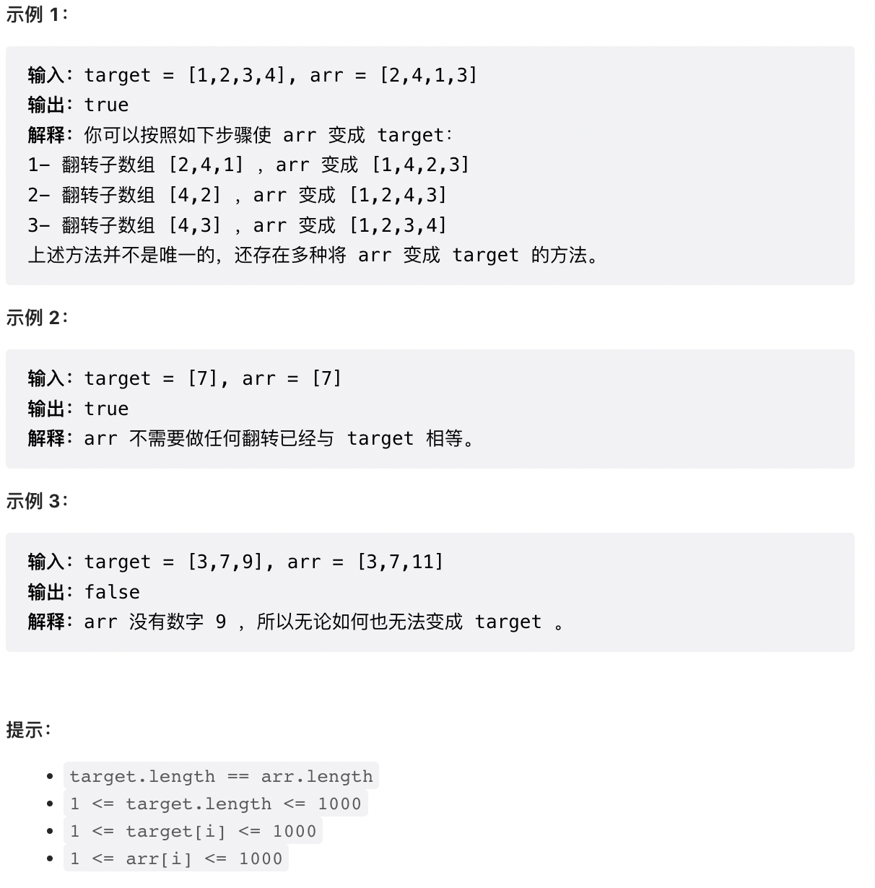

# 题目概述
> 给你两个`长度相同`的整数数组 target 和 arr 。每一步中，你可以选择 arr 的任意 非空子数组 并将它翻转。你可以执行此过程任意次。
> 如果你能让 arr 变得与 target 相同，返回 True；否则，返回 False 。


# 我的题解
```java
class Solution {
    public boolean canBeEqual(int[] target, int[] arr) {
        int[] hash = new int[1001];

        for(int i : target) {
            hash[i]++;
        }

        for(int j : arr) {
            if( --hash[j] < 0) {
                return false;
            }
        }
        return true;
    }
}
```
# 优质题解
## 方法一：排序
根据冒泡排序原理，只有两个数组完全相同，才能让`arr`变为`target`
因此直接对两个数组进行排序，然后比较是否相等即可。
```java
public boolean canBeEqual(int[] target, int[] arr) {
	// 排序
	Arrays.sort(target);
	Arrays.sort(arr);
	// 循环比较
	for (int i = 0; i < target.length; i++) {
		if (target[i] != arr[i]) {
			return false;
		}
	}
	return true;
}
```
## 方法二：哈希表
维护一个`hash`表，对数字进行计数即可。遇到小于`0`的返回false。
```java
/**
 * 前提是arr的长度与target相同。就比如 arr:[1,2,2,3] 与 target:[1,2,3]
 * arr先放入hash表，此时arr与target并不相同。
 */
public boolean canBeEqual(int[] target, int[] arr) {
	// 定义数组
	int[] hash = new int[1001];
	// 将target存入，key为target元素，value为出现的次数
	for (int i : target) {
		hash[i]++;
	}
	// 在hash表中查找arr的元素
	for (int i : arr) {
		// 如果arr在hash中的出现次数自减后小于0，说明hash中没有，返回false。
		if (--hash[i] < 0) {
			return false;
		}
	}
	return true;
}
```

