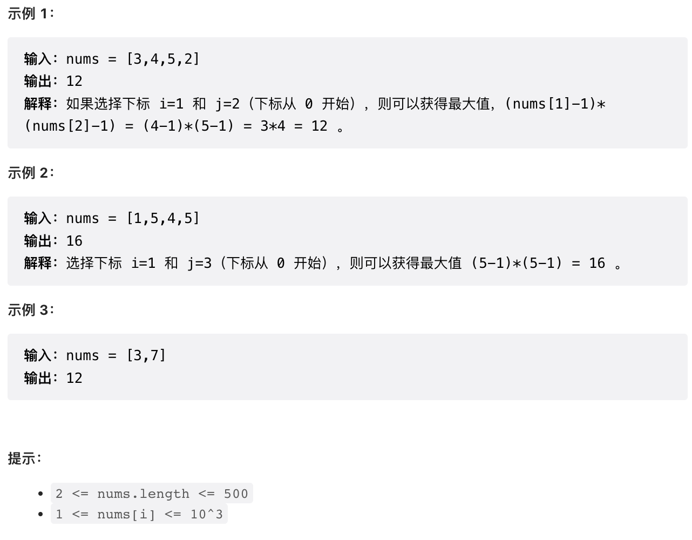

# 题目描述
> 给你一个整数数组 nums，请你选择数组的两个不同下标 i 和 j，使 (nums[i]-1)*(nums[j]-1) 取得最大值。
> 请你计算并返回该式的最大值。


# 我的题解
```java
class Solution {
    public int maxProduct(int[] nums) {
		// 直接排序
        Arrays.sort(nums);
        int leg = nums.length;
        // 返回排序完的后两位数
        return (nums[leg-1]-1)*(nums[leg-2]-1);
    }
}
```
# 优质题解

