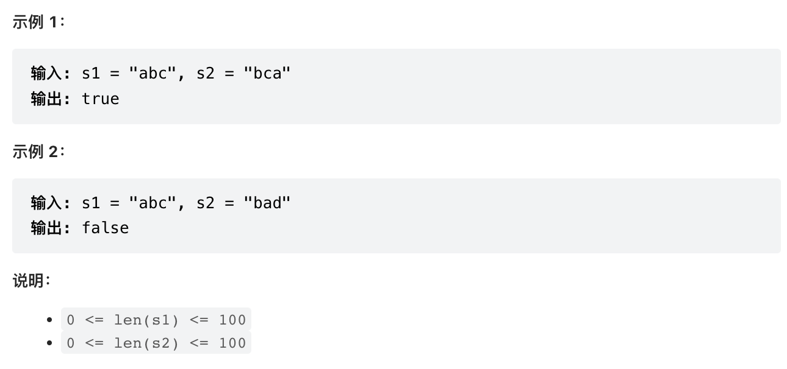

## 题目概述
> 给定两个字符串 s1 和 s2，请编写一个程序，确定其中一个字符串的字符重新排列后，能否变成另一个字符串


## 我的题解
```java
class Solution {
    public boolean CheckPermutation(String s1, String s2) {
        // 排序
        char[] a = s1.toCharArray();
        char[] b = s2.toCharArray();
        Arrays.sort(a);
        Arrays.sort(b);
        return Arrays.equals(a, b);
    }
}
```
## 优质题解
> 可采用hash表，与1460题原理相似

