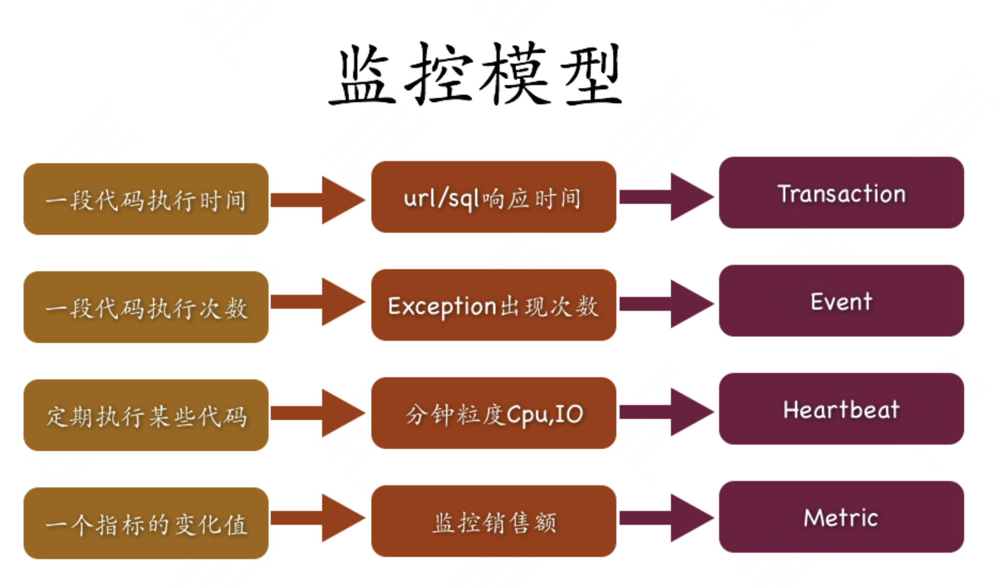

## 监控模型

## 示例

​​

在这个基本模型的基础上，定义了我们监控的Java的API，Sample大致如下：

* 这个API里面Transaction以及Event都有两层分类，为什么是两层分类，从实际的经验中两层分类可以解决大部分的问题，所以定义了两层。 当业务程序完成了API的情况，CAT客户端会产生原始监控请求，称之为Logview。
* 这个Logview是一个树的结构，根节点一般都是Transaction，Transaction可以嵌套子的Transaction，Event就是一个单个节点，不能嵌套。这个longview将应用程序的执行路径按照时间序列组成一个Logview。
