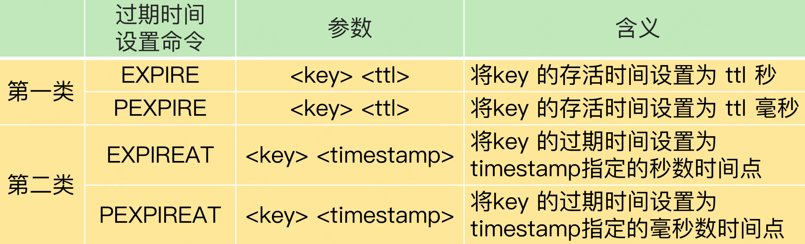

Redis可以为键值设置生存周期（TTL）并在过期之后自动删除这些键值对。

## 过期键的相关命令

Redis 提供了 ***EXPIRE（PEXPIRE)***  和 ***EXPIREAT（PEXPIREAT）*** 两个命令以秒或者毫秒精度来设置过期时间，区别是前者是生存时间，后者是具体的过期时间戳。

EXPIRE（PEXPIRE、EXPIREAT、PEXPIREAT）命令实现

```c
/*-----------------------------------------------------------------------------
 * Expires Commands
 *----------------------------------------------------------------------------*/

/* This is the generic command implementation for EXPIRE, PEXPIRE, EXPIREAT
 * and PEXPIREAT. Because the commad second argument may be relative or absolute
 * the "basetime" argument is used to signal what the base time is (either 0
 * for *AT variants of the command, or the current time for relative expires).
 *
 * unit is either UNIT_SECONDS or UNIT_MILLISECONDS, and is only used for
 * the argv[2] parameter. The basetime is always specified in milliseconds. */
void expireGenericCommand(client *c, long long basetime, int unit) {
    robj *key = c->argv[1], *param = c->argv[2];
    long long when; /* unix time in milliseconds when the key will expire. */

    if (getLongLongFromObjectOrReply(c, param, &when, NULL) != C_OK)
        return;

    if (unit == UNIT_SECONDS) when *= 1000;
    when += basetime;

    /* No key, return zero. */
    if (lookupKeyWrite(c->db,key) == NULL) {
        addReply(c,shared.czero);
        return;
    }

    /* EXPIRE with negative TTL, or EXPIREAT with a timestamp into the past
     * should never be executed as a DEL when load the AOF or in the context
     * of a slave instance.
     *
     * Instead we take the other branch of the IF statement setting an expire
     * (possibly in the past) and wait for an explicit DEL from the master. */
    if (when <= mstime() && !server.loading && !server.masterhost) {
        robj *aux;

        int deleted = server.lazyfree_lazy_expire ? dbAsyncDelete(c->db,key) :
                                                    dbSyncDelete(c->db,key);
        serverAssertWithInfo(c,key,deleted);
        server.dirty++;

        /* Replicate/AOF this as an explicit DEL or UNLINK. */
        aux = server.lazyfree_lazy_expire ? shared.unlink : shared.del;
        rewriteClientCommandVector(c,2,aux,key);
        signalModifiedKey(c->db,key);
        notifyKeyspaceEvent(NOTIFY_GENERIC,"del",key,c->db->id);
        addReply(c, shared.cone);
        return;
    } else {
        setExpire(c,c->db,key,when);
        addReply(c,shared.cone);
        signalModifiedKey(c->db,key);
        notifyKeyspaceEvent(NOTIFY_GENERIC,"expire",key,c->db->id);
        server.dirty++;
        if (CAN_CHANGE_REPL_TTL && basetime) {
            robj *pxat_obj = createStringObjectFromLongLong(when);
            rewriteClientCommandArgument(c,0,shared.pexpireat);
            rewriteClientCommandArgument(c,2,pxat_obj);
            decrRefCount(pxat_obj);
        }
        return;
    }
}
```

只有当键值被删除或者值被覆盖的时候，例如执行[DEL](https://redis.io/commands/del), [SET](https://redis.io/commands/set), [GETSET](https://redis.io/commands/getset) 和所有*STORE相关的命令，过期时间会被移除；而修改值的操作如[INCR](https://redis.io/commands/incr), [LPUSH](https://redis.io/commands/lpush), [HSET](https://redis.io/commands/hset)不会影响过期时间。另外，我们也可以通过***PERSIST***命令手动移除键的过期时间。

PERSIST命令实现

```c
/* PERSIST key */
void persistCommand(client *c) {
    if (lookupKeyWrite(c->db,c->argv[1])) {
        if (removeExpire(c->db,c->argv[1])) {
            addReply(c,shared.cone);
            server.dirty++;
        } else {
            addReply(c,shared.czero);
        }
    } else {
        addReply(c,shared.czero);
    }
}
```

***TTL***和***PTTL***两个命令可以以秒或者毫秒精度查询键的剩余生存时间。

TTL和PTTL命令实现

```c
/* Implements TTL and PTTL */
void ttlGenericCommand(client *c, int output_ms) {
    long long expire, ttl = -1;

    /* If the key does not exist at all, return -2 */
    if (lookupKeyReadWithFlags(c->db,c->argv[1],LOOKUP_NOTOUCH) == NULL) {
        addReplyLongLong(c,-2);
        return;
    }
    /* The key exists. Return -1 if it has no expire, or the actual
     * TTL value otherwise. */
    expire = getExpire(c->db,c->argv[1]);
    if (expire != -1) {
        ttl = expire-mstime();
        if (ttl < 0) ttl = 0;
    }
    if (ttl == -1) {
        addReplyLongLong(c,-1);
    } else {
        addReplyLongLong(c,output_ms ? ttl : ((ttl+500)/1000));
    }
}
```

## 过期键的删除策略

当键过期时，有三种策略可以用来确定删除的时间：

* 定时删除：在设置键的过期时间的同时，创建一个定时器，让定时器在键的过期时间来临时，立即执行对键的删除
* 惰性删除：放任键过期不管，但是每次从键空间中获取键时，都检查取得的键是否过期，如果过期的话，就删除该键；如果没有过期，就返回该键。
* 定期删除：每隔一段时间，程序就对数据库进行一次检查，删除里面的过期键。至于要删除多少过期键，以及要检查多少个数据库，则由算法决定。

第一种和第三种是主动删除策略，第二种则为被动删除策略。目前redis采用的是惰性删除和定期删除两种策略的配合使用，主要考虑到CPU和内存之间的平衡。

|删除策略|优点|缺点|
| ----------| -------------------------| ------------------------------|
|定时删除|内存友好|CPU不友好|
|惰性删除|CPU友好|内存不友好|
|定期删除|减少了对CPU和内存的影响|难以确定操作执行的时长和频率|

## AOF、RDB和复制功能对过期键的处理

**AOF**

* AOF文件写入时，某个键已经过期，但还没有被惰性删除或者定期删除，那么AOF文件不会因为这个过期键产生任何影响。只有当键被删除后，AOF会追加一条DEL命令。
* AOF重写时，程序会对键进行检查，已经过期的键不会保存到重写的AOF文件中。

**RDB**

* 生成RDB文件时，程序会对数据库中的键进行检查，已过期的键不会保存到新创建的RDB文件中。
* 载入RDB文件时，主节点和从节点采取不同的策略：

  * 主节点会对文件中保存对键进行检查，未过期的键会被载入到数据库，过期的键则会被忽略。
  * 从节点会把文件中包含的所有键，无论过期与否，都载入到数据库中。（不过，因为主从在进行数据同步的时候，从服务器的数据库就会被清空，所以一般来讲，过期键对载入RDB文件的从服务器也不会造成影响。）

**复制（集群）**

复制模式下，过期键的删除动作由主节点控制：

* 主节点在删除一个过期键之后，会显式地向所有从节点发送一个DEL命令
* 从节点在执行客户端发送的读命令时，即使碰到过期键也不会将过期键删除，只有在接受到主节点发送的DEL命令之后，才会删除过期键。

## 主从数据不一致问题

因为**主从库间的命令复制是异步进行的**，所以有可能客户端从从库中读取到的值和主库中的最新值并不一致。

具体来说，在主从库命令传播阶段，主库收到新的写命令后，会发送给从库。但是，主库并不会等到从库实际执行完命令后，再把结果返回给客户端，而是主库自己在本地执行完命令后，就会向客户端返回结果了。如果从库还没有执行主库同步过来的命令，主从库间的数据就不一致了。

从库滞后执行同步命令主要有两种情况：

一方面，主从库间的网络可能会有传输延迟，所以从库不能及时地收到主库发送的命令，从库上执行同步命令的时间就会被延后。

另一方面，即使从库及时收到了主库的命令，但是，也可能会因为正在处理其它复杂度高的命令（例如集合操作命令）而阻塞。

为了避免从库会滞后执行同步命令，有以下两种方法：

首先，**在硬件环境配置方面，我们要尽量保证主从库间的网络连接状况良好。** 例如，我们要避免把主从库部署在不同的机房，或者是避免把网络通信密集的应用（例如数据分析应用）和 Redis 主从库部署在一起。另外，我们还**可以开发一个外部程序来监控主从库间的**复制进度。

## 读取过期数据

这个问题是由 Redis 的过期数据删除策略引起的。**Redis 同时使用了两种策略来删除过期的数据，分别是惰性删除策略和定期删除策略。**

* 惰性删除策略：当一个数据的过期时间到了以后，并不会立即删除数据，而是等到再有请求来读写这个数据时，对数据进行检查，如果发现数据已经过期了，再删除这个数据。
* 定期删除策略：Redis 每隔一段时间（默认 100ms），就会随机选出一定数量的数据，检查它们是否过期，并把其中过期的数据删除，这样就可以及时释放一些内存。

首先如果过期数据很多，并且一直没有再被访问的话，定期删除检查的数据数量也并不多，这些数据就会留存在 Redis 实例中。业务应用之所以会读到过期数据，这些**留存数据就是一个重要因素**。

其次如果客户端从主库上读取留存的过期数据，主库会触发删除操作，此时，客户端并不会读到过期数据。但是，**从库本身不会执行删除操作**，如果客户端在**从库中访问留存的过期数据，从库并不会触发数据删除。**

如果你使用的是 Redis 3.2 之前的版本，那么，从库在服务读请求时，并不会判断数据是否过期，而是会返回过期数据。在 3.2 版本后，Redis 做了改进，如果读取的数据已经过期了，从库虽然不会删除，但是会返回空值，这就避免了客户端读到过期数据。所以，在应用主从集群时，尽量使用 Redis 3.2 及以上版本。

Redis 3.2 后的版本也并不能完全保证读不到过期数据，这跟 Redis 用于设置过期时间的命令有关系，有些命令给数据设置的过期时间在从库上可能会被延后，导致应该过期的数据又在从库上被读取到了，我来给你具体解释下。

我先给你介绍下这些命令。设置数据过期时间的命令一共有 4 个，我们可以把它们分成两类：

* EXPIRE 和 PEXPIRE：它们给数据设置的是从命令执行时开始计算的存活时间；
* EXPIREAT 和 PEXPIREAT：它们会直接把数据的过期时间设置为具体的一个时间点。

​​

当主从库全量同步时，如果主库接收到了一条 EXPIRE 命令，那么，主库会直接执行这条命令。这条命令会在全量同步完成后，发给从库执行。而从库在执行时，就会在当前时间的基础上加上数据的存活时间，这样一来，从库上数据的过期时间就会比主库上延后了。

为了避免这种情况，我给你的建议是，在业务应用中使用 **EXPIREAT/PEXPIREAT** 命令，把数据的过期时间设置为具体的时间点，避免读到过期数据。

**参考博客：**

1. https://blog.csdn.net/ggh0314/article/details/117782124
2. https://blog.csdn.net/weixin_43934607/article/details/109591618

‍
