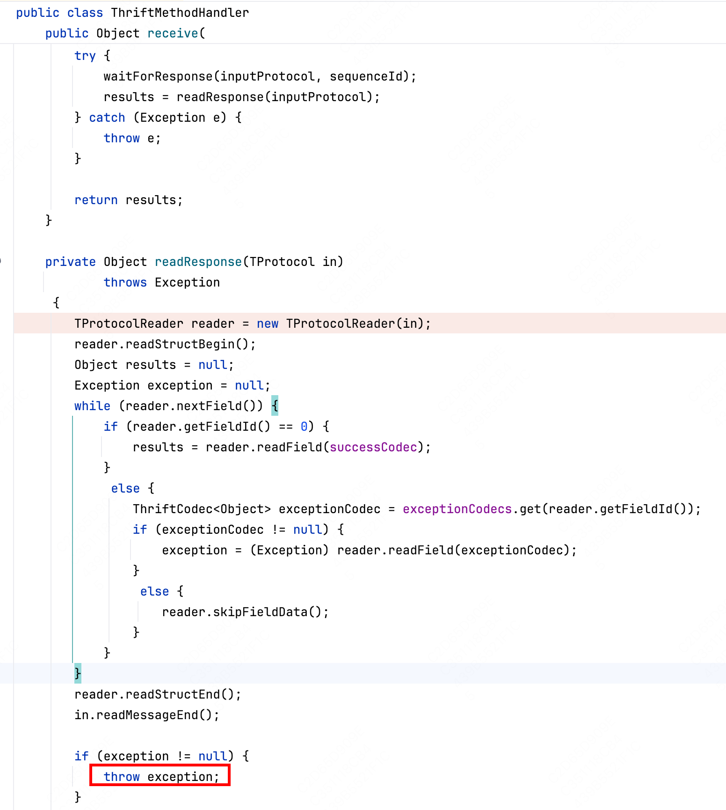

## ThirftServiceBean与ThriftServerPublisher

ThriftServiceBean和ThriftServerPublisher是两个不同的类，用于在RPC服务中发布和管理Thrift服务。

ThriftServiceBean是一个Spring Bean，用于将Thrift服务的实现类与服务接口进行关联。它通过配置`serviceImpl`​属性，将具体的Thrift服务实现类注入到ThriftServiceBean中。ThriftServiceBean可以被用于发布单个Thrift服务。

ThriftServerPublisher是一个Spring Bean，用于发布多个Thrift服务。它通过配置`serviceProcessorMap`​属性，将多个Thrift服务的接口类和对应的ThriftServiceBean进行映射。ThriftServerPublisher会根据配置的映射关系，将多个Thrift服务一起发布。

总结来说，ThriftServiceBean用于发布单个Thrift服务，而ThriftServerPublisher用于发布多个Thrift服务。

‍

## Thirft异常处理

在服务端抛异常，可以将异常定义为结构体，然后通过thirft传递到客户端，客户端可以通过try catch捕获并进行降级。

​​

异常结构体为

```java
@ThriftStruct
public class CapNewTException extends AbstractThriftException {
    private int code;
    private String message;

    @ThriftConstructor
    public CapNewTException(int code, String message) {
        this.code = code;
        this.message = message;
    }

    /**
     * 重要，必须重写getMessage()，否则异常的message信息为空
     */
    @ThriftField(1)
    public int getCode() {
        return code;
    }

    @ThriftField
    public void setCode(int code) {
        this.code = code;
    }

    @Override
    @ThriftField(2)
    public String getMessage() {
        return message;
    }

    @ThriftField
    public void setMessage(String message) {
        this.message = message;
    }
}
```
