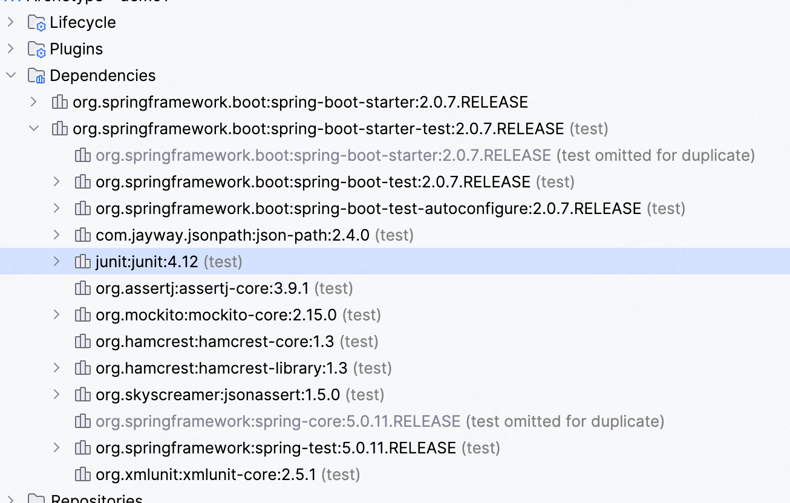
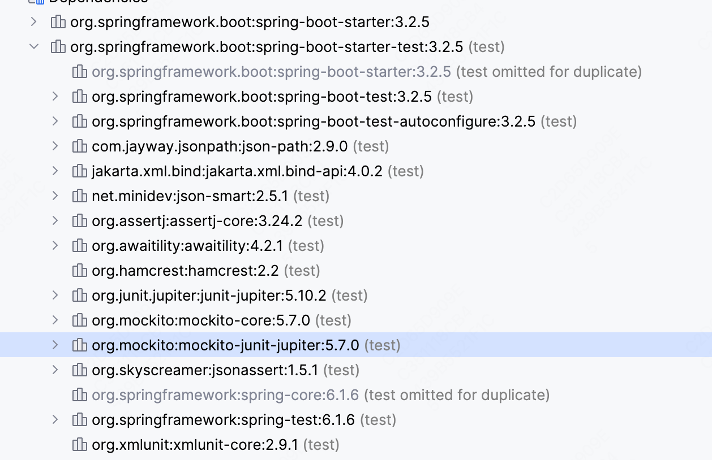

## Junit 4 与 Junit 5

Junit 4与Junit 5（也称为JUnit Jupiter）在使用方面的主要区别包括：

1. **注解的变化**：

    * Junit 4使用`@Before`​和`@After`​注解来分别表示在每个测试方法前后执行的方法，而Junit 5使用`@BeforeEach`​和`@AfterEach`​。
    * Junit 4使用`@BeforeClass`​和`@AfterClass`​注解来表示在所有测试方法前后只执行一次的方法，这些方法必须是静态的。Junit 5则使用`@BeforeAll`​和`@AfterAll`​，并且不再要求方法是静态的，如果测试类或方法是非静态的，需要用`@TestInstance(Lifecycle.PER_CLASS)`​注解。
    * Junit 4的`@Ignore`​注解在Junit 5中变为`@Disabled`​。
    * Junit 5引入了`@DisplayName`​注解，允许给测试类和测试方法设置自定义的名称。
2. **断言的变化**：

    * Junit 5中的断言是通过`Assertions`​类提供的静态方法来实现的，而Junit 4中则是通过`Assert`​类。
    * Junit 5支持更多种类的断言，如`assertAll`​用于组合断言，确保所有断言都被执行。
3. **假设（Assumptions）的使用**：

    * Junit 5中引入了`Assumptions`​类，它提供的假设方法允许在不满足某些条件时跳过测试。
4. **测试接口（Test Interfaces）** ：

    * Junit 5允许通过接口定义测试，这意味着可以在接口中声明`@Test`​方法，以及`@BeforeEach`​和`@AfterEach`​方法，实现类可以继承这些方法。
5. **扩展模型**：

    * Junit 5引入了一种新的扩展模型，通过使用`@ExtendWith`​注解，可以自定义测试的行为，这是Junit 4中`@RunWith`​注解的替代品。
6. **标签和过滤**：

    * Junit 5引入了`@Tag`​注解，允许给测试方法和测试类打标签，然后可以基于这些标签来过滤测试执行。
7. **动态测试**：

    * Junit 5支持动态生成测试用例，可以在运行时根据条件生成不同的测试用例。
8. **模块化**：

    * Junit 5被设计为多个不同的模块，主要包括Jupiter、Platform和Vintage，其中Jupiter是新的测试API和测试引擎，Platform是在JVM上启动测试框架的基础，Vintage提供了对Junit 3和Junit 4的支持。

总的来说，Junit 5在灵活性、扩展性和表达能力方面相比Junit 4有了显著的提升。

## SpringBootStartTest

​`spring-boot-starter-test`​是Spring Boot用于测试的起步依赖，它包括了多个用于测试的库，其中就包括JUnit。具体到JUnit的版本，Spring Boot 2.x版本默认包含JUnit 4的依赖，同时也支持JUnit 5（也称为JUnit Jupiter）。

如果你使用的是Spring Boot 2.2.x及以上版本，你可以很方便地使用JUnit 5进行测试，因为这些版本的`spring-boot-starter-test`​已经默认包括了JUnit Jupiter的依赖。如果你想使用JUnit 5，你不需要额外添加JUnit 5的依赖，但可能需要在`pom.xml`​中做一些配置来排除JUnit 4的依赖，以避免版本冲突。

​`spring-boot-starter-test`​在2.0.7的版本只支持Junit 4，同时Mockito作为默认测试框架

​​

​`spring-boot-starter-test`​在3.x以上的版本只支持Junit Jupiter。(Junit 5向下兼容)

​​

‍

## 测试容器的使用

在使用Spring容器进行测试时，Junit 5与Junit 4相比有以下几个主要区别：

* Junit 4中，使用`@RunWith(SpringJUnit4ClassRunner.class)`​或`@RunWith(SpringRunner.class)`​注解来启用Spring的测试支持，这样可以在测试中自动创建和管理Spring应用上下文。
* Junit 5中，使用`@ExtendWith(SpringExtension.class)`​来替代`@RunWith`​，实现Spring测试上下文的管理。这是因为Junit 5引入了新的扩展模型，使用`@ExtendWith`​来代替Junit 4的`@RunWith`​。

在使用Mockito进行测试时，Junit 5与Junit 4相比，主要有以下几个区别：

* 在Junit 4中，通常通过`@RunWith(MockitoJUnitRunner.class)`​注解来初始化Mockito框架，以便在测试中使用Mock对象。
* Junit 5引入了新的扩展模型，使用`@ExtendWith(MockitoExtension.class)`​来代替`@RunWith`​注解，实现Mockito的初始化和集成。这是因为Junit 5不再使用`@RunWith`​，而是采用更灵活的`@ExtendWith`​来管理扩展。

‍

## @SpringBootTest

​`@SpringBootTest`​和`@ExtendWith(SpringExtension.class)`​是Spring Boot和Junit 5中用于测试的两个不同注解，它们在测试中的作用和应用场景有所不同：

​`@SpringBootTest`​

* ​`@SpringBootTest`​是一个由Spring Boot提供的注解，用于集成测试。它会加载完整的应用程序上下文，以便进行更接近真实环境的测试。
* 当使用`@SpringBootTest`​时，Spring Boot会根据配置自动配置整个应用程序上下文，包括所有的Bean、配置类等，这对于需要测试应用程序的整体行为或者需要自动注入Spring管理的Bean的场景非常有用。
* ​`@SpringBootTest`​通常与`@Test`​注解一起使用，可以选择指定`webEnvironment`​属性来模拟不同的Web环境，例如模拟运行一个真实的Servlet容器。

​`@ExtendWith(SpringExtension.class)`​

* ​`@ExtendWith`​是Junit 5提供的注解，用于声明一个自定义扩展。`SpringExtension.class`​是Spring Framework提供的一个扩展，它允许在Junit 5的测试中使用Spring TestContext Framework。
* 使用`@ExtendWith(SpringExtension.class)`​可以在测试中启用Spring的依赖注入和其他Spring测试特性，但不会自动加载完整的应用程序上下文。这对于单元测试和轻量级的集成测试非常有用，因为它允许测试运行得更快，同时仍然可以使用Spring的特性。
* ​`@ExtendWith(SpringExtension.class)`​通常与`@WebMvcTest`​、`@DataJpaTest`​等其他Spring Boot测试注解一起使用，这些注解提供了更专门化的测试上下文配置。

区别总结

* **应用场景**：`@SpringBootTest`​适用于需要完整Spring应用程序上下文的集成测试，而`@ExtendWith(SpringExtension.class)`​适用于更轻量级的测试，如单元测试或需要特定Spring测试支持的集成测试。
* **性能**：`@SpringBootTest`​由于加载了完整的应用程序上下文，因此在执行测试时可能会更慢。`@ExtendWith(SpringExtension.class)`​通常用于更快速的测试，因为它不需要加载完整的上下文。
* **使用方式**：`@SpringBootTest`​是Spring Boot特有的，而`@ExtendWith(SpringExtension.class)`​是基于Junit 5的测试扩展机制，可以与Spring Framework一起使用，不限于Spring Boot应用。

根据测试的具体需求和上下文，可以选择适当的注解来编写有效的测试代码。

‍

 **@ExtendWith(SpringExtension.class)可以与@SpringBootTest一起使用吗？**

不需要将`@ExtendWith(SpringExtension.class)`​与`@SpringBootTest`​一起使用。

原因如下：

* ​`@SpringBootTest`​是Spring Boot专为集成测试设计的注解，它自动包含了加载Spring应用上下文的功能。当使用`@SpringBootTest`​时，Spring Boot测试框架已经隐式地提供了Spring TestContext Framework的集成，这正是`@ExtendWith(SpringExtension.class)`​所做的事情。
* 在Spring Boot 2.1及更高版本中，`@SpringBootTest`​以及其他Spring Boot测试注解（如`@DataJpaTest`​, `@WebMvcTest`​等）已经自动集成了`@ExtendWith(SpringExtension.class)`​的功能。这意味着，当你使用这些注解时，无需显式添加`@ExtendWith(SpringExtension.class)`​来启用Spring的测试支持。

简而言之，`@SpringBootTest`​已经隐式地包含了`@ExtendWith(SpringExtension.class)`​的效果，因此在使用`@SpringBootTest`​时，不需要也不应该再单独使用`@ExtendWith(SpringExtension.class)`​。

‍

**那为什么说**​ **​`@ExtendWith(SpringExtension.class)`​** ​**通常与**​ **​`@WebMvcTest`​**​ **、**​ **​`@DataJpaTest`​**​**等其他Spring Boot测试注解一起使用？**

在Spring Boot中，`@WebMvcTest`​、`@DataJpaTest`​等专门化的测试注解已经隐式地使用了`@ExtendWith(SpringExtension.class)`​或等效的机制，以提供Spring测试支持。这意味着，当你使用这些专门化的测试注解时，实际上已经通过这些注解启用了Spring TestContext Framework，无需再显式地添加`@ExtendWith(SpringExtension.class)`​。

这些专门化的测试注解，如`@WebMvcTest`​和`@DataJpaTest`​，是为了提供针对特定层（如MVC层或数据访问层）的轻量级测试上下文配置而设计的。它们确实与`@ExtendWith(SpringExtension.class)`​一起工作，但这是在注解的实现中隐式完成的，作为Spring Boot对Junit 5支持的一部分。

因此，当我说`@ExtendWith(SpringExtension.class)`​通常与`@WebMvcTest`​、`@DataJpaTest`​等其他Spring Boot测试注解一起使用时，我的意思是这些专门化的测试注解已经内置了对Spring TestContext Framework的支持，而这正是`@ExtendWith(SpringExtension.class)`​所提供的。用户在使用这些专门化的测试注解时，无需（也不应该）再手动添加`@ExtendWith(SpringExtension.class)`​。

‍

‍

‍

‍

‍

‍
