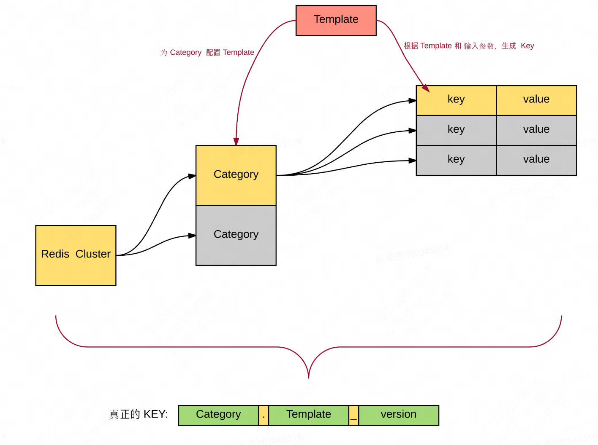

## MDP

美团基于Springboot自研的脚手架框架

## Zebra

美团数据库访问中间件客户端。Zebra是一个高可用、高性能、低延时数据库访问中间件客户端。

Zebra是一个基于JDBC API协议上开发出的高可用、高性能的数据库访问层解决方案

```java
// 强制读主
ZebraForceMasterHelper.forceMasterInLocalContext();
ZebraForceMasterHelper.clearLocalContext();
```

## OCTO

微服务治理，能够轻松实现服务注册发现、负载均衡、容错处理、降级熔断、灰度发布、调用数据可视化等服务治理功能。

[OCTO是一个分布式服务通信框架及服务治理平台](https://km.sankuai.com/collabpage/1275090121)

OCTO有哪些业界对标产品？字节跳动CloudWeGo、阿里Dubbo、蚂蚁金服Sofa、华为ServiceComb、开源Spring Cloud。

## Thirft

mdp-boot-starter-thrift 组件封装了公司基础中间件 [MTthrift](https://km.sankuai.com/page/28257152)，主要提供如下功能：

* 引入 MTthrift 相关依赖
* 使用注解形式声明 thrift 客户端、服务端

## 泳道

个人单独的测试环境

SET泳道配置的主要用户场景：

* 泳道配置通常在线下环境使用。业务团队需要维护一个稳定的线下环境，所以研发在线下环境自测时通常使用泳道机器，针对在自测中需要修改的配置，可以创建对应的泳道配置，这样就不会影响到线下主干环境的稳定性了。
* SET配置通常在线上环境使用。同一个配置，不同的SET内的机器，要获取不同的值。

## Squirrel

> key的结构
>
> 为了便于管理业务的不同类型的key，我们对Squirrel中key的结构进行了规定。存储key包含了三部分：category, template, version，最后存储的key字符串结构为`${category}.${template}_${version}`​。
>
> 可见，category类似于数据库中表的概念，template类似数据库中列的概念。

**基本概念**

* cluster：存储集群，用于指定后端的存储节点，主要类型有 memcached，redis等，后面统一使用redis
* category：存储类别，用于指定某一类存储数据，可以类比的理解为数据库中的一张表，具有统一的过期时间，统一由框架设置，无需用户进一步的设置。
* key：存储的键，用于唯一定位一个value
* value：存储的值，经**序列化**后存储在后端存储中



**存储key的组成**

存储 key 的组成包括3部分：category、template、version，最终存储的 key 字符串是由  **${category}.${template}_${version}**  组合而成：

1. category 是某一类存储的名称，它不是存储 key，它是存储 key 的前缀，可以理解它是数据库里的一张表。
2. template 是指如何组装 key 的模板。比如u{0}c{1}这个templete，u{0}代表第1个参数，template仅支持数字和字母。  
    真实意义是把userId组装到key中去，其中u就是userId的缩写。c{1}代表第2个参数比如cityId，是将cityId组装到key中去，其中c是cityId的缩写。在申请category的时候，会被要求填写详细的参数是什么意思，方便查看。
3. version 是 squirrel 内部管理的一个数字，如果这个 category 清一次缓存，那么 version 会加1，这样最后的key字符串会变成全新的字符串，应用使用新的key之后需要重新从数据源加载数据到缓存

比如申请一个category：shopDetail，template为s{0}p{1}，其中s{0}指商户id，p{1}是指商品id，那么在使用StoreKey拼key时会按照如下用法：

> StoreKey key = new StoreKey("shopDetail", shopId，productId); // shopId = 123456 ; productId=654321

那么经过StoreKey后，真实落到后端的key是如下样子，可以通过调用getFinalKey得到结果。

> String finalKey = storeClient.getFinalKey(key); // finalKey = shopDetail.s123456p654321_0

有关为什么需要有Category的概念，请参考 [Squirrel中的Category设计](https://km.sankuai.com/page/28311640)

注：如果category没有配置模板，在使用squirrel客户端的时候即使传入了参数，参数也是无效的，该category就等同于redis里面的一个key。使用category和模版参数都是为了限制业务的key的长度，节省空间。category方便管理一类数据，category清理就是清除这个category上的数据，此外，使用category还有统计的目的，如统计该category上key的类型以及key的空闲时间等。

‍
