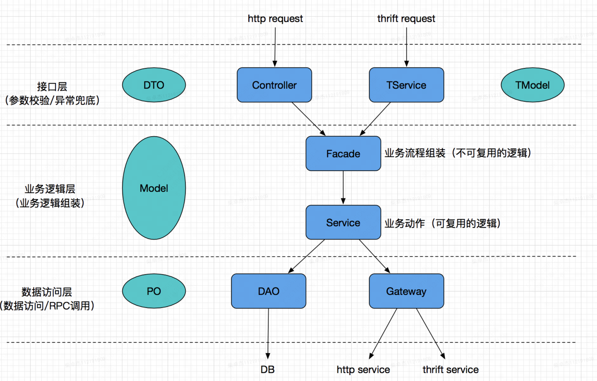

外部与子系统的通信通过一个统一的外观对象进行，为子系统中的一组接口提供一个统一的入口。外观模式定义了一个高层接口，这个接口使得子系统更加容易使用。外观模式又称为门面模式，它是一种对象结构型模式。

一个客户类需要和多个业务类交互，有时候这些需要交互的业务类会作为一个整体出现，这时引入一个新的外观类(Facade)来负责和多个业务类【子系统(Subsystem)】进行交互，而客户类只需与外观类交互，客户类与子系统之间原有的复杂引用关系由外观类来实现，从而降低了系统的耦合度。没有外观类，客户类需要和多个子系统之间进行复杂的交互，系统耦合度大。

如图：

1. 接口层（Controller提供http服务，TService提供thrift服务）只负责“参数校验、异常兜底”，不能包含具体业务处理逻辑
2. 业务逻辑层（Facade负责流程组装，Service负责封装可复用的业务逻辑动作）
3. 数据访问层（DAO访问数据库，Gateway发起http/thrift的RPC）

备注：

* 上述三层依赖关系为“自顶向下”：例如DAO与Gateway是看不到业务逻辑层定义的Model对象的
* 为避免教条，上述参考结构并非强制，例如：

  * 如果业务逻辑非常简单，可以去掉Facade，仅保留Service层
  * 如果数据访问层拿到底层服务返回的thrift对象结构很清晰，可以考虑直接向上返回给业务逻辑层（而不需要转化为Model对象再向上返回）
