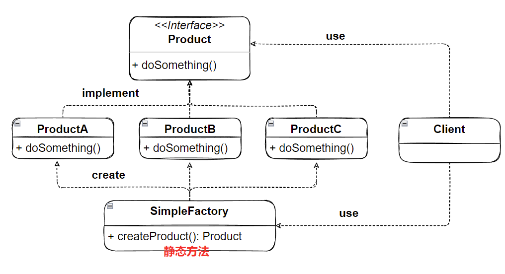
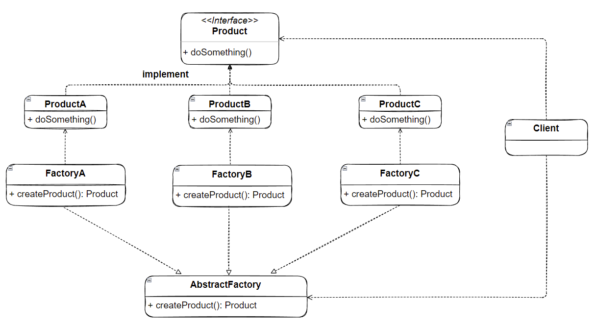
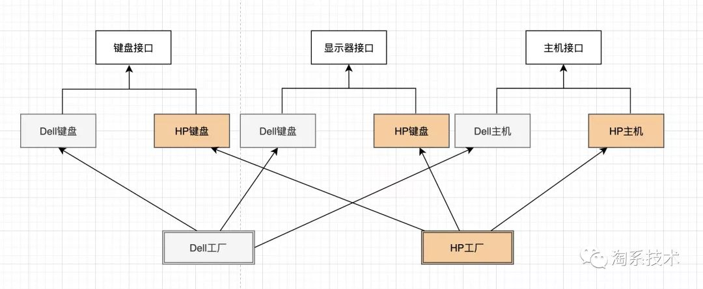

设计模式中的工厂模式（Factory Design pattern）是一个比较常用的创建型设计模式，其中可以细分为三种：简单工厂（Simple Factory）、工厂方法(Factory Method)和抽象工厂(Abstract Factory)。那么三者有什么区别呢？先说结论：

- **简单工厂**：只有唯一工厂（简单工厂），一个产品接口/抽象类，根据简单工厂中的静态方法来创建具体产品对象。适用于产品较少，几乎不扩展的情景
- **工厂方法**：有多个工厂（抽象工厂+多个具体工厂），一个产品接口/抽象类，根据继承抽象工厂中的方法来多态创建具体产品对象。适用于一个类型的多个产品
- **抽象方法**：有多个工厂（抽象工厂+多个具体工厂），多个产品接口/抽象类，对产品子类进行分组，根据继承抽象工厂中的方法多态创建同组的不同具体产品对象。适用于多个类型的多个产品

下面具体展开说明

## 一、简单工厂模式（Simple Factory Pattern）

### 1.1 简单工厂模式介绍

简单工厂模式又叫做静态工厂方法模式（static Factory Method pattern）,它是通过使用静态方法接收不同的参数来返回不同的实例对象。我们通过一个类图来进行讲解：



- `Product`接口：定义要创建的产品对象的接口
- `ProductA`、`ProductB`、`ProductC`产品类：实现产品接口，具有产品接口特性的具体产品
- `SimpleFactory`简单工厂：只有一个工厂，通过**静态方法**`createProduct`创建具体的产品对象
- `client`客户端：客户端有多个，每个客户端可以通过简单工厂来创建具体的产品对象

### 1.2 简单工厂模式实现

我们以上面类图为例，实现简单工厂模式：

```java
/**产品接口**/
public interface Product {

    void doSomething();
}

/**具体产品实现**/
class ProductA implements Product{

    @Override
    public void doSomething() {
        System.out.println("我是ProductA");
    }
}

class ProductB implements Product{

    @Override
    public void doSomething() {
        System.out.println("我是ProductB");
    }
}

class ProductC implements Product{

    @Override
    public void doSomething() {
        System.out.println("我是ProductC");
    }
}
/**简单工厂**/
public class SimpleFactory {
    /**工厂类创建产品静态方法**/
    public static Product createProduct(String productName) {
        Product instance = null;
        switch (productName){
            case "A":
                instance = new ProductA();
                break;
            case "B":
                instance = new ProductB();
                break;
            case "C":
                instance = new ProductC();
        }
        return instance;
    }
    /**客户端(client)调用工厂类**/
    public static void main(String[] args) {
        SimpleFactory simpleFactory = new SimpleFactory();
        createProduct("A").doSomething();
        createProduct("B").doSomething();
    }
}
```

- **优点**：简单工厂可以使客户端免除直接创建对象的职责，能够根据需要创建出对应的产品。实现客户端和产品类代码分离。此外可以通过配置文件来实现不修改客户端代码的情况下添加新的具体产品类（改进）。
    
- **缺点**：违背开闭原则，如果需要新增其他产品类，就必须在工厂类中新增`if-else`逻辑判断（可以通过配置文件来改进）。但是整体来说，系统扩展还是相对其他工厂模式要困难。  
    我们发现，简单工厂模式中的工厂类使用的是静态方法，那么为什么要这样做呢？可不可以使用非静态的方法呢？
    
- 使用静态方法可以不需要使用`new`的方式创建对象，方便调用
    
- 静态方法意味着可以直接获得实例对象，非静态方法只能通过构造方法（一般私有）调用，在工厂类以外不能被访问
    
- 对于一些实例化和销毁对象比较敏感的场景，比如数据库连接池，实例化对象能够重复稳定的被使用
    

综上来说，简单工厂模式适用于业务简单，产品固定不会经常改变工厂类的情况。

### 1.3 简单工厂模式使用场景

下面来看看简单工厂模式一般用于哪些业务场景

#### 1.3.1 JDK 、Spring等各类源码

在Java 中就有这样的设计，比如`DateFormat`中的这个方法就是简单工厂的应用

```java
private static DateFormat get(LocaleProviderAdapter adapter, int timeStyle, int dateStyle, Locale loc) {
    DateFormatProvider provider = adapter.getDateFormatProvider();
    DateFormat dateFormat;
    //逻辑判断实现那个具体对象
    if (timeStyle == -1) {
        dateFormat = provider.getDateInstance(dateStyle, loc);
    } else {
        if (dateStyle == -1) {
            dateFormat = provider.getTimeInstance(timeStyle, loc);
        } else {
            dateFormat = provider.getDateTimeInstance(dateStyle, timeStyle, loc);
        }
    }
    return dateFormat;
}
```

此外还有`Calender`等，在Spring 源码中也可以看到一些以"Factory"结尾的类，这些都是工厂模式的使用。

#### 1.3.2 数据库连接池

比如在业务连接数据库时，需要支持不同的数据库，比如有`dbcp`、`c3p0`、`druid`等等，这个时候数据库连接方式有限，而且比较固定不容易更改，所以可以尝试采用简单工厂模式来进行管理数据库连接对象。

## 二、工厂方法模式（Factory Method Pattern）

我们知道简单工厂模式有违背开闭原则，不容易扩展的缺点，所以在 GOF 23种设计模式中也没有简单工厂模式，下面我们就来看看另外一种工厂模式：工厂方法模式

### 2.1 工厂方法模式介绍

抽象工厂模式所要解决的问题是在一个产品族上，若存在多个不同类型的产品情况下，接口选择的问题。

工厂方法模式实际上是简单工厂模式的升级，工厂方法模式定义除了产品接口外，还定义了一个用于创建对象工厂的接口，让工厂子类再去实例化对应的产品类。通过类图来解释：



- `Product`接口：和简单工厂相同，提供产品对象的接口
- `ProductA`、`ProductB`和`productC`：具体类型的产品对象
- `FactoryA`、`FactoryB`和`FactoryC`：具体的产品工厂，实现具体的产品对象
- `AbstractFactory`：抽象工厂，可以有多个，其中的方法负责返回创建的产品对象
- `Client`：使用该模式的客户端

### 2.2 工厂方法模式实现

对照着上面的类图，我们可以对应实现相应的代码：

```java
/**产品接口**/
public interface Product {

    void doSomething();
}

/**具体产品实现**/
class ProductA implements Product{

    @Override
    public void doSomething() {
        System.out.println("我是ProductA");
    }
}

class ProductB implements Product{

    @Override
    public void doSomething() {
        System.out.println("我是ProductB");
    }
}

class ProductC implements Product{

    @Override
    public void doSomething() {
        System.out.println("我是ProductC");
    }
}

/**工厂接口**/
public interface AbstractFactory {
	/**创建Product方法,区别与工厂模式的静态方法**/
    public Product createProduct();
}

/**具体工厂实现**/
class FactoryA implements AbstractFactory{

    @Override
    public Product createProduct() {
        return new ProductA();
    }
}

class FactoryB implements AbstractFactory{

    @Override
    public Product createProduct() {
        return new ProductB();
    }
}

class FactoryC implements AbstractFactory{

    @Override
    public Product createProduct() {
        return new ProductC();
    }
}
/**客户端调用工厂**/
public class Client {
    public static void main(String[] args) {
        Product productA = new FactoryA().createProduct();
        productA.doSomething();
        Product productB = new FactoryB().createProduct();
        productB.doSomething();
    }
}
```

其中最主要的是 `AbstractFactory`类中的`createProduct`方法，通过这个方法来生成具体产品，这也是为什么叫工厂方法的原因。和简单工厂的静态方法不同，这里是使用的非静态调用方式。而且可以发现，没有了简单工厂中的 `if-else`逻辑判断，相对而言扩展性也要强的多。

- **优点**：完全实现开闭原则，实现了可扩展和更复杂的层次结构。明确了职责，具有多态性，适用于任何实体类。
- **缺点**：如果业务增加，会使得系统中类的个数成倍增加，提高了代码的复杂度

### 2.3 工厂方法模式使用场景

#### 2.3.1 Slf4j

在Slf4j 这个我们经常使用的日志框架中，就有工厂方法模式的应用，比如使用频率很高的获取`logger`对象实例中:

`private Logger logger = LoggerFactory.getLogger(Client.class);`

点进源码看我们会发现这个`getLogger`方法：

```java
//简单工厂模式
public static Logger getLogger(String name) {
    /**工厂方法模式的使用**/
    ILoggerFactory iLoggerFactory = getILoggerFactory();
    return iLoggerFactory.getLogger(name);
}
//工厂接口
public interface ILoggerFactory {
    Logger getLogger(String var1);
}
//Logger产品接口
public interface Logger {
    String ROOT_LOGGER_NAME = "ROOT";
    ...
}
```

需要调用工厂方法接口来实现具体`logger` 对象实例，这就是一个工厂方法模式的一个典型应用

#### 2.3.2 一些规则配置解析

在一些需要不同类型的规则配置解析时，我们也可以用到工厂方法模式，比如引用《设计模式之美》的代码：

```java
public class RuleConfigSource {
  public RuleConfig load(String ruleConfigFilePath) {
    String ruleConfigFileExtension = getFileExtension(ruleConfigFilePath);

    IRuleConfigParserFactory parserFactory = RuleConfigParserFactoryMap.getParserFactory(ruleConfigFileExtension);
    if (parserFactory == null) {
      throw new InvalidRuleConfigException("Rule config file format is not supported: " + ruleConfigFilePath);
    }
    IRuleConfigParser parser = parserFactory.createParser();

    String configText = "";
    //从ruleConfigFilePath文件中读取配置文本到configText中
    RuleConfig ruleConfig = parser.parse(configText);
    return ruleConfig;
  }

  private String getFileExtension(String filePath) {
    //...解析文件名获取扩展名，比如rule.json，返回json
    return "json";
  }
}

//因为工厂类只包含方法，不包含成员变量，完全可以复用，
//不需要每次都创建新的工厂类对象，所以，简单工厂模式的第二种实现思路更加合适。
public class RuleConfigParserFactoryMap { //工厂的工厂
  private static final Map<String, IRuleConfigParserFactory> cachedFactories = new HashMap<>();

  static {
    cachedFactories.put("json", new JsonRuleConfigParserFactory());
    cachedFactories.put("xml", new XmlRuleConfigParserFactory());
    cachedFactories.put("yaml", new YamlRuleConfigParserFactory());
    cachedFactories.put("properties", new PropertiesRuleConfigParserFactory());
  }

  public static IRuleConfigParserFactory getParserFactory(String type) {
    if (type == null || type.isEmpty()) {
      return null;
    }
    IRuleConfigParserFactory parserFactory = cachedFactories.get(type.toLowerCase());
    return parserFactory;
  }
}
```

在需要添加新的规则配置解析器时，只需要创建新的 `parser` 类和 `parserfactory` 完成不同的配置

## 三、抽象工厂模式（Abastract Factory Pattern）

抽象工厂模式没有简单工厂和工厂方法模式那么常用，场景比较特殊，在简单工厂和工厂方法中，对于类只有一种分类方式，比如简单工厂中，根据产品类型分为`ProductA`、`ProductB`和`ProductC`。但是如果有多种分类方式，比如按照产品的生产商分类，`ProductA`可能和`ProductC`为一类。这样就用到了抽象工厂模式

### 3.1 抽象工厂模式介绍

抽象工厂模式（Abstract Factory Pattern）属于创建型模式，它实际上是对工厂方法模式的扩展，相当于一个超级工厂，用于创建其他工厂的模式。在抽象工厂模式中，接口是负责创建一个相关对象的工厂，而且每个工厂都能按照工厂模式提供对象。其实抽象工厂也是为了减少工厂方法中的子类和工厂类数量，基于此提出的设计模式，如下图（来源淘系技术）：



比如在工厂方法中，我们只能按照键盘、主机、显示器分别进行分类，这样会造成大量的工厂类和产品子类。而抽象工厂可以将上述三种产品类进行分组，可以大大减少工厂类的数量。我们再来看看对应的类图：


- `Product1`和`Product2`：定义一种类型的产品对象接口
- `Product1A`、`Product1B`等：各种类型的具体产品对象
- `FactoryA`和`FactoryB`：具体产品工厂，负责创建该工厂类型下的产品对象
- `AbstractFactory`：抽象工厂接口，定义一类产品对象
- `Client`：客户端，使用抽象工厂，调用产品对象

### 3.2 抽象工厂模式实现

下面就根据上面的类图，利用代码实现抽象工厂：

```java
/**Product1类的产品接口**/
public interface Product1 {
    void doSomething();
}

class Product1A implements Product1{

    @Override
    public void doSomething() {
        System.out.println("我是Product1A");
    }
}

class Product1B implements Product1{

    @Override
    public void doSomething() {
        System.out.println("我是Product1B");
    }
}


/** Product2类的产品接口**/
public interface Product2 {
    void doSomething();
}

class Product2A implements Product2{

    @Override
    public void doSomething() {
        System.out.println("我是Product2A");
    }
}

class Product2B implements Product2{

    @Override
    public void doSomething() {
        System.out.println("我是Product2B");
    }
}

/**抽象工厂接口**/
public interface AbstractFactory {

    public Product1 createProduct1();

    public Product2 createProduct2();
}

/**A类工厂**/
public class FactoryA implements AbstractFactory{

    @Override
    public Product1 createProduct1() {
        return new Product1A();
    }

    @Override
    public Product2 createProduct2() {
        return new Product2A();
    }
}

/**B类工厂**/
public class FactoryB implements AbstractFactory{

    @Override
    public Product1 createProduct1() {
        return new Product1B();
    }

    @Override
    public Product2 createProduct2() {
        return new Product2B();
    }
}


/**Client客户端调用**/
public class Client {
    public static void main(String[] args) {
        new FactoryA().createProduct1().doSomething();
        new FactoryB().createProduct2().doSomething();
    }
}
```

- **优点**：增加分组比较容易，而且能大大减少工厂类的数量
- **缺点**：因为分组，所以分组中的产品扩展就比较困难，比如再新增一个Product3，就需要改动`AbstractFactory`、`FactoryA`和`FactoryB`几乎所有工厂类

综上，没有哪种方法是万金油，要针对业务场景来使用哪种工厂模式


## 总结

抽象工厂更像是组合了多个单个工厂模式，将一类工厂归为一组。