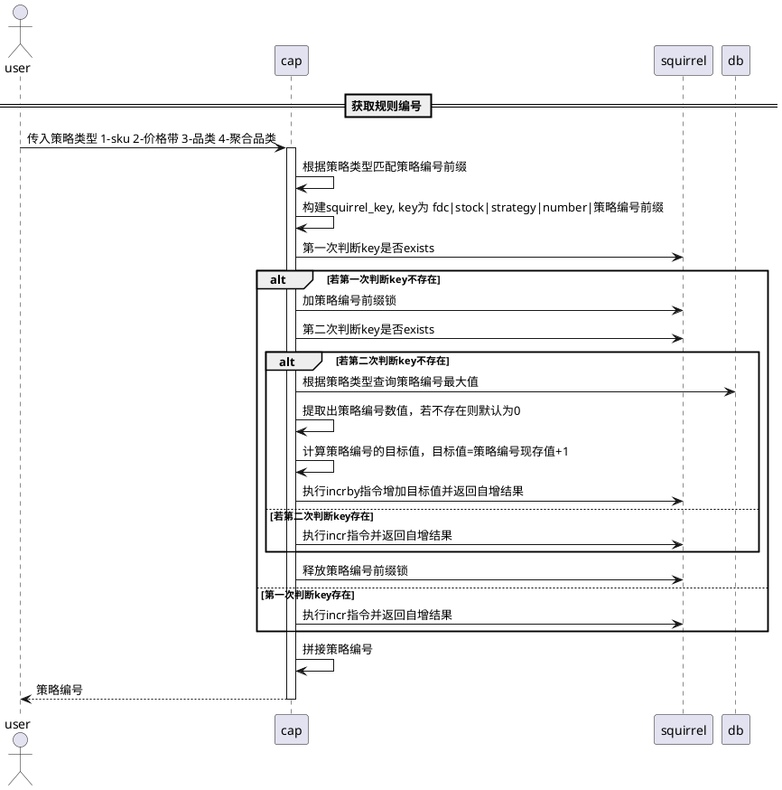

## 功能点

> 门店分组配置

维度：仓配-门店分组
门店分组不可跨管理城市

门店ID可以存储到一个字段内

```plantuml
@startuml

actor user
== 获取规则编号 ==

user -> cap: 传入策略类型 1-sku 2-价格带 3-品类 4-聚合品类
activate cap
cap -> cap: 根据策略类型匹配策略编号前缀
cap -> cap: 构建squirrel_key, key为 fdc|stock|strategy|number|策略编号前缀
cap -> squirrel: 第一次判断key是否exists
alt 若第一次判断key不存在
	cap -> squirrel: 加策略编号前缀锁
	cap -> squirrel: 第二次判断key是否exists
	alt 若第二次判断key不存在
		cap -> db: 根据策略类型查询策略编号最大值
		cap -> cap: 提取出策略编号数值，若不存在则默认为0
		cap -> cap: 计算策略编号的目标值，目标值=策略编号现存值+1
		cap -> squirrel: 执行incrby指令增加目标值并返回自增结果
	else 若第二次判断key存在
		cap -> squirrel: 执行incr指令并返回自增结果
	end
	cap -> squirrel: 释放策略编号前缀锁
else 第一次判断key存在
	cap -> squirrel: 执行incr指令并返回自增结果
end
cap -> cap: 拼接策略编号

return 策略编号

@enduml
```