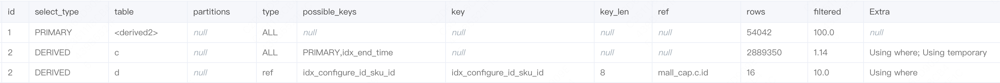
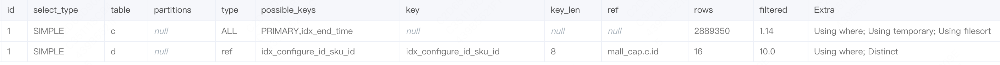
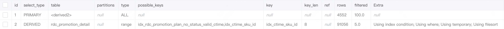

[（待处理）cap-固定建议量、RDC促销计划慢SQL、慢URL等问题](https://km.sankuai.com/collabpage/2024244338)

## 1. FixedSuggestConfigMapper.queryByConditionCount

相关表：fixed_suggest_config_detail,fixed_suggest_config

```sql
SELECT COUNT(*) 
FROM ( 
SELECT DISTINCT c.id, c.batch_no, c.start_time, c.end_time, c.create_mis , c.create_time, c.update_time, c.valid 
FROM fixed_suggest_config_detail d 
	LEFT JOIN fixed_suggest_config c ON d.configure_id = c.id 
WHERE d.valid = ? AND c.valid = ? AND start_time <= ? AND end_time >= ? 
) A;
```

平均耗时为0.419230秒

执行计划为：

​​

**优化措施**

暂无，该慢SQL为直接进去页面加载，SQL条件较少，且数据量大，SQL方面暂无优化措施

## 2. FixedSuggestConfigMapper.queryByCondition

相关表：fixed_suggest_config_detail,fixed_suggest_config

```sql
SELECT DISTINCT c.id, c.batch_no, c.start_time, c.end_time, c.create_mis , c.create_time, c.update_time, c.valid 
FROM fixed_suggest_config_detail d 
	LEFT JOIN fixed_suggest_config c ON d.configure_id = c.id 
WHERE d.valid = ? AND c.valid = ? AND start_time <= ? AND end_time >= ? 
ORDER BY start_time LIMIT ?, ?;
```

平均耗时为0.393357

执行计划为

​​

**优化措施**

暂无，该慢SQL为直接进去页面加载，SQL条件较少，且数据量大，SQL方面暂无优化措施

## 3. RdcPromotionDetailDtMapper.getPromotionPlanTotal

相关表：rdc_promotion_detail

```sql
SELECT COUNT(*) 
FROM ( 
SELECT COUNT(*) FROM rdc_promotion_detail 
WHERE status IN (?) AND ctime >= ? AND ctime <= ? AND valid = ? GROUP BY rdc_promotion_plan_no 
) groups;
```

平均耗时为0.371230

执行计划为

​​

**优化措施**

1. 创建联合索引，

```sql
create index idx_valid_status_ctime_rdc_promotion_plan_no on rdc_promotion_detail (valid, status, ctime, rdc_promotion_plan_no);
```

2. 更改SQL写法

```sql
SELECT COUNT(*)
FROM (
    SELECT distinct rdc_promotion_plan_no
	FROM rdc_promotion_detail
	WHERE status IN (?) AND ctime >= ? AND ctime <= ? AND valid = ? 
) A;
```

## 4. RdcPromotionDetailDtMapper.getRdcPromotionPlanData

在DAS上近期慢SQL未找到，观察SQL条件，已有相关索引

## 5. RdcPromotionDetailDtMapper.getPromotionPlanList

相关表：rdc_promotion_detail

```sql
SELECT rdc_promotion_plan_no, GROUP_CONCAT(DISTINCT management_city_name) AS managementCityName, management_city_id AS managementCityId , count(DISTINCT sku_id) AS totalSkuCount, count(daily_promotion_plan) AS totalPromotionDays , ctime, creator 
FROM rdc_promotion_detail 
WHERE status IN (?) 
AND ctime >= ? AND ctime <= ? 
AND valid = ? 
GROUP BY rdc_promotion_plan_no 
ORDER BY rdc_promotion_plan_no DESC 
LIMIT ?, ?;
```

平均耗时0.173306

执行计划为

​​

**优化措施**

1. 创建联合索引

```sql
create index idx_valid_status_ctime_rdc_promotion_plan_no on rdc_promotion_detail (valid, status, ctime, rdc_promotion_plan_no);
```

慢查询数一周为50个左右，且平均耗时较低，暂时不处理

## 6. RdcPromotionDetailDtMapper.getRdcPromotionDetailListTotal

相关表：rdc_promotion_detail

```sql
SELECT COUNT(*) FROM rdc_promotion_detail 
WHERE 1 = 1 
AND promotion_plan_day >= ? 
AND promotion_plan_day <= ? 
AND status IN (?) 
AND valid = ?;
```

平均耗时：1.237951

执行计划为

​​

**优化措施**

1. 创建索引

```sql
create index idx_status_promotion_plan_day on rdc_promotion_detail (valid, status, promotion_plan_day);
```

慢查询一周为8个，考虑到该表索引已有9个索引，暂时不处理

## 7. RdcPromotionDetailDtMapper.getRdcPromotionPlanDataTotal

在DAS上近期慢SQL未找到，观察SQL条件，已有相关索引

‍
