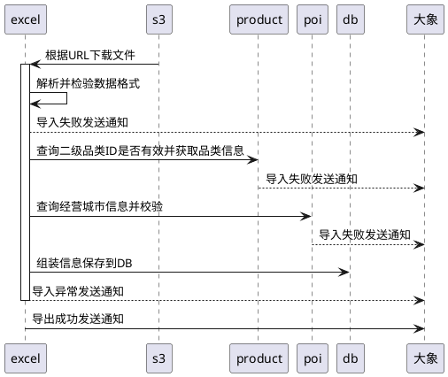
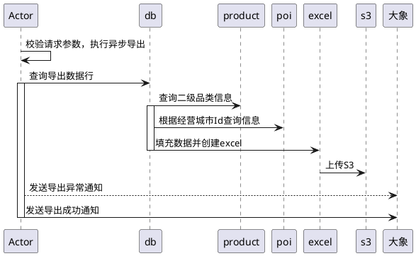
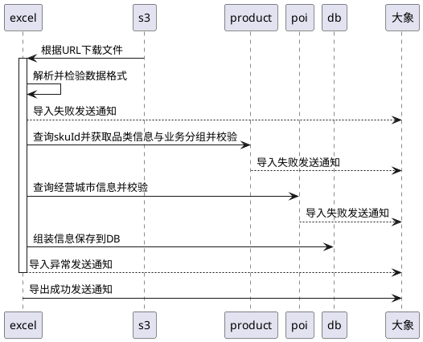
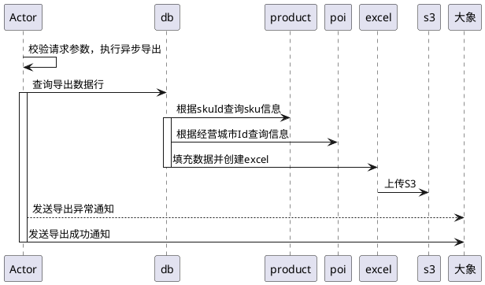

## 1. 盘货信息接入配置

inventory_check_conf

```sql
create table `inventory_check_conf` (  
    `id` bigint not null auto_increment comment '主键id',  
    `management_city_id` bigint not null default 0 comment '经营城市ID',  
    `category2_id` bigint not null default 0 comment '二级品类ID',  
    `business_group_type` int not null default 0 comment '业务分组类型',  
    `pre_warning_days` int not null default 0 comment '前置预警天数',  
    `pre_invalid_days` int not null default 0 comment '前置失效天数',  
    `operator` varchar(50) not null default '' comment '操作人',  
    `ctime` datetime not null default CURRENT_TIMESTAMP comment '创建时间',  
    `utime` datetime not null default CURRENT_TIMESTAMP on update CURRENT_TIMESTAMP comment '更新时间',  
    `valid` tinyint not null default 1 comment '记录是否有效，0-无效，,1-有效',  
  PRIMARY KEY (`id`),  
  index `idx_city_category_busi_group` (`management_city_id`, `category2_id`, `business_group_type`)  
) ENGINE=InnoDB AUTO_INCREMENT=1 DEFAULT CHARSET=utf8mb4 COMMENT='促销协同盘货信息检查配置表'
```


## 2. 关注商品清单配置

collaborate_mark_sku_conf

```sql
create table `collaborate_mark_sku_conf` (  
    `id` bigint not null auto_increment comment '主键id',  
    `management_city_id` bigint not null default 0 comment '经营城市ID',  
    `category2_id` bigint not null default 0 comment '二级品类ID',  
    `business_group_type` int not null default 0 comment '业务分组类型',  
    `sku_id` bigint not null default 0 comment 'skuID',  
    `operator` varchar(50) not null default '' comment '操作人',  
    `ctime` datetime not null default CURRENT_TIMESTAMP comment '创建时间',  
    `utime` datetime not null default CURRENT_TIMESTAMP on update CURRENT_TIMESTAMP comment '更新时间',  
    `valid` tinyint not null default 1 comment '记录是否有效，0-无效，,1-有效',  
  PRIMARY KEY (`id`),  
  index `idx_city_sku` (`management_city_id`, `category2_id`, `business_group_type`, `sku_id`)  
) ENGINE=InnoDB AUTO_INCREMENT=1 DEFAULT CHARSET=utf8mb4 COMMENT='促销协同关注商品配置表'
```

## 流程图

### 盘货信息批量导入



### 盘货信息批量导出




### 关注商品配置批量导入




### 关注商品配置批量导出




## 接口逻辑

**销售计划录入接口**


## 开发

新增Lion

sales_plan_collaborate_export_limit：销售协同导出限制条数 1000