## 品类计划配置

**数据库结构**


**城市阈值配置**

> 查询城市阈值配置

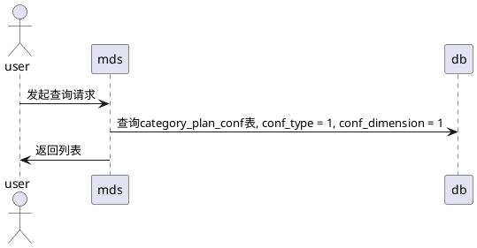

> 新增城市阈值配置

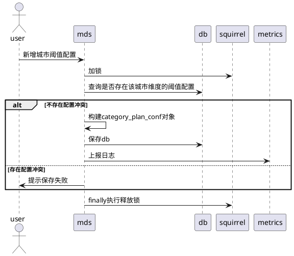

> 调整城市阈值配置

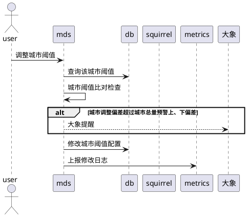


**城市+品类阈值配置**

> 查询城市+品类阈值配置

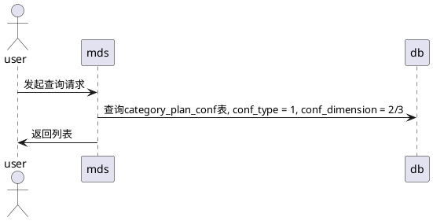
> 导入城市+品类阈值配置


**销售-订货口径转换系数配置**

> 查询销售-订货口径转换系数
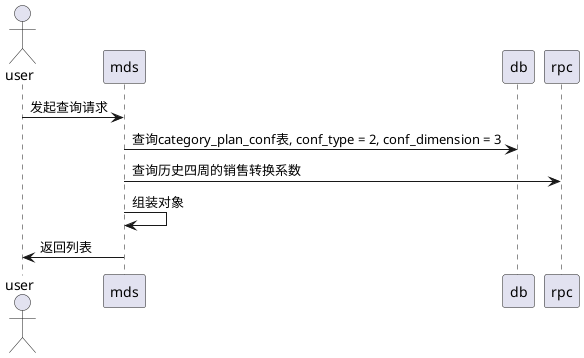

> 导入销售-订货口径转换系数

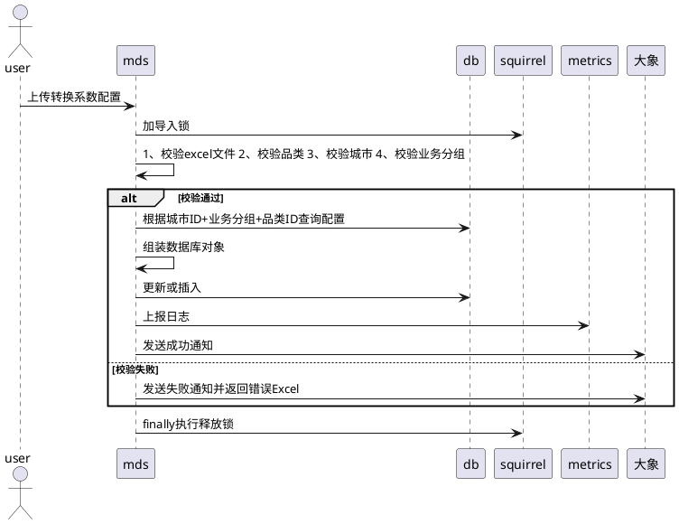

**计划调整维度管理**

> 查询

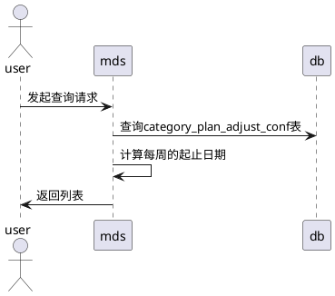

> 导入

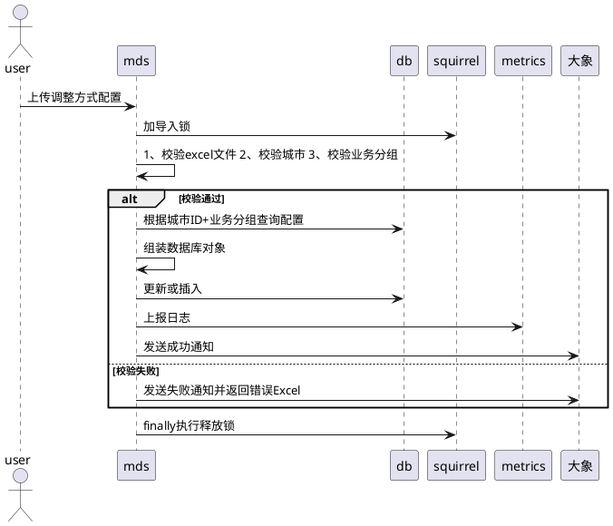

> 批量新增

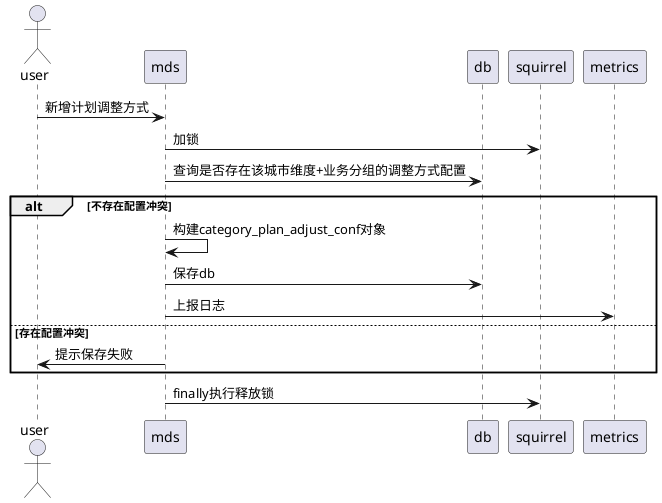


## 品类计划看板

> 查询品类计划看板

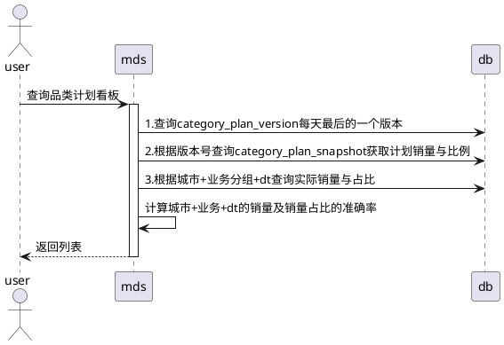

> 导出品类计划看板

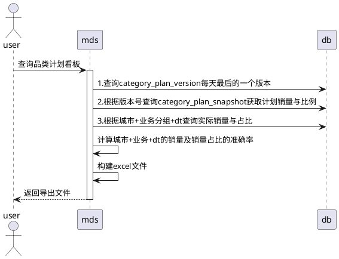


## 品类计划管理

**计划调整审核**

dt销量锁定与修改不冲突，锁定只是为了不受一件凑整的影响

> 批量确认

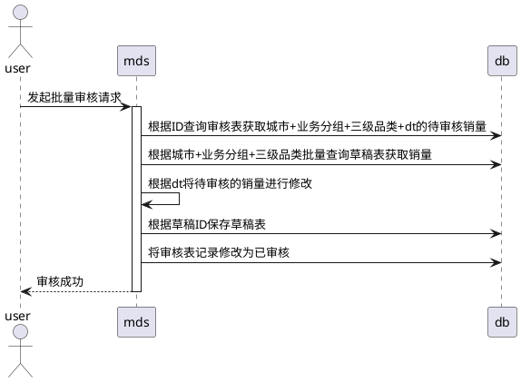

> 批量驳回

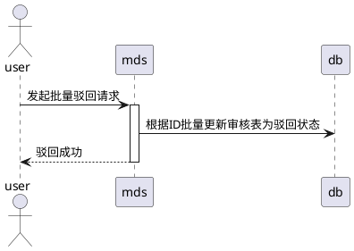

**RDC盖帽/撤回**

> 盖帽

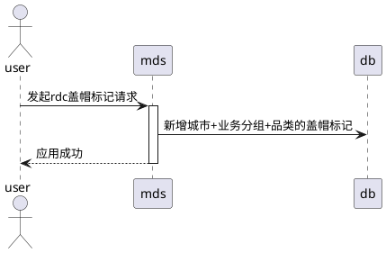

> 撤回

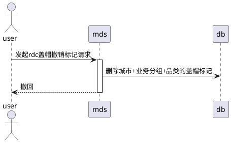


## 页面查询

**二级品类页查询**

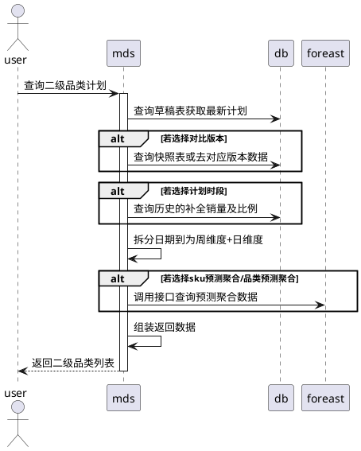

**三级品类页查询**

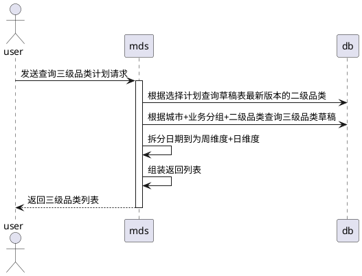

**二级品类导出**

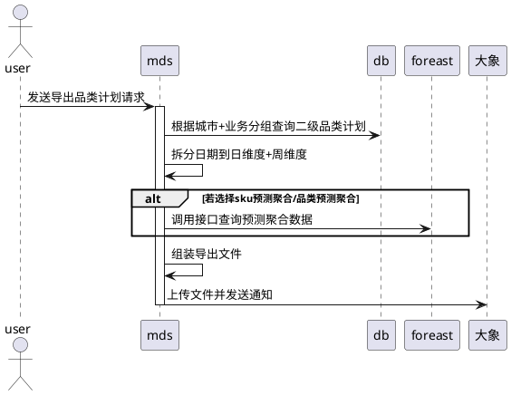


**三级品类导出**


**审核页查询**

```plantuml
@startuml

actor user

user -> mds: 发起查询审核信息请求
activate mds
mds -> lion: 获取当前人有权限的经营城市
mds -> db: 根据经营城市查询category_plan_audit
mds -> mds: 组装返回对象
return 返回列表
@enduml
```

