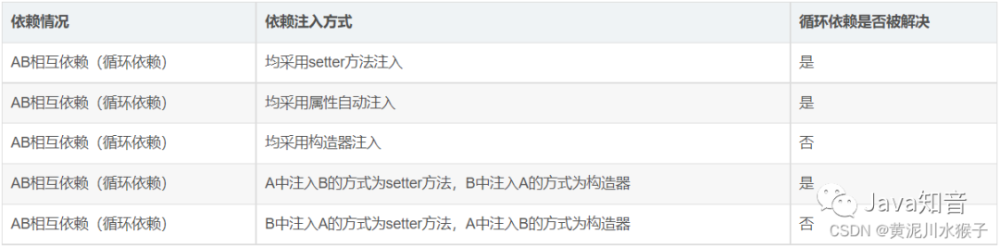
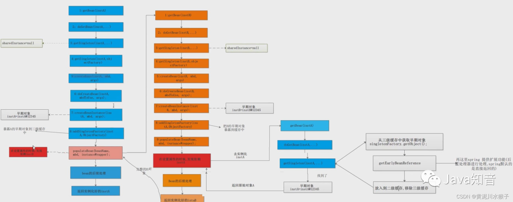
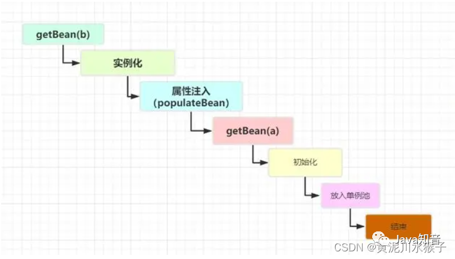
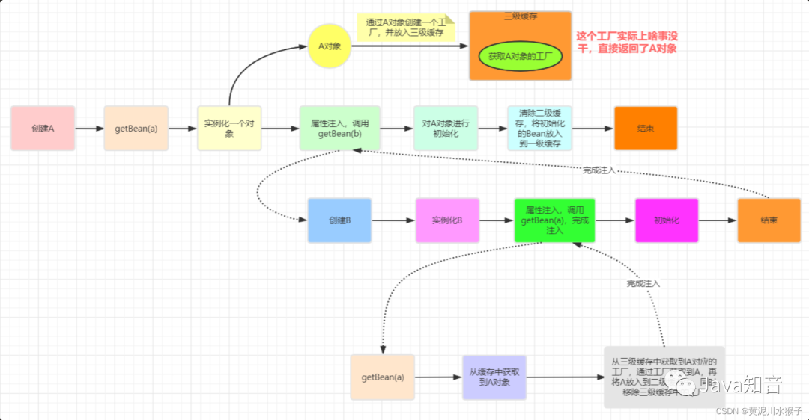

Spring为什么需要三级缓存？二级缓存能解决循环依赖吗？

## 什么是循环依赖？

A创建时—>需要B---->B去创建—>需要A，从而产生了循环

什么情况下循环依赖可以被处理？

从上面的测试结果我们可以看到，不是只有在setter方法注入的情况下循环依赖才能被解决，即使存在构造器注入的场景下，循环依赖依然被可以被正常处理掉。

## 三级缓存

三级缓存是通用的叫法。

-   `singletonObjects`，一级缓存，存储的是所有创建好了的单例Bean
-   `earlySingletonObjects`，完成实例化，但是还未进行属性注入及初始化的对象
-   `singletonFactories`，提前暴露的一个单例工厂，二级缓存中存储的就是从这个工厂中获取到的对象

## 如果只有一级缓存

-   实例化A对象。
    
-   填充A的属性阶段时需要去填充B对象，而此时B对象还没有创建，所以这里为了完成A的填充就必须要先去创建B对象；
    
-   实例化B对象。
    
-   执行到B对象的填充属性阶段，又会需要去获取A对象，而此时Map中没有A，因为A还没有创建完成，导致又需要去创建A对象。
    

这样，就会循环往复，一直创建下去，只到堆栈溢出。

**为什么不能在实例化A之后就放入Map？**

因为此时A尚未创建完整，所有属性都是默认值，并不是一个完整的对象，在执行业务时可能会抛出未知的异常。所以必须要在A创建完成之后才能放入Map。

## 如果只有二级缓存

此时我们引入二级缓存用另外一个`Map2 {k:name; v:earlybean}` 来存储尚未已经开始创建但是尚未完整创建的对象。

-   实例化A对象之后，将A对象放入Map2中。
    
-   在填充A的属性阶段需要去填充B对象，而此时B对象还没有创建，所以这里为了完成A的填充就必须要先去创建B对象。
    
-   创建B对象的过程中，实例化B对象之后，将B对象放入Map2中。
    
-   执行到B对象填充属性阶段，又会需要去获取A对象，而此时Map中没有A，因为A还没有创建完成，但是我们继续从Map2中拿到尚未创建完毕的A的引用赋值给a字段。这样B对象其实就已经创建完整了，尽管B.a对象是一个还未创建完成的对象。
    
-   此时将B放入Map并且从Map2中删除。
    
-   这时候B创建完成，A继续执行b的属性填充可以拿到B对象，这样A也完成了创建。
    
-   此时将A对象放入Map并从Map2中删除。
    

## 二级缓存已然解决了循环依赖问题，为什么还需要三级缓存？

这是正常的循环依赖

到这里不知道小伙伴们会不会有疑问，B中提前注入了一个没有经过初始化的A类型对象不会有问题吗？

从上图中我们可以看到，虽然在创建B时会提前给B注入了一个还未初始化的A对象，但是在创建A的流程中一直使用的是注入到B中的A对象的引用，之后会根据这个引用对A进行初始化，所以这是没有问题的。

**初始化的时候是对A对象本身进行初始化，而容器中以及注入到B中的都是代理对象，这样不会有问题吗？**

答：不会，这是因为不管是cglib代理还是jdk动态代理生成的代理类，内部都持有一个目标类的引用，当调用代理对象的方法时，实际会去调用目标对象的方法，A完成初始化相当于代理对象自身也完成了初始化

**三级缓存为什么要使用工厂而不是直接使用引用？换而言之，为什么需要这个三级缓存，直接通过二级缓存暴露一个引用不行吗？**

答：这个工厂的目的在于延迟对实例化阶段生成的对象的代理，只有真正发生循环依赖的时候，才去提前生成代理对象，否则只会创建一个工厂并将其放入到三级缓存中，但是不会去通过这个工厂去真正创建对象

即使没有循环依赖，也会将其添加到三级缓存中，而且是不得不添加到三级缓存中，因为到目前为止Spring也不能确定这个Bean有没有跟别的Bean出现循环依赖。

**假设我们在这里直接使用二级缓存的话，那么意味着所有的Bean在这一步都要完成AOP代理。这样做有必要吗？**

不仅没有必要，而且违背了Spring在结合AOP跟Bean的生命周期的设计！Spring结合AOP跟Bean的生命周期本身就是通过`AnnotationAwareAspectJAutoProxyCreator`这个后置处理器来完成的，在这个后置处理的`postProcessAfterInitialization`方法中对初始化后的Bean完成AOP代理。

如果出现了循环依赖，那没有办法，只有给Bean先创建代理，但是没有出现循环依赖的情况下，设计之初就是让Bean在生命周期的最后一步完成代理而不是在实例化后就立马完成代理。

## 总结

**面试官：”Spring是如何解决的循环依赖？“**

答：Spring通过三级缓存解决了循环依赖，其中一级缓存为单例池（`singletonObjects`）,二级缓存为早期曝光对象`earlySingletonObjects`，三级缓存为早期曝光对象工厂（`singletonFactories`）。

当A、B两个类发生循环引用时，在A完成实例化后，就使用实例化后的对象去创建一个对象工厂，并添加到三级缓存中，如果A被AOP代理，那么通过这个工厂获取到的就是A代理后的对象，如果A没有被AOP代理，那么这个工厂获取到的就是A实例化的对象。

当A进行属性注入时，会去创建B，同时B又依赖了A，所以创建B的同时又会去调用`getBean(a)`来获取需要的依赖，此时的`getBean(a)`会从缓存中获取，第一步，先获取到三级缓存中的工厂；第二步，调用对象工工厂的getObject方法来获取到对应的对象，得到这个对象后将其注入到B中。紧接着B会走完它的生命周期流程，包括初始化、后置处理器等。当B创建完后，会将B再注入到A中，此时A再完成它的整个生命周期。

至此，循环依赖结束！

**面试官：”为什么要使用三级缓存呢？二级缓存能解决循环依赖吗？“**

答：如果要使用二级缓存解决循环依赖，意味着所有Bean在实例化后就要完成AOP代理，这样违背了Spring设计的原则，Spring在设计之初就是通过`AnnotationAwareAspectJAutoProxyCreator`这个后置处理器来在Bean生命周期的最后一步来完成AOP代理，而不是在实例化后就立马进行AOP代理。