# 前言

在上篇文章我们讲解了`JMeter`这个软件, 本篇文章我们将要根据`JMeter`获取到的信息来搭建一个压测监控平台, 让我们更直观的监测我们系统的负载情况, 本篇文章将收录到专栏: [性能优化](https://juejin.cn/column/7248511603883589692 "https://juejin.cn/column/7248511603883589692")

上一篇文章地址: [手把手教你压测 - 掘金 (juejin.cn)](https://juejin.cn/post/7248511603883638844 "https://juejin.cn/post/7248511603883638844")

> 这些工具我都安装到一个 Linux系统上了, 建议 InfluxDB安装到另外一台服务器, 不然压测过程中一直在写入对性能也是有写影响的

# 安装docker

> Linux版本 centOS7

本次搭建为了方便使用, 全程都是`docker`版本的

- 更新 yum包

```bash
sudo yum update -y
```

- 安装需要的软件包， yum-util 提供yum-config-manager功能，另外两个是devicemapper驱动依赖的

```bash
sudo yum install -y yum-utils device-mapper-persistent-data lvm2
```

- 设置yum阿里源

```bash
sudo yum-config-manager --add-repo http://mirrors.aliyun.com/docker-ce/linux/centos/docker-ce.repo
```

- 安装`docker`

```bash
sudo yum install docker-ce -y # 启动  systemctl start docker
```


- 查看是否安装成功

`docker -v`


> 查看docker镜像列表: docker images (后面可以跟容器名进行精确查找)  
> 查看所有容器列表: docker ps -a  
> 查看正在运行容器列表: docker ps  
> 停止正在运行容器: docker stop 容器名/id  
> 删除容器(需要先停止): docker rm -f 容器名/id  
> 卸载docker容器:

# 安装InfluxDB

## 安装 InfluxDB

1）下载InfluxDB的镜像：

`docker pull influxdb:1.8`

成功拉取镜像执行命令之后如下图所示:

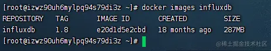

2）启动InfluxDB的容器，并将端口 8083 和 8086 映射出来：

> 宿主机端口自定义, 后面对得上就行

```bash
docker run -itd --name 容器名   -p 宿主机端口:容器端口        镜像名   
docker run -d   --name influxdb -p 28086:8086 -p 28083:8083 influxdb:1.8
```

成功创建容器, 执行命令 docker ps 如下图所示

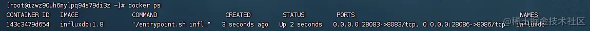 3）进入容器内部，创建名为jmeter的数据库：

进入 jmeter-influx 容器

```bash
docker exec -it influxdb /bin/bash
```

- 输入`influx`命令，即可进入 influx 操作界面
- 输入`create database jmeter` 命令，创建名为 jmeter 的数据库
- 输入`show databases` 命令，查看数据库创建成功

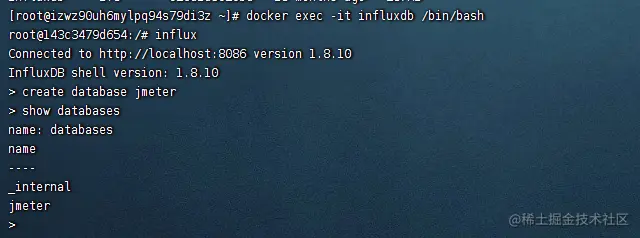

4）使用JMeter 库， select 查看数据，这个时候是没有数据的：

- 输入`use jmeter`命令，应用刚才创建的数据库
- 输入`select * from jmeter`命令，查询库中有哪些数据

> exit 是退出命令 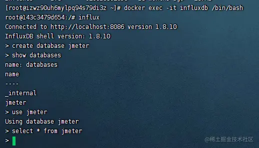

## 配置JMeter后端监听器

我们需要把`JMeter`的压测数据导入到上面安装的`influx`里, 要配置一个后端监听器

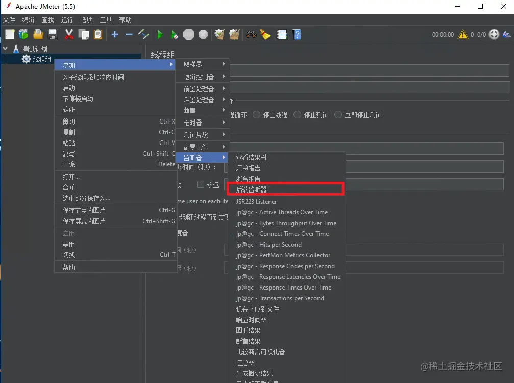

后端监听器实现选择第三个


同时我们对其进行相应的配置

- influxdbUrl：需要改为自己`influxdb`的部署ip和映射端口，我这里是部署在公司测试服务器，所以就不展示出来了，端口是容器启动时映射的 28086端口，db后面跟的是刚才创建的数据库名称
- application：可根据需要自由定义，只是注意后面在 grafana 中选对即可
- measurement：表名，默认是 jmeter ，也可以自定义(如果自定义的话上面也要改)
- summaryOnly：选择true的话就只有总体的数据。false会记录总体数据，然后再将每个transaction都分别记录
- samplersRegex：样本正则表达式，将匹配的样本发送到数据库
- percentiles：响应时间的百分位P90、P95、P99
- testTitle：events表中的text字段的内容
- eventTags：任务标签，配合Grafana一起使用

> 注意上述端口别忘记开放出来

## 运行后端监视器

运行 Jmeter 脚本，然后再次在 influxdb 中查看数据，发现类似下面的数据说明输入导入成功：

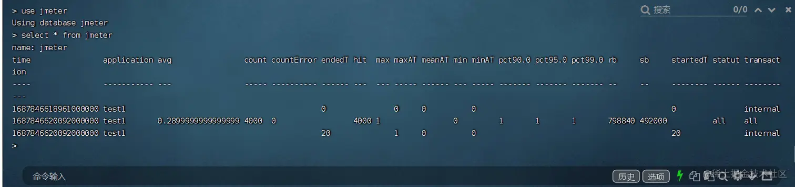

为了让数据更好看, 更加可视化, 所以我们要开始安装`Grafana`

## 后端监视器可能失败的几个原因

1. InfluxDB 端口可能未开放
2. 后端监视器 URL 拼写错误
3. 后端监视器 URL 端口错误

# Grafana

1）下载Grafana镜像：

```bash
docker pull grafana/grafana
```

2）启动Grafana容器：

启动Grafana容器，将3000端口映射出来

> 注意这里宿主机我写成了23000. 大家根据需求进行配置

```bash
docker run -d --name grafana -p 23000:3000 grafana/grafana
```

3）验证部署成功

网页端访问[http://ip:23000](https://link.juejin.cn?target=http%3A%2F%2Fip%3A23000 "http://ip:23000")验证部署成功


默认账户密码：admin\admin

> 首次登录会让你改密码, 忘记截图了

4）选择添加数据源

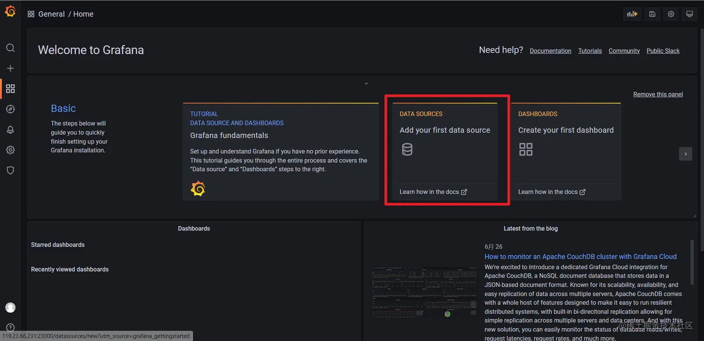

5）找到并选择 influxdb :


6）配置数据源 需要关注的也就是 名称, 数据库地址端口, 数据库名称, 账号, 密码, 其中账号密码我们不需要填写, 毕竟没有设置...

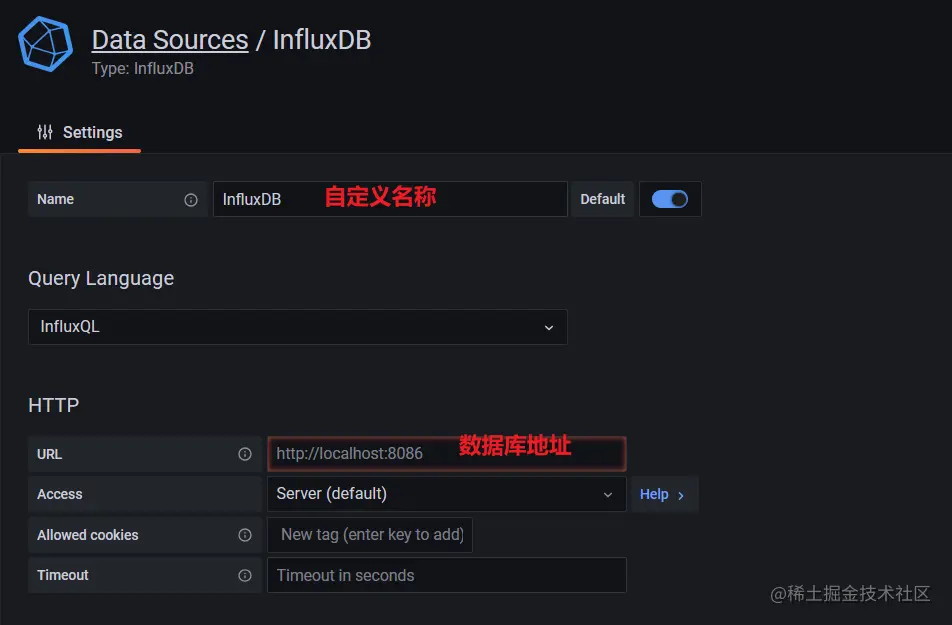


数据源创建成功时会有绿色的提示：


7）导入模板


有的模板导入地址可能如下图所示

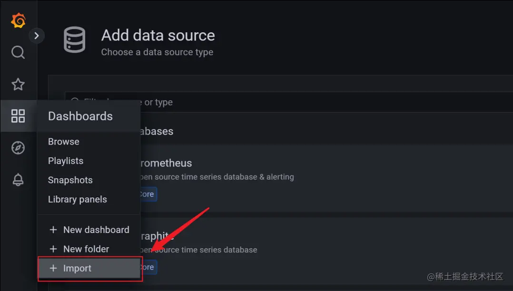

模板导入分别有以下3种方式：

- 直接输入模板id号
- 直接上传模板json文件
- 直接输入模板json内容


8）找展示模板

在Grafana的官网找到我们需要的展示模板

- Apache JMeter Dashboard
    
    - dashboad-ID：5496
- JMeter Dashboard(3.2 and up)
    
    - dashboad-ID：3351

9）导入找到的模板，使用模板id

导入模板，我这里选择输入模板id号，导入后如下，配置好模板名称和对应的数据源，然后 import 即可

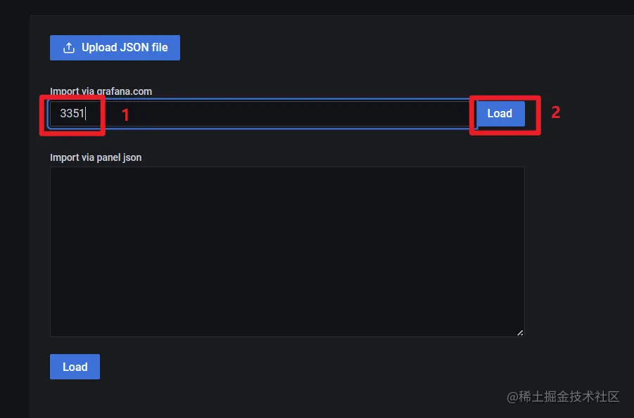

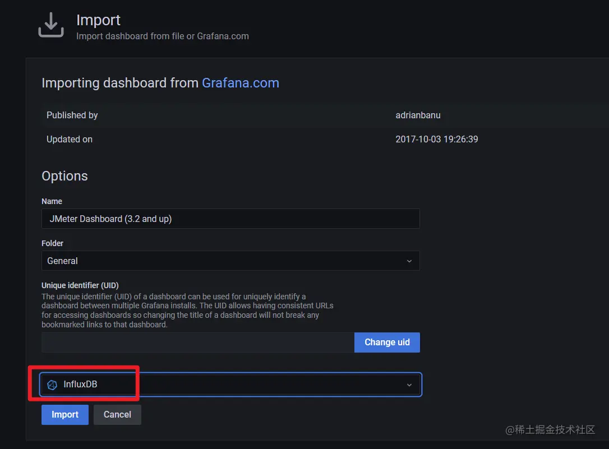

10）查看效果

展示设置，首先选择创建的application, 左上角的 application name就是我们在 JMeter-后端监视器设置的application name


**注意：** 如果我们修改过表名，也就是在jmeter的Backend Listener的measurement配置(默认为jmeter)，这个时候就需要去设置中进行修改，我这里使用的就是默认的，所以无需修改。

11. 数据源查看

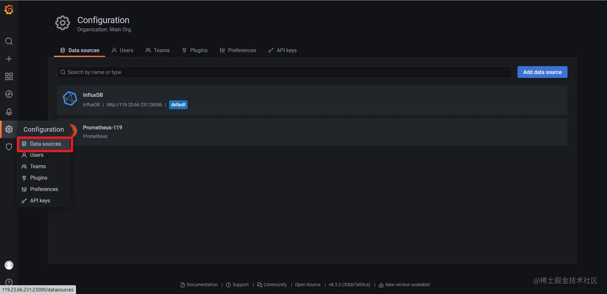

# 安装node_exporter

```bash
# 下载 
wget -c https://github.com/prometheus/node_exporter/releases/download/v0.18.1/node_exporter-0.18.1.linux-amd64.tar.gz 
# 解压 
tar zxvf node_exporter-0.18.1.linux-amd64.tar.gz -C /usr/local/ningxuan/ 
# 启动 
cd /usr/local/ningxuan/node_exporter-0.18.1.linux-amd64 
nohup ./node_exporter > node.log 2>&1 &
```

**注意：在被监控服务器中配置开启端口9100**

访问 [http://ip:9100/metrics](https://link.juejin.cn?target=http%3A%2F%2Fip%3A9100%2Fmetrics "http://ip:9100/metrics") 地址应该就可以看到相应的数据


# 安装Prometheus

## 1）下载解压运行

> 建议网页复制链接下载, 然后放到 Linux系统中, 外网慢的一批, 我下好之后阿里云盘不让分享, 很难受

```bash
# 下载  
wget -c https://github.com/prometheus/prometheus/releases/download/v2.15.1/prometheus-2.15.1.linux-amd64.tar.gz 
# 解压 
mkdir /usr/local/ningxuan/ 
tar zxvf prometheus-2.15.1.linux-amd64.tar.gz -C /usr/local/ningxuan/ 
cd /usr/local/ningxuan/prometheus-2.15.1.linux-amd64 
# 运行 
nohup ./prometheus > prometheus.log 2>&1 &
```

## 2）配置prometheus

在prometheus.yml中加入如下配置：

- job_name自定义
- targets是数组, 可以写多个, 我这里是本机就写的 127.0.0.1

```yml
- job_name: '119-Linux'     
	static_configs:     
- targets: ['127.0.0.1:9100','***']
```

## 3）测试Prometheus

测试Prometheus是否安装配置成功

[http://101.200.146.199:9090/targets](https://link.juejin.cn?target=http%3A%2F%2F101.200.146.199%3A9090%2Ftargets "http://101.200.146.199:9090/targets")


## 4）在Grafana中配置Prometheus的数据源:

- 新增数据源
- 选择Prometheus
- 添加数据库访问地址

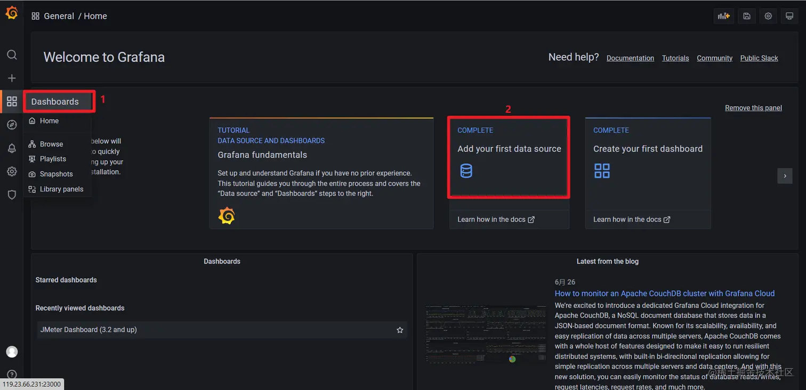


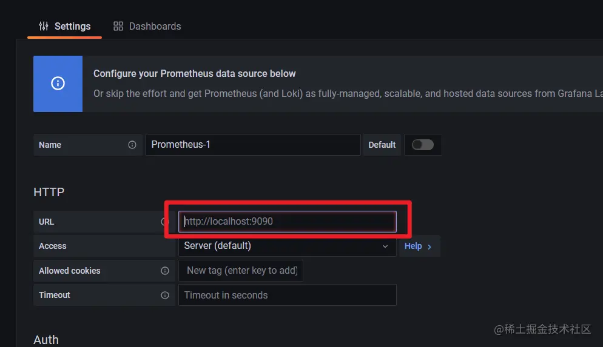

## 5）Grafana导入Linux展示模板

导入Linux系统dashboard

- Node Exporter for Prometheus Dashboard EN 20201010
    - dashboard-ID: 11074
- Node Exporter Dashboard
    - dashboard-ID: 16098

