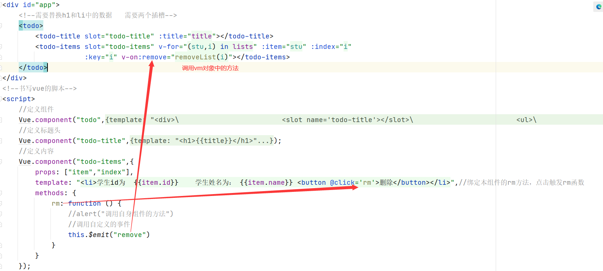
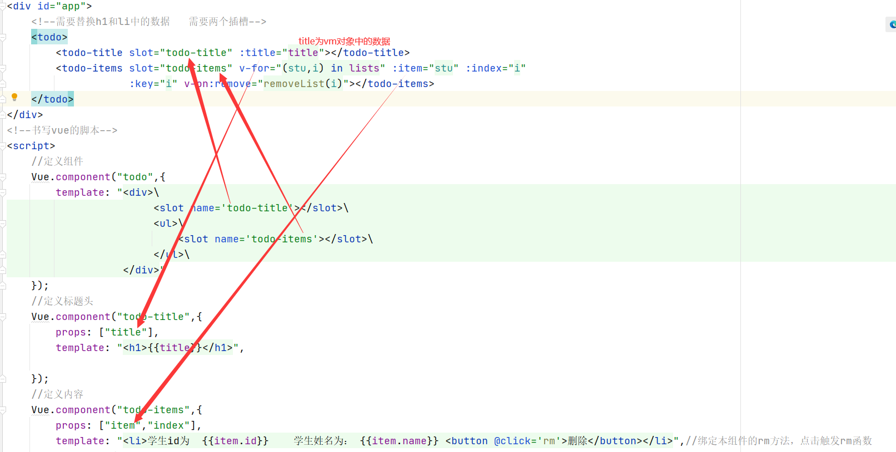
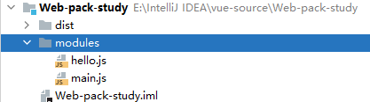
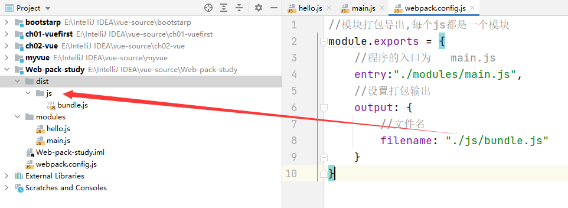
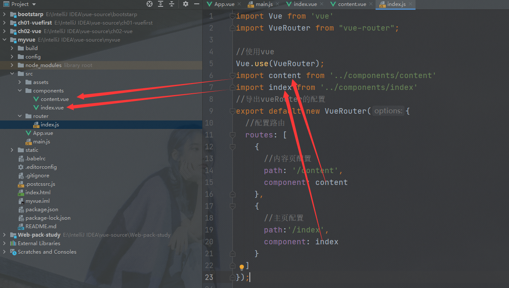
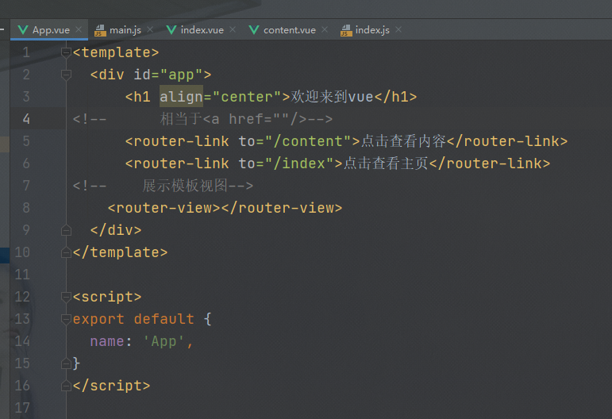
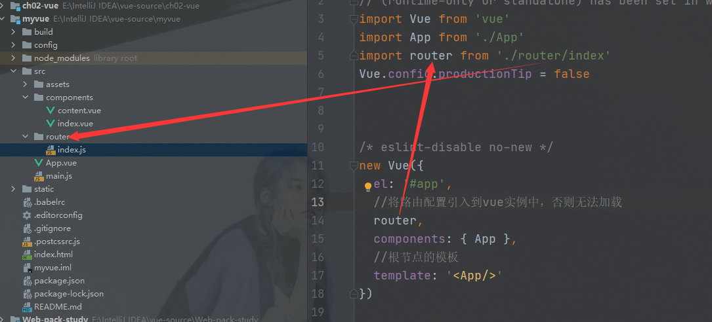
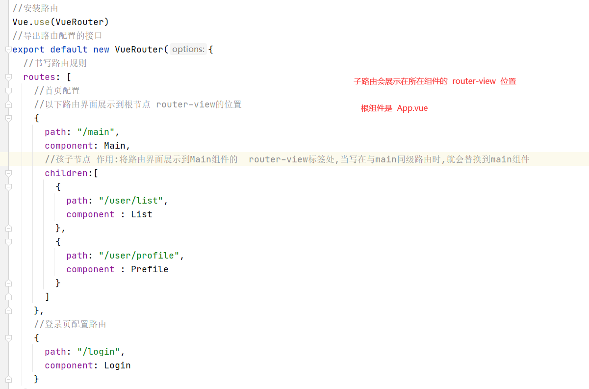
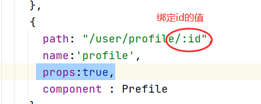
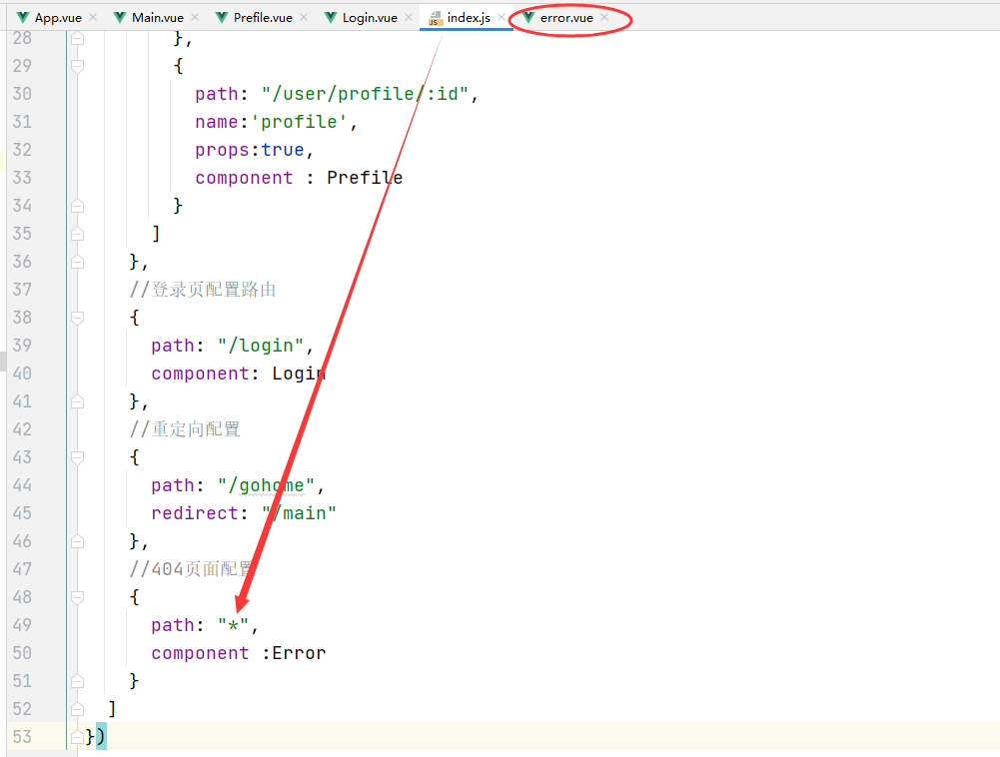

# Vue

## 1.自定义事件绑定

### 调用过程



### 参数传递

 

### 组件的data属性

 

### 组件的template属性

 

## 2.插槽的绑定过程

name 元素和 slot 属性绑定



## 3.第一个Vue-cli程序

### 常用命令

```java
1.确认nodejs安装成功:
cmd 下输入 node -v,查看是否能够正确打印出版本号即可!
cmd 下输入 npm-v,查看是否能够正确打印出版本号即可!

2.安装 Node.js 淘宝镜像加速器（cnpm）
# -g 就是全局安装
npm install cnpm -g

3.安装vue-cli
#在命令台输入
cnpm install vue-cli -g
#查看是否安装成功
vue list
    
4.创建webpack打包的项目，相当于maven
    
# 这里的 myvue 是项目名称，可以根据自己的需求起名
vue init webpack myvue    
一路都选择no即可;

5.初始化并运行
    
    转到myvue目录
cd myvue
    
    下载项目所需要的结构和依赖
npm install
    
    运行项目
npm run dev 
    
    终止项目
    ctrl+c
```

## 4.安装WebPack

安装命令

```
npm install webpack -g  #安装webpack打包工具
npm install webpack-cli -g #安装webpack客户端
```

测试安装成功

```
webpack   -v
webpack-cli    -v
```

## 5.使用WebPack

1.创建项目,项目结构如下

 

2.具体代码

hello.js

```js
//使用exports关键字将sayhello方法导出,
exports.sayhello=function () {
    document.write("<h1>我是第一个vue程序</h1>")
}
```

main.js

```js
//使用require引入hello.js,  ./代表当前文件夹
let hello=require("./hello");
//调用hello.js内的导出的sayhello方法,只有导出之后才能调用方法
hello.sayhello();
```

webpack.config.js

```js
//模块打包导出,每个js都是一个模块
module.exports = {
    //程序的入口为   main.js
    entry:"./modules/main.js",
    //设置打包输出
    output: {
        //文件名
        filename: "./js/bundle.js"
    }
}
```

3.文件打包输出,使用命令 webpack 打包



4.将打包好的js模块引入html

```html
<!DOCTYPE html>
<html lang="en">
<head>
    <meta charset="UTF-8">
    <title>Title</title>
</head>
<body>
<script src="dist/js/bundle.js"></script>
</body>
</html>
```


## 6.webpack解析

### 代码解析

 

## 7.vue-router

1.安装

```
npm install vue-router --save-dev
```

2.书写组件

3.配置路由



4.在app.vue组件中引入



5.在main.js程序的入口使用路由



### 路由嵌套

index.js

 

路由视图展示

 

 

##  8.vue-elementUI

1.创建一个工程

```vue
vue init webpack hello-vue
```

2.安装依赖，我们需要安装 `vue-router`、`element-ui`、`sass-loader` 和`node-sass` 四个插件,

sass-loader 是为了加载css文件,否则不识别

```vue
# 进入工程目录
cd hello-vue
# 安装 vue-router
npm install vue-router --save-dev
# 安装 element-ui
npm i element-ui -S
# 安装依赖
npm install
# 安装 SASS 加载器
cnpm install sass-loader node-sass --save-dev
# 启动测试
npm run dev
```

3.NPM命令解释

```
npm install moduleName：安装模块到项目目录下
npm install -g moduleName：-g 的意思是将模块安装到全局，具体安装到磁盘的哪个位置，要看 npm config prefix的位置
npm install moduleName -save：–save的意思是将模块安装到项目目录下，并在package文件的dependencies节点写入依赖，-S为该命令的缩写
npm install moduleName -save-dev：–save-dev的意思是将模块安装到项目目录下，并在package文件的devDependencies节点写入依赖，-D为该命令的缩写
```

4.使用elementUI

```javascript
import Vue from 'vue'
import App from './App'
//导入elementUI
import ElementUI from 'element-ui';
//导入elementUI的css
import 'element-ui/lib/theme-chalk/index.css';
//导入router,使router配置生效
import router from "./router/index";

//安装elementUI
Vue.use(ElementUI);
//创建vue实例,绑定index.html中的 根标签
new Vue({
  el: '#app',
  //使用路由
  router,
  //渲染App组件
  render: h => h(App),
  //声明组件
  components: { App },
  //vue实例中有template属性，会将该属性值进行编译，将编译后的虚拟dom直接替换掉vue实例绑定的元素（即el绑定的那个元素）
  //vue只能显示一个根标签
  template: '<App/>'
})
```

## 9.参数传递

 

 

### 重定向配置

​                                           

 

## 路由钩子与异步请求

### 1.路由模式和404

1. hash：路径带 # 符号，如 http://localhost/#/login
2. history：路径不带 # 符号，如 http://localhost/login

 

#### 404页面

 

## 注意！！！

### 关于箭头函数以及this的使用

`箭头函数`

不要在选项 property 或回调上使用[箭头函数](https://developer.mozilla.org/zh-CN/docs/Web/JavaScript/Reference/Functions/Arrow_functions)，比如 `created: () => console.log(this.a)` 或 `vm.$watch('a', newValue => this.myMethod())`。因为箭头函数并没有 `this`，`this` 会作为变量一直向上级词法作用域查找，直至找到为止，经常导致 `Uncaught TypeError: Cannot read property of undefined` 或 `Uncaught TypeError: this.myMethod is not a function` 之类的错误。

`this`

生命周期钩子的 `this` 上下文指向调用它的` Vue 实例`。

