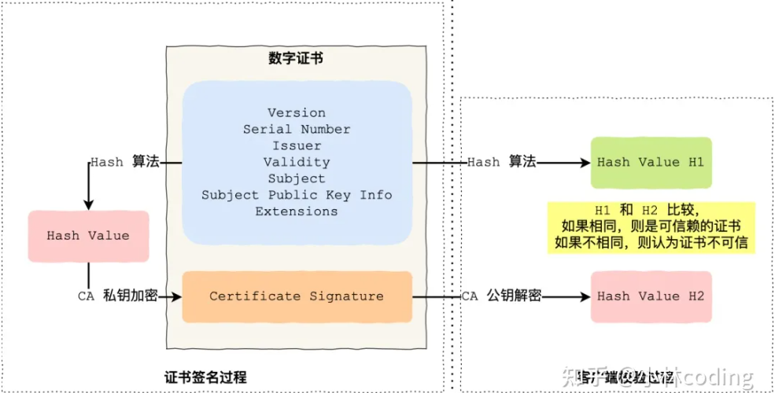
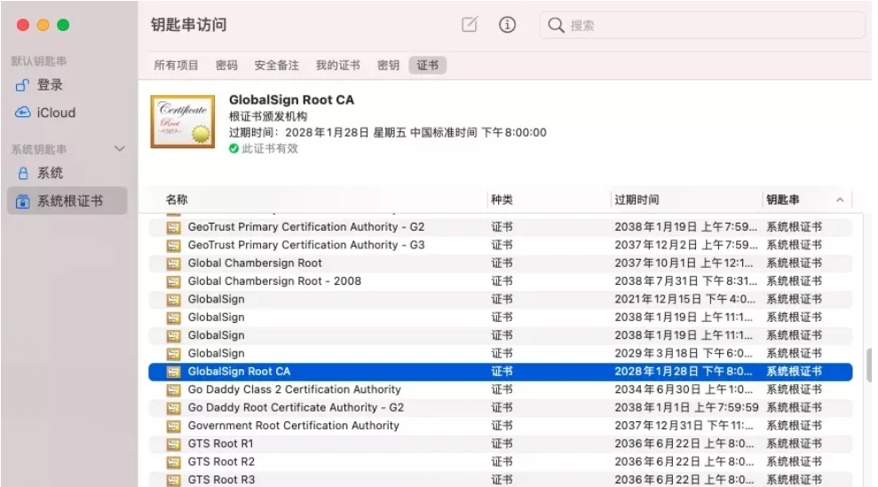

# 数字证书
[知乎参考回答](https://www.zhihu.com/question/37370216#:~:text=1%20%E9%A6%96%E5%85%88%E5%AE%A2%E6%88%B7%E7%AB%AF%E4%BC%9A%E4%BD%BF%E7%94%A8%E5%90%8C%E6%A0%B7%E7%9A%84%20Hash%20%E7%AE%97%E6%B3%95%E8%8E%B7%E5%8F%96%E8%AF%A5%E8%AF%81%E4%B9%A6%E7%9A%84%20Hash%20%E5%80%BC%20H1%EF%BC%9B%202,%E5%80%BC%20H2%20%EF%BC%9B%203%20%E6%9C%80%E5%90%8E%E6%AF%94%E8%BE%83%20H1%20%E5%92%8C%20H2%EF%BC%8C%E5%A6%82%E6%9E%9C%E5%80%BC%E7%9B%B8%E5%90%8C%EF%BC%8C%E5%88%99%E4%B8%BA%E5%8F%AF%E4%BF%A1%E8%B5%96%E7%9A%84%E8%AF%81%E4%B9%A6%EF%BC%8C%E5%90%A6%E5%88%99%E5%88%99%E8%AE%A4%E4%B8%BA%E8%AF%81%E4%B9%A6%E4%B8%8D%E5%8F%AF%E4%BF%A1%E3%80%82)

一个数字证书通常包括以下内容构成：

+ 公钥
+ 持有者信息
+ 证书认证机构（CA）信息
+ CA对这份文件的数字签名及使用的算法
+ 证书有效期
+ 额外信息

数字证书的作用，就是用来验证公钥持有者身份，以防第三方冒充。说简单些，证书就是用来告诉客户端，该服务端是否合法，因为只有证书合法，才代表服务端身份可信。

我们用证书验证公钥持有者的身份（服务端的身份），那证书又是怎么来的？又该怎么认证证书呢？

为了让服务端的公钥被大家信任，服务端的证书都是由 CA （_Certificate Authority_，证书认证机构）签名的，CA 就是网络世界里的公安局、公证中心，具有极高的可信度，所以由它来给各个公钥签名，信任的一方签发的证书，那必然证书也是被信任的。

之所以要签名，是因为签名的作用可以避免中间人在获取证书时对证书内容的篡改。

## 签发验证流程

CA 签发证书的过程，如上图左边部分：

+ 首先 CA 会把持有者的公钥、用途、颁发者、有效时间等信息打成一个包，然后对这些信息进行 Hash 计算，得到一个 Hash 值；
+ 然后 CA 会使用自己的私钥将该 Hash 值加密，生成 Certificate Signature，也就是 CA 对证书做了签名；
+ 最后将 Certificate Signature 添加在文件证书上，形成数字证书；

客户端校验服务端的数字证书的过程，如上图右边部分：

+ 首先客户端会使用同样的 Hash 算法获取该证书的 Hash 值 H1；
+ 通常浏览器和操作系统中集成了 CA 的[公钥信息](https://www.zhihu.com/search?q=%E5%85%AC%E9%92%A5%E4%BF%A1%E6%81%AF&search_source=Entity&hybrid_search_source=Entity&hybrid_search_extra=%7B%22sourceType%22%3A%22answer%22%2C%22sourceId%22%3A1914075935%7D)，浏览器收到证书后可以使用 CA 的[公钥解密](https://www.zhihu.com/search?q=%E5%85%AC%E9%92%A5%E8%A7%A3%E5%AF%86&search_source=Entity&hybrid_search_source=Entity&hybrid_search_extra=%7B%22sourceType%22%3A%22answer%22%2C%22sourceId%22%3A1914075935%7D) Certificate Signature 内容，得到一个 Hash 值 H2 ；
+ 最后比较 H1 和 H2，如果值相同，则为可信赖的证书，否则则认为证书不可信

## 证书链
但事实上，证书的验证过程中还存在一个证书信任链的问题，因为我们向 CA 申请的证书一般不是根证书签发的，而是由中间证书签发的，比如百度的证书，从下图你可以看到，证书的层级有三级：

对于这种三级层级关系的证书的验证过程如下：

+ 客户端收到 [http://baidu.com](http://baidu.com) 的证书后，发现这个证书的签发者不是根证书，就无法根据本地已有的根证书中的公钥去验证 [http://baidu.com](http://baidu.com) 证书是否可信。于是，客户端根据 [http://baidu.com](http://baidu.com) 证书中的签发者，找到该证书的颁发机构是 “GlobalSign Organization Validation CA - SHA256 - G2”，然后向 CA 请求该中间证书。
+ 请求到证书后发现 “GlobalSign Organization Validation CA - SHA256 - G2” 证书是由 “GlobalSign Root CA” 签发的，由于 “GlobalSign Root CA” 没有再上级签发机构，说明它是根证书，也就是自签证书。应用软件会检查此证书有否已预载于根证书清单上，如果有，则可以利用根证书中的公钥去验证 “GlobalSign Organization Validation CA - SHA256 - G2” 证书，如果发现验证通过，就认为该中间证书是可信的。
+ “GlobalSign Organization Validation CA - SHA256 - G2” 证书被信任后，可以使用 “GlobalSign Organization Validation CA - SHA256 - G2” 证书中的公钥去验证 [http://baidu.com](http://baidu.com) 证书的可信性，如果验证通过，就可以信任 [http://baidu.com](http://baidu.com) 证书。

在这四个步骤中，最开始客户端只信任根证书 GlobalSign Root CA 证书的，然后 “GlobalSign Root CA” 证书信任 “GlobalSign Organization Validation CA - SHA256 - G2” 证书，而 “GlobalSign Organization Validation CA - SHA256 - G2” 证书又信任 [http://baidu.com](http://baidu.com) 证书，于是客户端也信任 [http://baidu.com](http://baidu.com) 证书。

总括来说，由于用户信任 GlobalSign，所以由 GlobalSign 所担保的 [http://baidu.com](http://baidu.com) 可以被信任，另外由于用户信任操作系统或浏览器的软件商，所以由软件商预载了根证书的 GlobalSign 都可被信任。

操作系统里一般都会内置一些根证书，比如我的 MAC 电脑里内置的根证书有这么多：

这样的一层层地验证就构成了一条信任链路，整个证书信任链验证流程如下图所示：

最后一个问题，为什么需要证书链这么麻烦的流程？Root CA 为什么不直接颁发证书，而是要搞那么多中间层级呢？

这是为了确保根证书的绝对安全性，将根证书隔离地越严格越好，不然根证书如果失守了，那么整个信任链都会有问题。

‍

