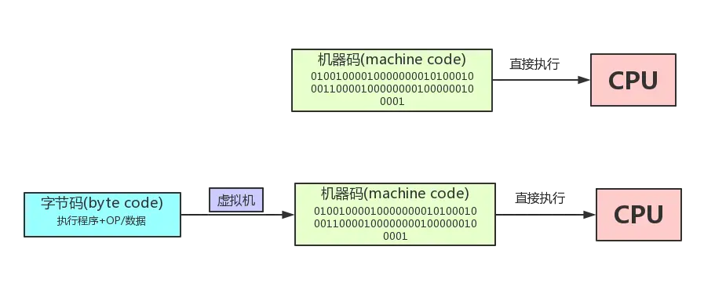

# 字节码与机器码

‍

## 1、机器码(machine code)
机器码(machine code)，学名`机器语言指令`，有时也被称为`原生码（Native Code）`，是电脑的`CPU可直接解读`的数据(计算机只认识0和1)。

通常意义上来理解的话，机器码就是计算机可以直接执行，并且执行速度最快的代码。

用`机器语言编`写程序，编程人员要首先熟记所用计算机的全部指令代码和代码的涵义。手编程序时，程序员得自己处理每条指令和每一数据的存储分配和输入输出，还得记住编程过程中每步所使用的工作单元处在何种状态。除了计算机生产厂家的专业人员外，绝大多数的程序员已经不再去学习机器语言了。

总结：机器码是电脑CPU直接读取运行的机器指令，运行速度最快，但是非常晦涩难懂，也比较难编写，一般从业人员接触不到。

## 2、字节码(byte code)
字节码（byte code）是一种包含`执行程序`、由一序列 `OP代码(操作码)/数据对` 组成的二进制文件。  
字节码是一种`中间码`，它比机器码更抽象，需要`直译器转译`后才能成为机器码的中间代码。可以理解为是半编译状态。

通常情况下它是已经经过编译，`但与特定机器码无关`。字节码通常不像源码一样可以让人阅读，而是编码后的数值常量、引用、指令等构成的序列。

字节码主要为了实现特定软件运行和软件环境、与硬件环境无关。字节码的实现方式是通过编译器和虚拟机器。编译器将源码编译成字节码，特定平台上的虚拟机器将字节码转译为可以直接执行的指令。

字节码的典型应用为`Java bytecode`。  
字节码在运行时通过`JVM（JAVA虚拟机）`做一次转换生成机器指令，因此能够更好的`跨平台`运行。

总结：字节码是一种中间状态（中间码）的二进制代码（文件）。需要直译器转译后才能成为机器码。

‍

‍

