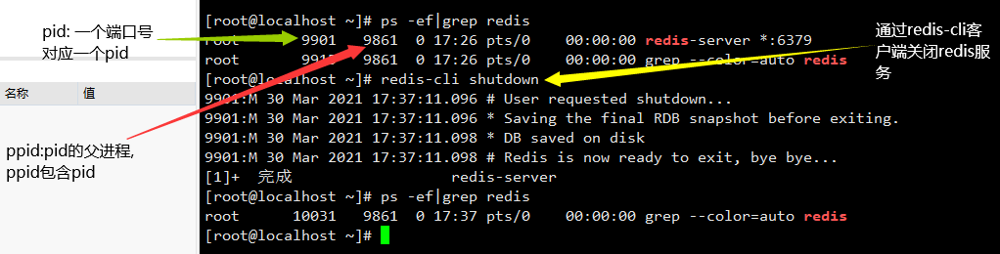
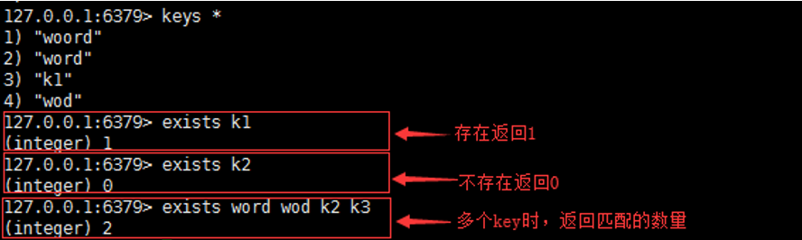
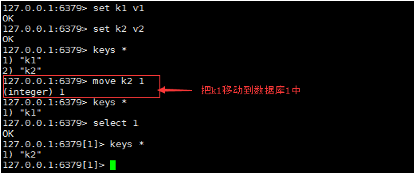
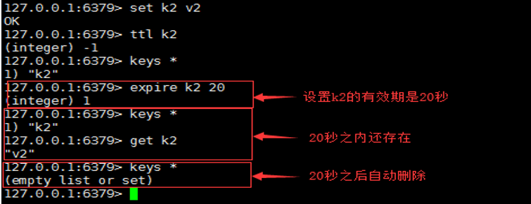
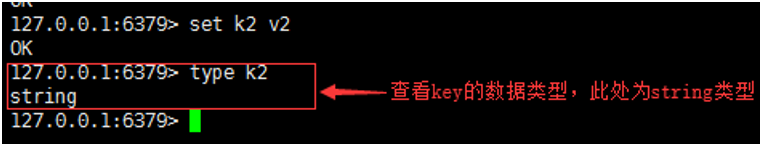
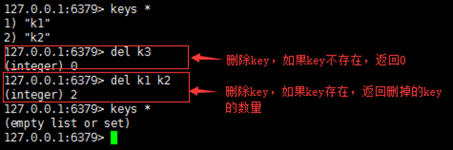

## 1.redis服务

### 启动redis

 

### 关闭redis

 

## 2.redis客户端

### 连接redis服务

```
redis-cli     #默认连接(127.0.0.1)本机 ,端口6379的redis服务

redis-cli   -p 端口号   #连接本机(127.0.0.1)的指定端口的redis服务

redis-cli   -h  ip地址    -p  端口号     #连接指定ip主机的指定端口号的redis服务
```

### 退出客户端

```
在客户端内执行quit   或者  exit   退出客户端
```

# 2,redis基本知识

## 五种数据类型

- string

  字符串类型是Redis中最基本的数据结构，它能存储任何类型的数据，包括二进制数据，序列化后的数据，JSON化的对象甚至是一张图片。最大512M

- list

  Redis列表是简单的字符串列表，按照插入顺序排序，元素可以重复。你可以添加一个元素到列表的头部（左边）或者尾部（右边）,底层是个链表结构

- set

  Redis的Set是string类型的无序无重复集合。

- hash

  Redis hash 是一个string类型的field和value的映射表，hash特别适合用于存储对象。

- zset

  Redis 有序集合zset和集合set一样也是string类型元素的集合，且不允许重复的成员。

  不同的是zset的每个元素都会关联一个分数（分数可以重复），redis通过分数来为集合中的成员进行从小到大的排序。

## 常用命令

```
  1)、测试redis服务的性能：
       redis-benchmark
       
   2)、查看redis服务是否正常运行：
       ping  如果正常---pong
       
   3)、查看redis服务器的统计信息：
       info  查看redis服务的所有统计信息
       info [信息段] 查看redis服务器的指定的统计信息，如：info Replication    #查看redis集群信息
       
   4)、redis的数据库实例：作用类似于mysql的数据库实例，redis中的数据库实例只能由redis服务来创建和维护，开发人员不能修改和自行创建数据库实例；默认情况下，redis会自动创建16个数据库实例，并且给这些数据库实例进行编号，从0开始，一直到15，使用时通过编号来使用数据库；可以通过配置文件，指定redis自动创建的数据库个数；redis的每一个数据库实例本身占用的存储空间是很少的，所以也不造成存储空间的太多浪费。
      默认情况下，redis客户端连接的是编号是0的数据库实例；可以使用select index切换数据库实例。
      
   5)、查看当前数据库实例中所有key的数量：dbsize
   
   6)、查看当前数据库实例中所有的key：keys *   
   
   7)、清空数据库实例：flushdb
   
   8)、清空所有的数据库实例：flushall
   
   9)、查看redis中所有的配置信息：config get *
   
       查看redis中的指定的配置信息：config get parameter
```

## 关于key命令

### 1.keys  

语法：keys pattren

作用：查找所有符合模式pattern的key.         pattern可以使用通配符。

通配符：

-  *：表示0或多个字符，例如：keys * 查询所有的key。

- ？：表示单个字符，例如：wo?d , 匹配 word , wood

-  [] ：表示选择[]内的一个字符，例如wo[or]d, 匹配word, wood, 不匹配wold、woord

   

### 2.exists

语法：exists key [key…]

作用：判断key是否存在

返回值：整数，存在key返回1，其他返回0。使用多个key，返回存在的key的数量。

 

### 3.move

语法：move key db

作用：移动key到指定的数据库，移动的key在原库被删除。

返回值：移动成功返回1，失败返回0.

 

### 4.ttl

语法：ttl key

作用：查看key的剩余生存时间（ttl: time to live），以秒为单位。

返回值：

- -1 ：没有设置key的生存时间， key永不过期。

-  -2：key不存在

   

### 5.expire

语法：expire key seconds

作用：设置key的生存时间，超过时间，key自动删除。单位是秒。

返回值：设置成功返回数字 1，其他情况是 0 。

 

### 6.type

语法：type key

作用：查看key所存储值的数据类型

返回值：字符串表示的数据类型

- none (key不存在)

- string (字符串) 

- list (列表)

- set (集合)

- zset (有序集)

- hash (哈希表)

     

### 7.rename

语法：rename key newkey

作用：将key改为名newkey。当 key 和 newkey 相同，或者 key 不存在时，返回一个错误。

当 newkey 已经存在时， RENAME 命令将覆盖旧值

 

### 8.del

语法：del key [key…]

作用：删除存在的key，不存在的key忽略。

返回值：数字，删除的key的数量。

 

## 关于string命令

### 基本命令

1. set  /   get   

   语法：set  key  value   /  get  key 

   作用：设置key对应的value，根据key取value

   返回值：ok：存储成功   /    vaule ：key对应的值

2. append   

   语法：append  key   value   

   作用：在指定key后拼接value的值，若key不存在，则新存储一个key-value，

   返回值：拼接之后的字符串长度

3. strlen

   语法：strlen    key

   作用：获取key对应的value的长度

   返回值：value的长度

4. incr   /    decr  

   语法：incr  key    /    decr   key  

   作用：对key的value进行加  /  减   1的操作  ，当key不存在时，则新存储一个key初始化value为0，然后再加1  减  1

   返回值：加  /   减  1  之后的value值

5. incrby    /  decrby

   语法：incrby   key   offset  /  decrby   key   offset

   作用：对key的value进行加减  offset的操作  ，当key不存在时，则新存储一个key初始化 value为0，然后进行加/减  offset操作

   返回值：加/减  offset 之后的value值

6. getrange  /  setrange  获取范围内的子字符串  /   从指定位置设置字符串    (range :  范围的意思)

   - getrange

     语法：getrange  key  start  end   

     作用：获取key对应的value，从start下标到end下标闭区间的子字符串

     下标：从左到右   0,1,2,3,4,5。		从右到左  -1，-2，-3，-4，-5

     返回值：子字符串的值（不影响数据库中的值）

   - setrange

     语法：setrange key  offset  value

     作用：设置key对应的value，从offset下标开始，将value替换原value的字符

     返回值：字符串的长度（影响数据库的值）

      

7. setex   （set  expire）

   语法：setex   key  seconds   value 

   作用：设置一个k-v,同时设置存活时间，若key存在，则覆盖value，同时指定存活时间

   返回值：ok，设置成功

8. setnx     (set not exists)

   语法：setnx key value 

   作用：存储key-value，仅当key不存在时设置成功，若key存在，设置失败

   返回值： 1：设置成功；0：设置失败

9. mset  /   mget  

   语法：mset  k1 v1 k2 v2 k3 v3   /  mget k1 k2 k3     (使用空格间隔)

   作用：设置多个k-v，如果存在则覆盖   /  获取多个key 对应的value的值，若key不存在则返回对应的（nil）

   返回值：ok：设置成功   /   取得的多个value的值

10. msetnx   (more set  not exist)

    语法：msetnx  k1 v1  k2  v2  k3  v3   (空格间隔)

    作用：设置多个k-v，仅当所有key都不存在时设置成功，若有一个key是存在的，则全都失败

    返回值：1：设置成功；0：设置失败

## 关于list命令 

1. lpush   /  rpush

   - lpush  : left  push

     语法：lpush  key  v1 v2 v3 v4

     作用：将一个或者多个value值插入到表头，插入后元素的顺序是  v4  v3  v2  v1

     返回值：插入之后列表的长度

   - rpush：right push

     语法：rpush  key  v1 v2 v3 v4

     作用：将一个或多个value值插入到表尾，插入之后的元素顺序是 v1 v2 v3  v4

     返回值：插入之后列表的长度

    

2. lrange ： list  range  根据list范围获取value

   语法：lrange  key  start  end

   作用：截取取key对应的value中从start到end下标之间闭区间的子字符串

   返回值：截取子字符串的内容

   下标：从左到右 ：0 1 2 3 4 5；从右到左：-1 -2 -3 -4

   遍历list所有元素的用法：lrange  key  0  -1

3. lpop   /    rpop    (lefit  pop   /    right   pop  pop：弹出的意思)

   - lpop

     语法：lpop  key  

     作用：移出指定key的list中的表头的第一个元素

     返回值：被移出的表头元素

   - rpop

     语法：rpop key 

     作用：移出指定key的list中的表尾的第一个元素

     返回值：被移出的表尾元素

4. lindex  (list index )  根据下标获取元素

   语法：lindex  key  index

   作用：获取指定下标下的list对应的元素

   返回值：key存在时，返回该元素的值，key不存在时，返回nil

5. llen  (list len )  

   语法：llen  key  

   作用：返回key指定的list的长度

   返回值：若key存在，则返回list的长度，若不存在，则返回0

6. lrem  (list  remove)

   语法：lrem  key  count  value  

   作用：

   - count>0：从key指定的list中从左向右移出 count个 与value相同的元素
   - count<0：从key指定的list中从右向左移出count个与value相同的元素
   - count=0：从key指定的list中移出所有与value相同的元素

   返回值：移出与value相同元素的个数

7. ltrim( list  trim  集合修剪)

   语法：ltrim  key  start  end

   作用：从key指定的list中截取start-end闭区间的元素并赋值给key

   返回值：ok，成功

    

8. lset   （list  set）

   语法：lset  key  index  value

   作用：设置指定list中指定index的值为value

   返回值：ok

9. linsert  (list  insert)

   语法：linsert key BEFORE|AFTER  pivot  value

   作用：将值 value 插入到列表 key 当中位于值 pivot 之前或之后的位置。key不存在或者pivot不在列表中，不执行任何操作。（pivot			从左向右寻找，重复时选取第一个）

   返回值：命令执行成功，返回新列表的长度。没有找到pivot返回 -1， key不存在返回0。

## 关于set命令

1. sadd（set add）

   语法：sadd key  v1 v2 v3 v4 v5 v6 v7 v8

   作用：将一个或多个member元素添加到集合key中，已经存在的元素不			会在加入

   返回值：加入到集合中新元素的个数，就是成功加入了几个元素

2. smembers  （set members）

   语法：smembers  key

   作用：获取指定key对应的集合中的所有成员元素

   返回值：key存在则返回所有成员，若不存在则返回空

3. sismember （set is member）

   语法：sismembers key value

   作用：判断指定集合中是否存在value元素

   返回值：若存在，返回1，若不存在，返回0

4. scard （set card：计数的意思）

   语法：scard key

   作用：统计指定key中所有元素的数量

   返回值：若key存在，返回元素的数量，若key不存在，返回0

5. srem（set remove）

   语法：srem key v1 v2 v3 v4 v5

   作用：移除指定key的集合中一个或多个元素，不存在的元素被忽略

   返回值：若key存在，返回成功移除元素的个数，否则返回0

6. srandmember（set randmember ：随机成员）

   语法：srandmember key count

   作用：从key指定的集合中随机获取count个元素，返回的元素可以重复

   返回值：若key存在，每次获取的元素；否则返回空

    

7. spop（set pop：随机移除一个元素）

   语法：spop key count

   作用：与srangmember类似，不同的是：spop会移除元素，srandmember是获取元素，不会从集合中删除

   返回值：被删除的元素，key不存在或空集合返回nil

8. smove （set move）

   语法：smove src dest value

   作用：从src集合中移动value元素到dest集合

   返回值：若value不存在，返回0，若dest存在value，则从src中删除value，成功返回1

9. sdiff（set differenet）

   语法：sdiff key key [key…]

   功能：返回指定集合的差集，以第一个集合为准进行比较，即第一个集合中有但在其它任何集合中都没有的元素组成的集合。

   返回值：返回第一个集合中有而后边集合中都没有的元素组成的集合，如果第一个集合中的元素在后边集合中都有则返回空集合。

10. sinter

    语法：sinter key key [key…]

    功能：返回指定集合的交集，即指定的所有集合中都有的元素组成的集合。

    返回值：交集元素组成的集合，如果没有则返回空集合。

11. sunion

    语法：sunion key key [key…]

    功能：返回指定集合的并集，即指定的所有集合元素组成的大集合，如果元素有重复，则保留一个。

    返回值：返回所有集合元素组成的大集合，如果所有key都不存在，返回空集合。

## 关于hash命令


## 关于zset命令

