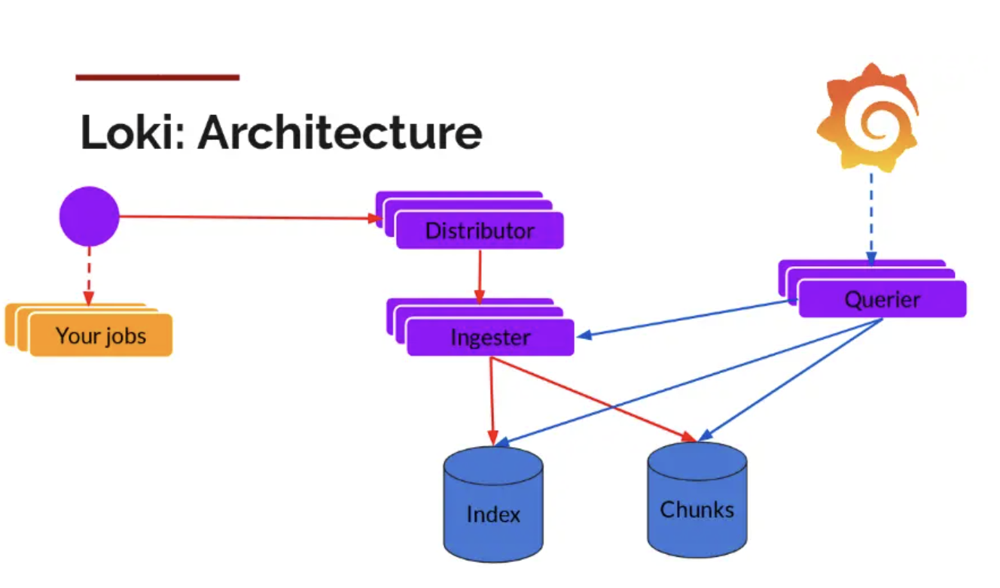

Loki是受Prometheus启发由Grafana Labs团队开源的水平可扩展，高度可用的多租户日志聚合系统。 开发语言: Google Go。它的设计具有很高的成本效益，并且易于操作。使用标签来作为索引，而不是对全文进行检索，也就是说，通过这些标签既可以查询日志的内容也可以查询到监控的数据签，极大地降低了日志索引的存储。系统架构十分简单，由以下3个部分组成 ：

**Loki 是主服务器，负责存储日志和处理查询 。promtail 是代理，负责收集日志并将其发送给 loki 。Grafana 用于 UI 展示。**

只要在应用程序服务器上安装promtail来收集日志然后发送给Loki存储，就可以在Grafana UI界面通过添加Loki为数据源进行日志查询（如果Loki服务器性能不够，可以部署多个Loki进行存储及查询）。作为一个日志系统不光只有查询分析日志的能力，还能对日志进行监控和报警。



promtail收集并将日志发送给loki的 Distributor 组件，Distributor会对接收到的日志流进行正确性校验，并将验证后的日志分批并行发送到Ingester，Ingester 接受日志流并构建数据块，压缩后存放到所连接的存储后端，Querier 收到HTTP查询请求，并将请求发送至Ingester 用以获取内存数据 ，Ingester 收到请求后返回符合条件的数据，如果 Ingester 没有返回数据，Querier 会从后端存储加载数据并遍历去重执行查询 ，通过HTTP返回查询结果

**与 ELK 比 较优势**

ELK虽然功能丰富，但规模复杂，资源占用高，操作苦难，很多功能往往用不上，有点杀鸡用牛刀的感觉。loki 不对日志进行全文索引。通过存储压缩非结构化日志和索引元数据，Loki 操作起来会更简单，更省成本。通过使用与 Prometheus 相同的标签记录流对日志进行索引和分组，这使得日志的扩展和操作效率更高。安装部署简单快速，且受 Grafana 原生支持。

## 容器化安装

**docker安装PGL**

```shell
# loki-config.yaml官网下载
wget https://raw.githubusercontent.com/grafana/loki/v2.9.0/cmd/loki/loki-local-config.yaml -O loki-config.yaml
# 运行loki
docker run --name loki -d -v $(pwd):/mnt/config -p 3100:3100 grafana/loki:2.9.0 -config.file=/mnt/config/loki-config.yaml
# promtail-config.yaml官方下载
wget https://raw.githubusercontent.com/grafana/loki/v2.9.0/clients/cmd/promtail/promtail-docker-config.yaml -O promtail-config.yaml
# 运行promtail
docker run --name promtail --privileged=true -d -v $(pwd):/mnt/config  -v /home/gic/gic-server-springcloud:/home/gic/gic-server-springcloud --link loki grafana/promtail:2.9.0 -config.file=/mnt/config/promtail-config.yaml

# grafana
docker volume create granfa
docker run -d -p 3000:3000 --name=grafana --volume grafana:/var/lib/grafana grafana/grafana-enterprise
```

### 默认配置文件解析

```yml
# loki-config.yaml
auth_enabled: false

server:
  http_listen_port: 3100 # http_listen_port: 配置HTTP监听端口号为3100。
  grpc_listen_port: 9096

common:
  instance_addr: 127.0.0.1
  path_prefix: /tmp/loki
  storage:
    filesystem:
      chunks_directory: /tmp/loki/chunks
      rules_directory: /tmp/loki/rules
  replication_factor: 1
  ring:
    kvstore:
      store: inmemory

query_range:
  results_cache:
    cache:
      embedded_cache:
        enabled: true
        max_size_mb: 100

schema_config:
  configs:
    - from: 2020-10-24
      store: boltdb-shipper
      object_store: filesystem
      schema: v11
      index:
        prefix: index_
        period: 24h

ruler:
  alertmanager_url: http://localhost:9093

# By default, Loki will send anonymous, but uniquely-identifiable usage and configuration
# analytics to Grafana Labs. These statistics are sent to https://stats.grafana.org/
#
# Statistics help us better understand how Loki is used, and they show us performance
# levels for most users. This helps us prioritize features and documentation.
# For more information on what's sent, look at
# https://github.com/grafana/loki/blob/main/pkg/usagestats/stats.go
# Refer to the buildReport method to see what goes into a report.
#
# If you would like to disable reporting, uncomment the following lines:
#analytics:
#  reporting_enabled: false
```

```yml
# promtail-config.yaml
server:
  http_listen_port: 9080
  grpc_listen_port: 0

positions:
  filename: /tmp/positions.yaml

clients:
  - url: http://loki:3100/loki/api/v1/push

scrape_configs:
- job_name: system
  static_configs:
  - targets:
      - localhost
    labels:
      job: gic-server
      __path__: /vdd/ynk/gic/gic-server-springcloud/*log
```

## 收集其他机器日志

在其他机器上收集日志并将其发送到 Loki，那么在每台机器上都需要安装 Promtail。Promtail 是 Loki 的客户端代理，用于在本地收集日志并将其发送到 Loki 服务器。

以下是在其他机器上安装和配置 Promtail 的基本步骤：

1. **安装 Promtail：**

    * 从 Loki 的[GitHub Releases](https://github.com/grafana/loki/releases)页面下载 Promtail 的二进制文件，并在每台机器上进行安装。
    * 下载 Promtail 的二进制文件 wget https://github.com/grafana/loki/releases/download/v2.3.0/promtail-linux-amd64 -0 promtail
2. **配置 Promtail：**

    修改 Promtail 的配置文件 `promtail-local-config.yaml`​，根据需要调整其中的配置项，如 Loki 服务器的地址、要监控的日志文件路径等。确保 `url`​ 配置项指向 Loki 服务器。

    ```yaml
    server:
      http_listen_port: 9080
      grpc_listen_port: 0

    positions:
      filename: /tmp/positions.yaml

    clients:
      - url: http://loki-server-ip:3100/loki/api/v1/push

    scrape_configs:
      - job_name: system
        static_configs:
          - targets:
              - localhost
            labels:
              job: varlogs
              __path__: /var/log/*log
    ```

    这里的 `loki-server-ip`​ 是 Loki 服务器的 IP 地址。
3. **启动 Promtail：**

    在每台机器上启动 Promtail，使用以下命令：

    ```bash
    ./promtail -config.file=promtail-local-config.yaml
    ```

通过在每台机器上安装和配置 Promtail，你可以将各机器上的日志发送到 Loki 服务器进行集中存储和查询。请确保 Loki 服务器和 Promtail 的配置是匹配的，以便能够正确地收集和存储日志数据。

**不需要在每台机器上安装 Loki**。Loki 是一个分布式的日志聚合系统，通常部署为集中式服务。在典型的架构中，你只需要在一个或少数几台服务器上安装 Loki，并配置其他机器上的 Promtail 以将日志数据发送到这个 Loki 服务器。

以下是基本的架构：

1. **Loki 服务器：**

    * 安装 Loki，参考 Loki 的[GitHub Releases](https://github.com/grafana/loki/releases)页面。
    * 配置 Loki，根据需要调整 `loki-local-config.yaml`​ 配置文件。
2. **Promtail 客户端：**

    * 在每台要收集日志的机器上安装 Promtail。
    * 配置 Promtail，确保 `url`​ 指向 Loki 服务器。

    * Promtail 将本地日志收集并发送到 Loki 服务器。

总结：Loki 服务器作为中心化的服务，而 Promtail 客户端被安装在每台要收集日志的机器上。Promtail 将本地日志发送到 Loki 服务器，使得 Loki 可以集中存储和查询这些日志数据。

### 启动脚本

你可以将这个命令写入一个简单的 Shell 脚本，比如一个名为 `start_promtail.sh`​ 的文件。以下是一个示例：

```bash
#!/bin/bash

# 启动 promtail 并将输出写入日志文件
nohup ./promtail -config.file=promtail-config.yaml > promtail.log 2>&1 &

# 提示消息
echo "Promtail 已启动，查看日志文件：promtail.log"
```

然后，通过运行以下命令为脚本添加执行权限：

```bash
chmod +x start_promtail.sh
```

接着，你可以使用 `./start_promtail.sh`​ 来运行这个脚本，它将启动 `promtail`​ 并将输出写入 `promtail.log`​ 文件。脚本中的 `echo`​ 语句提供了一个简单的提示消息，让你知道 `promtail`​ 已经启动，可以查看日志文件了。请确保脚本中的路径和文件名与实际情况匹配。如果需要，你可以根据你的需求修改脚本。

### 重启脚本

你可以将上述步骤写入一个脚本中，以便更方便地执行。以下是一个简单的 Bash 脚本示例，假设脚本名称为 `restart_promtail.sh`​：

```bash
#!/bin/bash

# 获取 promtail 进程的 PID
promtail_pid=$(ps aux | grep '[p]romtail' | awk '{print $2}')

if [ -n "$promtail_pid" ]; then
  # 杀死 promtail 进程
  echo "Killing existing promtail process with PID $promtail_pid"
  kill -9 "$promtail_pid"
  sleep 1  # 等待一秒确保进程已终止
fi

# 启动新的 promtail 进程
echo "Starting promtail"
nohup ./promtail -config.file=promtail-config.yaml > promtail.log 2>&1 &

echo "Promtail restarted"
```

这个脚本的功能如下：

1. 获取现有 `promtail`​ 进程的 PID。
2. 如果找到 `promtail`​ 进程，使用 `kill -9`​ 杀死进程。
3. 启动新的 `promtail`​ 进程。

确保给脚本执行权限：

```bash
chmod +x restart_promtail.sh
```

然后，你可以运行脚本：

```bash
./restart_promtail.sh
```

这样就能够自动完成杀死现有 `promtail`​ 进程并启动新的 `promtail`​ 进程的操作。脚本中的输出语句会提供一些信息，告诉你脚本执行的情况。

### 脚本解释

这个 Bash 脚本是用于重启 Loki 的 `promtail`​ 进程的。让我解释一下脚本的各个部分：

1. **获取** **`promtail`**​ **进程的 PID：**

    ```bash
    promtail_pid=$(ps aux | grep '[p]romtail' | awk '{print $2}')
    ```

    * ​`ps aux`​：显示所有正在运行的进程。
    * ​`grep '[p]romtail'`​：使用 `grep`​ 查找包含字符串 "promtail" 的进程。`[p]`​ 是为了避免匹配到 grep 进程本身。
    * ​`awk '{print $2}'`​：使用 `awk`​ 提取进程列表中的第二列，即进程的 PID（进程 ID）。

    这个命令的目的是获取 `promtail`​ 进程的 PID，并将其存储在变量 `promtail_pid`​ 中。
2. **检查是否找到** **`promtail`**​ **进程：**

    ```bash
    if [ -n "$promtail_pid" ]; then
    ```

    这个条件语句检查变量 `promtail_pid`​ 是否非空，即是否找到了 `promtail`​ 进程。
3. **杀死** **`promtail`**​ **进程：**

    ```bash
    echo "Killing existing promtail process with PID $promtail_pid"
    kill -9 "$promtail_pid"
    ```

    * ​`echo`​：输出消息到标准输出。
    * ​`kill -9 "$promtail_pid"`​：使用 `kill`​ 命令强制终止（`-9`​）指定 PID 的进程。

    这部分的目的是向终端输出一条消息，然后强制终止现有的 `promtail`​ 进程。
4. **等待进程终止：**

    ```bash
    sleep 1  # 等待一秒确保进程已终止
    ```

    使用 `sleep`​ 命令等待一秒，以确保 `promtail`​ 进程有足够的时间终止。
5. **启动新的** **`promtail`**​ **进程：**

    ```bash
    echo "Starting promtail"
    nohup ./promtail -config.file=promtail-config.yaml > promtail.log 2>&1 &
    ```

    * ​`echo`​：输出消息到标准输出，指示正在启动新的 `promtail`​ 进程。
    * ​`nohup`​：使命令忽略挂断信号，使其在脚本运行结束后继续运行。
    * ​`./promtail -config.file=promtail-config.yaml`​：启动新的 `promtail`​ 进程，并指定配置文件。
    * ​`> promtail.log 2>&1`​：将标准输出和标准错误重定向到 `promtail.log`​ 文件。
    * ​`&`​：使命令在后台运行。

    这一部分的目的是启动新的 `promtail`​ 进程。
6. **输出提示消息：**

    ```bash
    echo "Promtail restarted"
    ```

    输出一条提示消息，指示 `promtail`​ 已经重新启动。

总体而言，这个脚本的功能是检查并终止现有的 `promtail`​ 进程，然后启动一个新的 `promtail`​ 进程。
