## 前言

> 秒杀和高并发是面试的高频考点，也是我们做电商项目必知必会的场景。**欢迎大家参与我们的开源项目，提交PR，提高竞争力。早日上岸，升职加薪。**

## 知识点详解

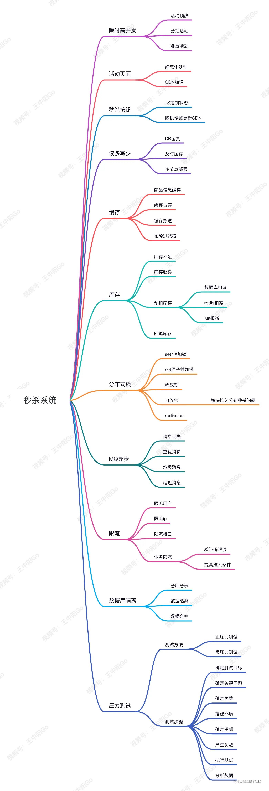

## 秒杀系统架构图


## 秒杀流程图


## 秒杀系统设计

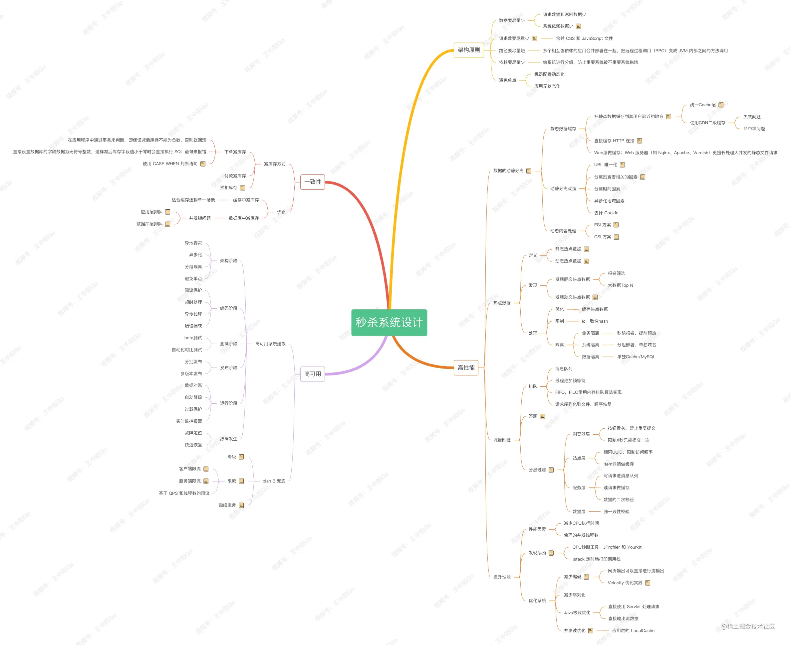

这篇文章一万多字，详细解答了大家在面试中经常被问到的秒杀问题，对做秒杀项目的朋友也应该有帮助。

**欢迎大家交流讨论、点赞、收藏、转发。**

本文除了结合我的项目经验、也感谢**GoFrame**作者强哥的帮助、我的好友**苏三**哥的帮助（公众号：**苏三说技术**）。

文章中的图片会压缩，高清版思维导图可以关注我的公众号 [**程序员升职加薪之旅**](https://link.juejin.cn/?target=https%3A%2F%2Fmp.weixin.qq.com%2Fs%3F__biz%3DMzIyNjM0MzQyNg%3D%3D%26mid%3D2247486565%26idx%3D2%26sn%3D76e0d850c0a7d2cfe398ca2c1391c4d9%26chksm%3De870a308df072a1e73c42f4cdb99a636614ad8eff839168fb1bc3241156899e2a9420ed4cea9%26token%3D400433917%26lang%3Dzh_CN%23rd "https://mp.weixin.qq.com/s?__biz=MzIyNjM0MzQyNg==&mid=2247486565&idx=2&sn=76e0d850c0a7d2cfe398ca2c1391c4d9&chksm=e870a308df072a1e73c42f4cdb99a636614ad8eff839168fb1bc3241156899e2a9420ed4cea9&token=400433917&lang=zh_CN#rd") ，回复：“**秒杀**” 领取。

## 1. 瞬时高并发

瞬时高并发是秒杀项目的典型问题，常规的架构设计和代码实现在一般活动中可以应对，但是却经受不住瞬时高并发的考验。

这也是为什么秒杀能成为一个面试高频考点。

本文从浅入深，先将业务再讲原理，先讲问题再将方案，先讲理论再上代码。

也欢迎大家加入我的 [学习圈子](https://link.juejin.cn/?target=https%3A%2F%2Fmp.weixin.qq.com%2Fs%2FIUsfZGiOPtFIB1GBr10l7g "https://mp.weixin.qq.com/s/IUsfZGiOPtFIB1GBr10l7g")，参与到我使用**GoFrame**开源的电商项目中，欢迎star：

[github.com/wangzhongya…](https://link.juejin.cn/?target=https%3A%2F%2Fgithub.com%2Fwangzhongyang007%2Fgoframe-shop-v2 "https://github.com/wangzhongyang007/goframe-shop-v2")

[github.com/gogf/gf](https://link.juejin.cn/?target=https%3A%2F%2Fgithub.com%2Fgogf%2Fgf "https://github.com/gogf/gf")

### 秒杀业务的场景

1.  预抢购业务：活动未正式开始前，先进行活动预约。在真正秒杀的时间点，很多数据都是预处理好的了，可以很大程度削减系统压力。比如：活动预约、订金预约、火车票预约等
    
2.  分批抢购业务：分时段多场次抢购，比如我们熟悉的京东满减优惠券就是分场次开放的，整点抢购。
    
3.  实时秒杀：这是最有难度的秒杀场景，比如双11晚上0点秒杀，在这个时间点前后会涌入高并发流量：频繁刷新页面、疯狂点击抢购按钮、甚至利用机器模拟请求。
    

下面就按照思维导图的顺序，为大家展开聊聊**如何做好秒杀系统的设计？**

## 2. 活动页面

活动页面是用户流量的第一入口，是并发量最大的地方。

如果这些流量都直接访问服务端，服务端会因为承受不住这么大的压力，而直接挂掉。

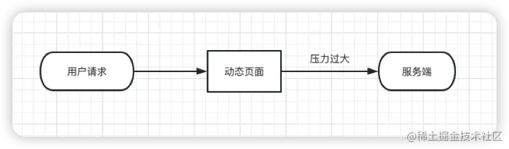

活动页面绝大多数内容是固定的，比如：商品名称、商品描述、图片等。

为了减少不必要的服务端请求，通常情况下，**会对活动页面做静态化处理**。

因为用户浏览商品等常规操作，并不会请求到服务端。只有到了秒杀时间点，并且用户主动点了秒杀按钮才允许访问服务端。

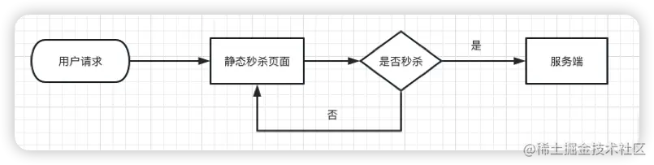

### CDN

更进一步，只做页面静态化还不够，因为用户分布在全国各地，有些人在北京，有些人在上海，有些人在深圳，地域相差很远，网速各不相同。

如何才能让用户最快访问到活动页面呢？

这就需要使用**CDN**，它的**全称是Content Delivery Network，即内容分发网络**。

使用户能够就近获取所需内容，提高用户访问活动页面的响应速度和命中率。


## 3 秒杀按钮

如果你也参与过秒杀活动，应该有这样的体会：**因为担心错过秒杀时间，会提前进入活动页面，并且不断的刷新页面。**

很多秒杀活动在活动开始前，秒杀按钮是置灰，不可点击的。只有到了秒杀时间点那一时刻，秒杀按钮才会自动点亮，变成可点击的。

**往往在秒杀开始之前，很多用户已经迫不及待了，通过不停刷新页面，争取在第一时间看到秒杀按钮的点亮。**

大家思考一个问题：这个活动页面是静态的，我们在静态页面中如何控制秒杀按钮，只在秒杀时间点时才点亮呢？

答案就是：**使用js文件控制。**

为了性能考虑，我们一般会将css、js和图片等静态资源文件提前缓存到CDN上，让用户能够就近访问秒杀页面。

### 更新CDN

我们还要考虑一个问题：CDN上的js文件要如何更新呢？

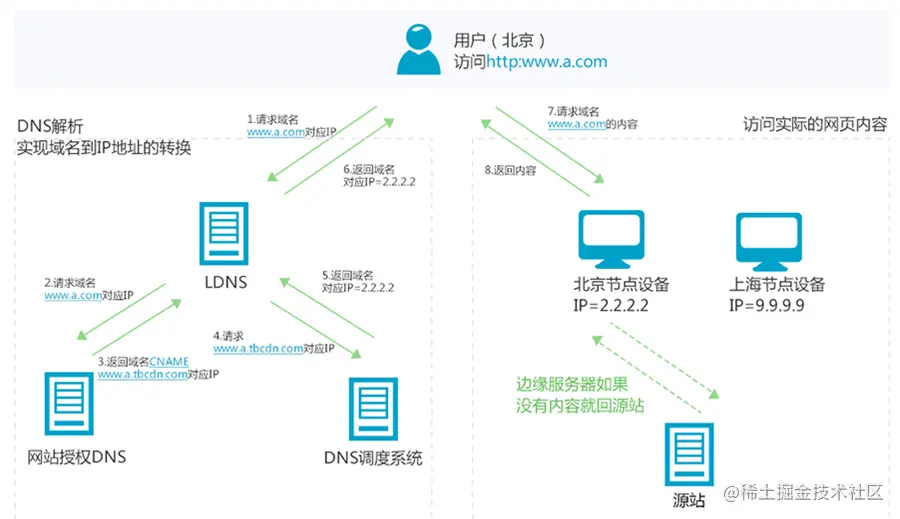

**我们可以通过在js中设置标记的方式来设置按钮的状态，比如isBegin=true代表活动开始，isBegin=false代表活动未开始。**

秒杀开始之前，js标志为false，秒杀活动开始时设置为true。为了达到这个效果，我们另外还需要一个随机参数用来主动刷新CDN。

**当秒杀开始的时候系统会生成一个新的js文件，此时标志为true，并且随机参数生成一个新值，然后同步给CDN。由于有了这个随机参数，CDN不会缓存数据，每次都能从CDN中获取最新的js代码。**

### 前端骚操作

除了使用CDN降低请求压力，**前端还可以加一个定时器，控制请求频率，比如：10秒之内，只允许发起一次请求。**

如果用户点击了一次秒杀按钮，则在10秒之内置灰，不允许再次点击，等到过了时间限制，又允许重新点击该按钮。

## 4 读多写少

秒杀是非常典型的“**读多写少**”场景。

在秒杀的过程中，系统一般会先查一下库存是否足够，如果库存充足才允许下单，写数据库。如果不够，则直接返回该商品已经抢完。

由于大量用户抢少量商品，只有极少部分用户能够抢成功，所以绝大部分用户在秒杀时，库存其实是不足的，系统会直接返回该商品已经抢完。

**如果有数十万的请求过来，并发请求数据库查库存是否足够，此时数据库可能会挂掉。**

因为数据库的连接资源非常有限，MySQL这类关系型数据库是无法同时支持这么多的连接。

那怎么办呢？

我们应该使用nosql缓存，比如：redis。


**注意：即便用了redis，在高并发场景下也需要部署多个节点。**

## 5 缓存

通常情况下，我们需要在redis中保存商品信息，包括：商品id、商品名称、规格属性、库存等信息，**同时数据库中也要有相关信息，毕竟缓存并不完全可靠。**

用户在点击秒杀按钮，请求秒杀接口的过程中，传入的商品id参数，服务端需要校验该商品是否合法。

大致流程如下图所示：


1.  根据商品id，先从缓存中查询商品，如果商品存在，则参与秒杀。
2.  如果不存在，则需要从数据库中查询商品：
3.  如果存在，则将商品信息放入缓存，然后参与秒杀。
4.  如果商品不存在，则直接提示失败。

这个过程表面上看起来是OK的，但是如果深入分析，会发现一些问题。

为了方便大家理解，也科普一下缓存常用问题：

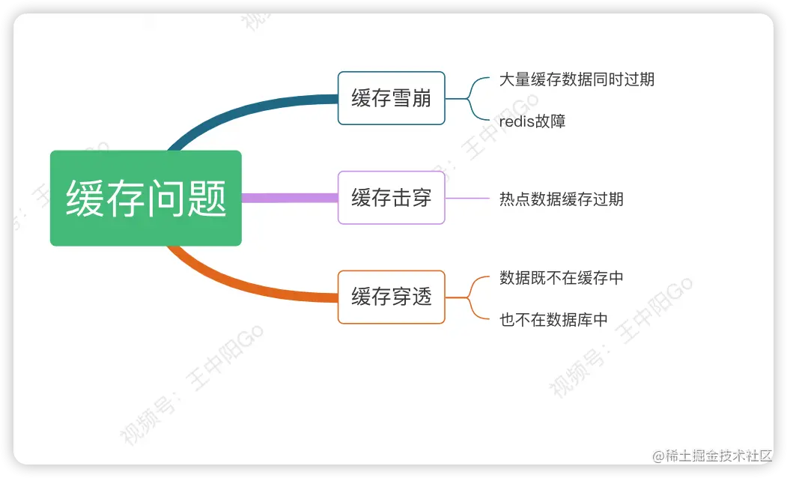

### 5.1 缓存击穿

比如商品A第一次秒杀时，缓存中是没有数据的，但数据库中有。虽说上面有从数据库中查到数据，放入缓存的逻辑。

**但是在高并发下，同一时刻会有大量的请求，都在秒杀同一件商品，这些请求同时去查缓存没有命中，然后又同时访问数据库。结果悲剧了，数据库可能扛不住压力，直接挂掉。**

如何解决这个问题呢？

这就需要加锁，最好使用**分布式锁**，思路见下图：


#### 预热

针对这种情况，我们最好在项目启动之前，先把缓存进行预热。

**事先把参与秒杀的所有商品，同步到缓存中，这样商品基本都能直接从缓存中获取到，就不会出现缓存击穿的问题了。**

是不是上面加锁这一步可以不需要了？

#### 双保险

表面上看起来，确实可以不需要。但是真实环境是比较复杂的，我们要考虑到意外情况，比如：

1.  缓存中设置的过期时间不对，缓存提前过期了
2.  或者缓存被不小心删除了
3.  或者缓存设置的时间过短，在秒杀活动结束前同时到期了

如果不加锁，上面这些情况很可能出现缓存击穿的问题。

**活动数据预缓存+分布式锁，相当于上了双保险。**

### 5.2 缓存穿透

如果有大量的请求传入商品id，并且在缓存和数据库中都不存在，这些请求就都会穿透过缓存，而直接访问数据库了。这就是典型的**缓存穿透**。

如果没有加锁的话很可能造成服务不可用。

**由于前面已经加了锁，所以即使这里的并发量很大，也不会导致数据库直接挂掉。但很显然这些请求的处理性能并不好。**

有没有更好的解决方案？

**布隆过滤器**你值得拥有

> 简单来说，布隆过滤器（BloomFilter）是一种数据结构。特点是**存在性检测**，**如果布隆过滤器中不存在，那么实际数据一定不存在**；如果布隆过滤器中存在，实际数据不一定存在。相比于传统数据结构（如：List、Set、Map等）来说，它更高效，占用空间更少。缺点是它对于存在的判断是具有概率性。


引入布隆过滤器后的流程如下：

1.  系统根据商品id，先从布隆过滤器中查询该id是否存在
2.  如果存在则允许从缓存中查询数据
3.  如果不存在，则直接返回失败。

#### 数据一致性

虽说该方案可以解决缓存穿透问题，但是又会引出另外一个问题：**布隆过滤器中的数据如何跟缓存中的数据保持一致？**

这就要求，如果缓存中数据有更新，就要及时同步到布隆过滤器中。

如果数据同步失败了，还需要增加重试机制，而且跨数据源，能保证数据的实时一致性吗？

显然是不能的。

#### 应用场景

**布隆过滤器建议使用在缓存数据更新很少的场景中。**

如果缓存数据更新非常频繁，又该如何处理呢？

#### 巧妙的设计

**我们可以把不存在的商品id也缓存起来。**

下次，再有该商品id的请求过来，则也能从缓存中查到数据，**只不过该数据比较特殊，表示商品不存在。** 需要特别注意的是，这种特殊缓存设置的超时时间应该尽量短一点。

## 6 库存问题

秒杀场景中的库存问题是比较复杂的，可不是简单的库存减1就ok了~

真正的秒杀场景，不是说扣完库存，就完事了。如果用户在一段时间内，还没完成支付，扣减的库存是要加回去的。

### 预扣库存

在这里为大家介绍**预扣库存**的概念，预扣库存的主要流程如下：


**扣减库存中除了上面说到的 _预扣库存_ 和 _回退库存_ 之外，还需要特别注意的是 _库存不足_ 和 _库存超卖_ 问题。**

下面逐个为大家解释：

### 6.1 数据库扣减库存

使用数据库扣减库存，是最简单的实现方案了，假设扣减库存的update sql如下：

```go
update product set stock=stock-1 where id=123;
复制代码
```

这种写法对于扣减库存是没有问题的，但如何控制库存不足的情况下，不让用户操作呢？

这就需要在update之前，先查一下库存是否足够了。

伪代码如下：

```go
int stock = product.getStockById(123);
if(stock > 0) {
  int count = product.updateStock(123);
  if(count > 0) {
    addOrder(123);
  }
}
复制代码
```

大家有没有发现这段代码的问题？

问题就是**查询操作和更新操作不是原子性的，会导致在并发的场景下，出现库存超卖的情况。**

有些同学可能会说：这简单，加把锁不就搞定了。

确实可以，但是性能不够好，**我们做秒杀一定要考虑高并发，考虑到性能问题。**

#### 优雅的方案

优雅的处理方案：**基于数据库的乐观锁，这样会少一次数据库查询，而且能够天然的保证数据操作的原子性。**

只需将上面的sql稍微调整一下：

```go
update product set stock=stock-1 where id=product_id and stock > 0;
复制代码
```

在sql最后加上：stock > 0，就能保证不会出现超卖的情况。

#### 进一步思考：

我们都知道数据库连接是非常昂贵的资源，在高并发的场景下，可能会造成系统雪崩。而且，容易出现多个请求，同时竞争行锁的情况，造成相互等待，从而出现死锁的问题。

除了上述方案有没有更好的办法呢？

当然有了，**nosql要比关系型数据库性能好很多，我们可以使用redis扣减库存：**

### 6.2 redis扣减库存

redis的incr方法是原子性的，可以用该方法扣减库存。伪代码如下：

```ini
boolean exist = redisClient.query(productId,userId);
  if(exist) {
    return -1;
  }

  int stock = redisClient.queryStock(productId);
  if(stock <=0) {
    return 0;
  }
  
  redisClient.incrby(productId, -1);
  redisClient.add(productId,userId);
  return 1;
复制代码
```

代码流程如下：

1.  先判断该用户有没有秒杀过该商品，如果已经秒杀过，则直接返回-1。
2.  查询库存，如果库存小于等于0，则直接返回0，表示库存不足。
3.  如果库存充足，则扣减库存，然后将本次秒杀记录保存起来。然后返回1，表示成功。

估计很多小伙伴，一开始都会按这样的思路写代码。

但仔细想想会发现，这段代码也有问题。有什么问题呢？

**如果在高并发下，有多个请求同时查询库存，当时都大于0。由于查询库存和更新库存非原则操作，则会出现库存为负数的情况，即库存超卖。**

其实解决这个问题也很简单，我们回忆一下上面数据库扣减库存的原子操作，redis扣减库存同样适用这个思路，为了解决上面的问题，代码优化如下：

```ini
boolean exist = redisClient.queryJoined(productId,userId);
if(exist) {
  return -1;
}
if(redisClient.incrby(productId, -1)<0) {
  return 0;
}
redisClient.add(productId,userId);
return 1;
复制代码
```

该代码主要流程如下：

1.  先判断该用户有没有秒杀过该商品，如果已经秒杀过，则直接返回-1。
2.  扣减库存，判断返回值是否小于0，如果小于0，则直接返回0，表示库存不足。
3.  如果扣减库存后，返回值大于或等于0，则将本次秒杀记录保存起来。然后返回1，表示成功。

这个方案已经比较优雅了，但是还不够好。

如果在高并发场景中，有多个请求同时扣减库存，大多数请求的incrby操作之后，结果都会小于0。

虽说，库存出现负数，不会出现超卖的问题。但由于这里是预减库存，如果负数值负的太多的话，后面万一要回退库存时，就会导致库存不准。

那么，有没有更好的方案呢？

### 6.3 Lua脚本扣减库存

> Redis在2.6版本推出了 Lua 脚本功能，允许开发者使用Lua语言编写脚本传到Redis中执行。

使用Lua脚本的好处如下:

1.  减少网络开销：可以将多个请求通过脚本的形式一次发送，减少网络时延
2.  原子操作：redis会将整个脚本作为一个整体执行，中间不会被其他请求插入。因此在脚本执行过程中无需担心会出现竞态条件，无需使用事务
3.  复用：客户端发送的脚本会永久存在redis中，这样其他客户端可以复用这一脚本，而不需要使用代码完成相同的逻辑

Go语言要执行lua脚本也是很简单的，有很多依赖库可以使用：

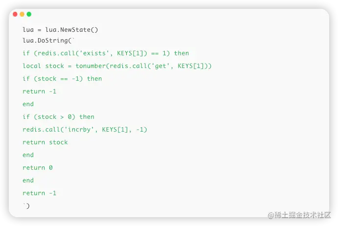

上述lua代码的流程如下：

1.  先判断商品id是否存在，如果不存在则直接返回。
2.  获取该商品id的库存，判断库存如果是-1，则直接返回，表示不限制库存。
3.  如果库存大于0，则扣减库存。
4.  如果库存等于0，是直接返回，表示库存不足。

## 7 分布式锁

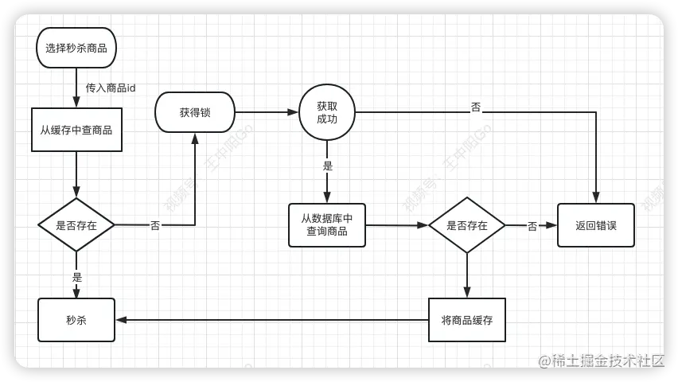

上文咱们提到过，秒杀的数据获取流程：

1.  需要先从缓存中查商品是否存在
2.  如果不存在，则会从数据库中查商品
3.  如果数据库存在，则将该商品放入缓存中，然后返回
4.  如果数据库中没有，则直接返回失败。

大家试想一下，如果在高并发下，有大量的请求都去查一个缓存中不存在的商品，这些请求都会直接打到数据库。数据库由于承受不住压力，而直接挂掉。

那么如何解决这个问题呢？

这就需要用redis分布式锁了。

下面带着大家详解一下分布式锁

### **7.1 setNx加锁**

使用redis的分布式锁，首先想到的是setNx命令。

> Redis Setnx（SET if Not eXists） 命令在指定的 key 不存在时，为 key 设置指定的值。

```go
if (redis.setnx(lockKey, val) == 1) {
   redis.expire(lockKey, timeout);
}
复制代码
```

用该命令可以加锁，但和后面的设置超时时间是分开的，并非原子操作。

**假如加锁成功了，但是设置超时时间失败了，该lockKey就变成永不失效的了。在高并发场景中，该问题会导致非常严重的后果。**

那么，有没有保证原子性的加锁命令呢？

### 7.2 set加锁

使用redis的set命令，它可以指定多个参数。

```go
result,err := redis.set(lockKey, requestId, "NX", "PX", expireTime);
if err!=nil{
  panic(err)
}
if ("OK".equals(result)) {
    return true;
}
return false;
复制代码
```

其中：

1.  lockKey：锁的标识
2.  requestId：请求id
3.  NX：只在键不存在时，才对键进行设置操作。
4.  PX：设置键的过期时间为 millisecond 毫秒。
5.  expireTime：过期时间

由于该命令只有一步，所以它是原子操作。

### **7.3 释放锁**

细心的小伙伴可能注意到了一个问题：**在加锁时，既然已经有了lockKey锁标识，为什么还需要记录requestId呢？**

答：requestId是在释放锁的时候用的。

```kotlin
if (redis.get(lockKey).equals(requestId)) {
    redis.del(lockKey);
    return true;
}
return false;
复制代码
```

在释放锁的时候，只能释放本次请求加的锁，不允许释放其他请求加的锁。

这里为什么要用requestId，用userId不行吗？

**如果用userId的话，假设本次请求流程走完了，准备删除锁。此时，巧合另外一个请求使用相同的userId加锁成功。而本次请求删除锁的时候，删除的其实是本应该加锁成功的锁（新的请求的锁），所以不我们不能以userId为加锁标识，而应该用每次的requestId为加锁标识。**

当然使用lua脚本也能避免该问题，它能保证原子操作：**查询锁是否存在和删除锁**具有原子性。

```go
if redis.call('get', KEYS[1]) == ARGV[1] then 
 return redis.call('del', KEYS[1]) 
else 
  return 0 
end
复制代码
```

### 7.4 自旋锁

上面的加锁方法看起来好像没有问题，但如果你仔细想想，如果有1万个请求同时去竞争那把锁，可能只有一个请求是成功的，其余的9999个请求都会失败。

在秒杀场景下，会有什么问题？

答：**每1万个请求，有1个成功。再1万个请求，有1个成功。如此下去，直到库存不足。这就变成均匀分布的秒杀了，跟我们想象中的不一样。**

如何解决这个问题呢？

其实也很简单：**使用自旋锁即可**。

自旋锁的思路如下：

1.  在规定的时间，比如500毫秒内，自旋不断尝试加锁
2.  如果成功则直接返回
3.  如果失败，则休眠50毫秒，再发起新一轮的尝试。
4.  如果到了超时时间，还未加锁成功，则直接返回失败。

## 8 mq异步处理

我们都知道在真实的秒杀场景中，有三个核心流程：

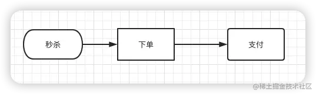

而这三个核心流程中，**真正并发量大的是秒杀功能，下单和支付功能实际并发量很小**。

所以，我们在设计秒杀系统时，有必要把下单和支付功能从秒杀的主流程中拆解出来。

MQ异步处理了解一下：**特别是下单功能要做成mq异步处理的。而支付功能，比如支付宝支付，是业务场景本身就是异步的。**

于是，秒杀后下单的流程变成如下：


如果使用mq，需要关注以下几个问题：

1.  消息丢失问题
2.  消息重复消费问题
3.  垃圾消息问题
4.  延迟消费问题

### **8.1 消息丢失问题**

秒杀成功了，向MQ发送下单消息的时候，有可能会失败。

原因有很多，比如：网络问题、broker挂了、mq服务器等问题。这些情况，都可能会造成消息丢失。

那么，如何防止消息丢失呢？

**加一张消息发送表**就可以了。

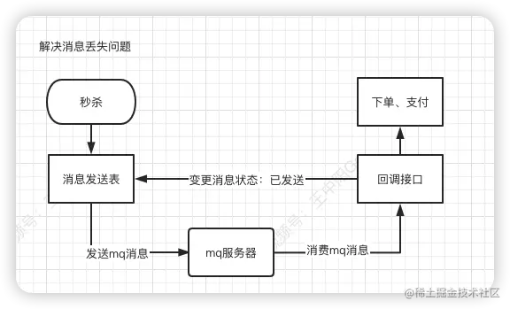

其流程如下：

1.  在生产者发送mq消息之前，先把该条消息**写入消息发送表**，初始状态是待处理
2.  然后再发送mq消息。
3.  消费者消费消息时，回调生产者的一个接口，处理完业务逻辑之后，修改消息状态为已处理。

#### 消息重发

如果生产者把消息写入消息发送表之后，再发送mq消息到mq服务端的过程中失败了，造成了消息丢失。

这时候，要如何处理呢？

答：使用job，增加重试机制。**用job每隔一段时间去查询消息发送表中状态为待处理的数据，然后重新发送mq消息。**


### 8.2 重复消费问题

一般情况下消费者在消费消息，做**ACK应答**的时候，如果网络超时，本身就可能会消费重复的消息。

> ACK应答也称为**确认消息应答**，是在计算机网上中通信协议的一部分，是设备或是进程发出的消息，回复已收到数据。

由于我们前面引入了消息发送重试机制，会导致消费者重复消费消息的概率进一步增大。

那么，如何解决重复消费消息的问题呢？

答案也很简单：**加一张消息处理表**即可。

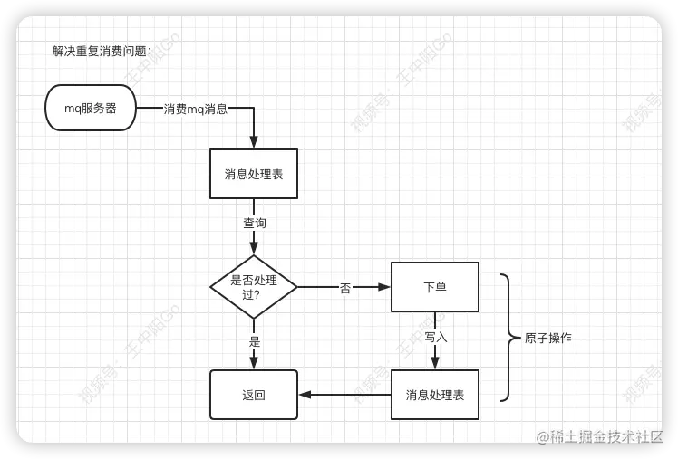

消费者读到消息之后，先判断一下消息处理表，是否存在该消息，如果存在，表示是重复消费，则直接返回。

如果不存在，则进行下单操作，接着将该消息写入消息处理表中，再返回。

有个非常关键的问题，需要大家注意：**下单和写消息处理表，要放在同一个事务中，保证原子操作。**

### **8.3 垃圾消息问题**

上面这套方案表面上看起来没有问题，但如果出现了消息消费失败的情况。比如：由于某些原因，消息消费者下单一直失败，一直不能回调状态变更接口，这样job会不停的重试发消息。最后，会产生大量的垃圾消息。

那么，如何解决这个问题呢？

#### 限制重试次数

每次在job重试时，需要先判断一下消息发送表中该消息的发送次数是否达到最大限制，如果达到了，则直接返回。如果没有达到，则将消息发送次数加1，然后再发送消息。

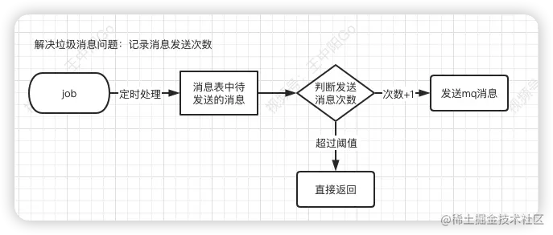

这样如果出现异常，只会产生少量的垃圾消息，不会影响到正常的业务。

### **8.4 延迟消费问题**

通常情况下，如果用户秒杀成功了，下单之后，在30分钟之内还未完成支付的话，该订单会被自动取消，回退库存。

那么，在30分钟内未完成支付，订单被自动取消的功能，要如何实现呢？

我们首先想到的可能是job，因为它比较简单。

但job有个问题，需要每隔一段时间处理一次，实时性不太好。

还有更好的方案？

肯定是有的：**使用延迟队列**即可。比如：**RocketMQ，自带了延迟队列的功能。**

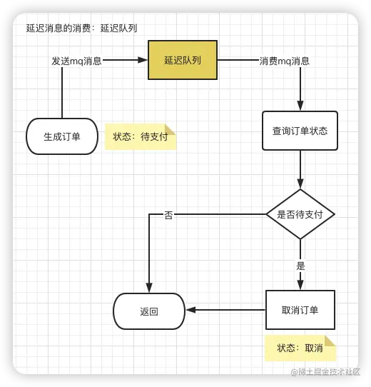

我们再来梳理一下流程：

1.  下单时消息生产者首先生成订单，此时为待支付状态。
2.  然后向延迟队列中发一条消息。
3.  当达到了延迟时间，消息消费者读取消息之后，会查询该订单的状态是否为待支付。
4.  如果是待支付状态，则会更新订单状态为取消状态。
5.  如果不是待支付状态，说明该订单已经支付过了，则直接返回。

注意：**在我们的业务开发中，当用户完成支付之后，会修改订单状态为已支付。这个千万不要忘记！**

## 9 限流

做秒杀活动不担心真实用户多，担心的是：

有些高手，并不会像我们一样老老实实，通过秒杀页面点击秒杀按钮，抢购商品。他们可能在自己的服务器上，模拟正常用户登录系统，跳过秒杀页面，直接调用秒杀接口。

如果是我们手动操作，一般情况下，一秒钟只能点击一次秒杀按钮。

**但是如果是服务器，一秒钟可以请求成上千接口。**


这种差距实在太明显了，如果不做任何限制，绝大部分商品可能是被机器抢到，而不是正常用户，这就违背了搞秒杀活动的初衷。

所以，我们有必要识别这些非法请求，做一些限制。那么，我们该如何限制这些非法请求呢？

### **9.1 对同一用户限流**

为了防止某个用户，请求接口次数过于频繁，可以只针对该用户做限制。

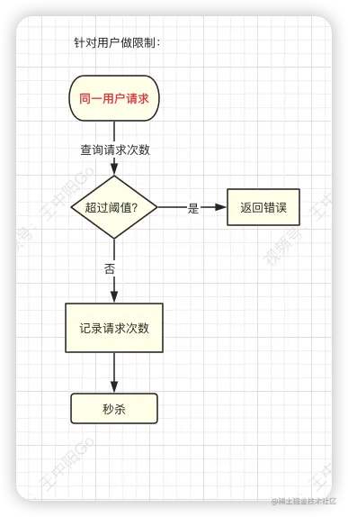

限制同一个用户id，比如每分钟只能请求5次接口。

### **9.2 对同一ip限流**

有时候只对某个用户限流是不够的，有些高手可以模拟多个用户请求，这种nginx就没法识别了。

这时需要加同一ip限流功能。


限制同一个ip，比如每分钟只能请求5次接口。

#### 误伤问题

但这种限流方式可能会有误伤的情况，比如同一个公司或网吧的出口ip是相同的，如果里面有多个正常用户同时发起请求，有些用户可能会被限制住。

### **9.3 对接口限流**

别以为限制了用户和ip就万事大吉，有些高手甚至可以使用代理，每次都请求都换一个ip。

这时可以限制请求的接口总次数。

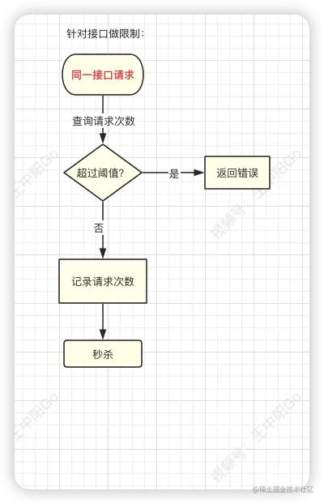

**在高并发场景下，这种限制对于系统的稳定性是非常有必要的。**

但可能由于有些非法请求次数太多，达到了该接口的请求上限，而影响其他的正常用户访问该接口。**一般我们对接口限流会设置时间，超过一段时间后则重新开放。**

### **9.4 加验证码**

相对于上面三种方式，加验证码的方式可能更精准一些，同样能限制用户的访问频次，但好处是不会存在误杀的情况。

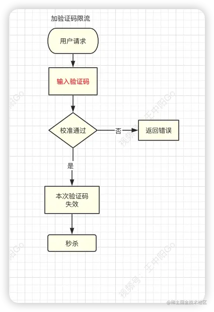

1.  通常情况下，用户在请求之前，需要先输入验证码。
2.  用户发起请求之后，服务端会去校验该验证码是否正确。
3.  只有正确才允许进行下一步操作。
4.  否则直接返回，并且提示验证码错误。

**注意：验证码一般是一次性的，同一个验证码只允许使用一次，不允许重复使用。**

#### 普通验证码

普通验证码，由于生成的数字或者图案比较简单，可能会被破解。

优点是生成速度比较快，缺点是有安全隐患。

#### 滑块验证码


移动滑块，虽然它生成速度比较慢，但比较安全，是目前各大互联网公司的首选。也有不少三方平台推出了这套服务，可以直接使用。

### **9.5 提高业务门槛**

上面说的加验证码虽然可以限制非法用户请求，但是有些影响用户体验。用户点击秒杀按钮前，还要先输入验证码，流程显得有点繁琐，秒杀功能的流程不是应该越简单越好吗？

**其实，有时候达到某个目的，不一定非要通过技术手段，通过业务手段也一样。**

12306刚开始的时候，全国人民都在同一时刻抢火车票，由于并发量太大，系统经常挂。后来，重构优化之后，将购买周期放长了，可以提前20天购买火车票，并且可以在9点、10、11点、12点等整点购买火车票。调整业务之后（当然技术也有很多调整），将之前集中的请求，分散开了，一下子降低了用户并发量。

同样的，我们的秒杀系统也可以借鉴12306的方案，站在业务的角度有针对性的做优化，比如：

1.  我们可以通过提高业务门槛，比如只有会员才能参与秒杀活动，普通注册用户没有权限。
2.  或者只有等级到达3级以上的用户，才有资格参加该活动。
3.  或者分时间段获得秒杀资格，比如9点、10、11点、参加活动获得秒杀资格，获得资格的朋友12点集中参与秒杀。

## 数据库层隔离

上面的内容也呼应了一下开篇，秒杀场景除了站在技术的角度考虑，也需要站在业务的角度去考虑。

除了上面提到的“静态化”、“Redis缓存”、“分布式锁”、“限流”等。**数据库层隔离也是非常重要的。**

针对秒杀系统可能会影响已经正常运行的其他数据库的情况，我们需要考虑“数据库隔离设计”。常用以下三种方法：分表分库、数据隔离、数据合并。

### 10.1 分库分表

数据库很容易产生性能瓶颈，导致数据库的活跃连接数增加，一旦达到连接数的阈值，会出现应用服务无连接可用，造成灾难性后果。

我们可以先从代码、SQL语句、索引这几个方面着手优化，如果没有优化空间了，就要考虑分库分表了。

以我们的经验，Mysql单表推荐的存储量是500万条记录左右。如果估算超过这个阈值，就建议做分表。

**如果服务的链接数较多，就建议进行分库操作。**

### 10.2 数据隔离

这也是我们做秒杀系统最大的经验分享：秒杀系统使用的关系型数据库，绝大多数是多操作，再者是插入，只有少部分修改，几乎没有删除操作。**建议用专门的表来存放数据，不建议使用业务系统正在使用的表来存放秒杀相关的数据。**

前文也有提到，数据隔离是必须的，万一秒杀系统出了问题，不能影响正常业务系统。

**表的设计，除了自增ID之外，最好不要设置其他主键，以保证能够快速插入。**

### 10.3 数据合并

如果我们秒杀系统是用的专用表存储，在秒杀活动结束后，需要将其和现有数据进行合并。

（交易已经完成，合并的目的是为了方便后续查询）

**这个合并可以根据具体情况来做，对于那些“只读”的数据，可以只导入到专门负责读的数据库或者NoSQL数据库中即可。**

## 11 压力测试

对于秒杀系统，上线之前进行压力测试是必不可少的，不仅能够帮助我们优化设计，更重要的能够检测出系统崩溃的边缘及系统的极限在哪里。

只有这样，我们才能合理的设置流量上限，把多余的流量主动抛弃掉，进而保证系统的稳定性。

### 11.1 压测方法

#### 正压力测试

简单来说：在保证服务器资源不变的情况下，网络请求不断做加法。

每次秒杀活动评估要使用多少服务器资源，承受多少请求。可以通过不断加压的方式，直到系统接近崩溃或者真正崩溃。

如下图所示：


#### 负压力测试

负压力测试如下图所示，也很好理解：在系统正常运行的情况下，逐渐减少支撑系统的服务器资源，观察什么时候系统无法在支撑正常的业务请求。

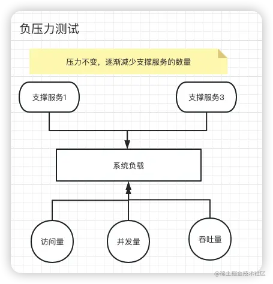

### 11.2 压测步骤

知道有哪些测试方法还远远不够，下面介绍的压测步骤才是最重要的内容。

为大家分享8个测试步骤，不止是秒杀系统，其他需要压测的场景也可以按照这个思路进行测试：

#### 1.确定测试目标

压力测试和性能测试不同，压力测试的目标是什么时候系统会接近崩溃，比如需要支持100万的访问量，测试出性能阈值。

#### 2. 确定关键问题

**二八原则大家一定要知道**，压力测试也是有重点的，系统中只有20%的功能是最常用的，比如秒杀接口、下单、扣减库存。要集中火力测试常用的功能，高度还原真实场景。

#### 3. 确定负载

和上面观点一样，不是每个服务都有高负载，测试时要重点关注高负载的服务，真实场景中服务的负载一定是波动的，并且不是均匀分布的。

#### 4. 搭建环境

搭建环境要和生产环境保持一致。

#### 5. 确定监测指标

提前确定好要重点监测的参数指标，比如：CPU负载、内存使用率、系统吞吐量、带宽阈值等

#### 6. 产生负载

1.  建议优先使用往期的秒杀数据，或者从生产环境中同步数据进行测试
2.  根据目标系统的承受要求由脚本驱动测试
3.  模拟不同网络环境，对硬件条件有规律的进行测试

#### 7. 执行测试

根据目标系统、关键组件、用负载进行测试、返回监测点的数据。

#### 8. 分析数据

针对测试的目的，对关键服务的压力测试数据进行分析，得出这些服务的承受上限在哪里？

对有波动的负载或者大负载的的服务进行数据分析，明确优化的方向。

## 项目实战

秒杀系统的项目实战欢迎加入我的[学习圈子](https://link.juejin.cn/?target=https%3A%2F%2Fmp.weixin.qq.com%2Fs%2FIUsfZGiOPtFIB1GBr10l7g "https://mp.weixin.qq.com/s/IUsfZGiOPtFIB1GBr10l7g")，邀你进项目组。

## 总结

总体来说，秒杀系统是十分复杂的，我们要根据自身的情况，选择合适的架构。这篇文章比较系统的介绍了秒杀场景中常见的问题和解决方案。咱们再回顾一下开篇的思维导图：


最后再给大家3个建议：

1.  **负载均衡，分而治之**。通过负载均衡，将不同的流量划分到不同的机器上，每台机器处理好自己的请求，将自己的性能发挥到极致。这样整个系统的性能也就达到最高了。
2.  **合理使用并发**。Go语言能够完美发挥服务器多核优势，很多可以用并发处理的任务，都可以用Go的协程处理。比如Go处理HTTP请求时每个请求都会在一个goroutine中执行。
3.  **合理使用异步**。异步处理已经被越来越多的开发者所接受，对实时性要求不高的业务都可以用异步来处理，在功能拆解上能达到意想不到的效果。