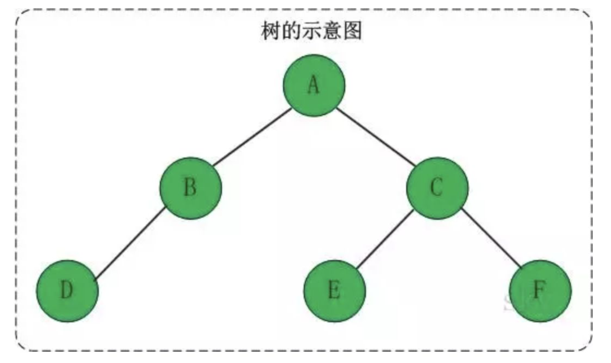
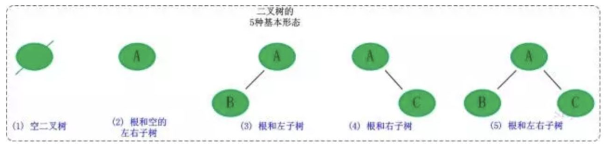
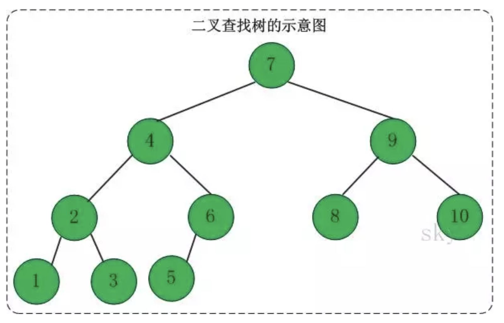

## 定义

树是一种非线性的数据结构，它是由n（n>0）个有限节点组成的一个具有层次关系的集合，把它叫做树是因为它看起来像一颗倒挂的树，也就是说它是根朝上，而叶朝下的。它具有以下特点：

-   每个结点有零个或多个子结点
-   没有父结点的节点称为根结点
-   每个非根结点有且只有一个父结点
-   除了根结点外，每个子结点可以分为多个不相交的子树

## 基本术语

若一个结点为子树，那么该结点称为子树根的双亲，子树的根是该结点的孩子。有相同双亲的结点称为兄弟。一个结点的所有子树上的任何结点都是该结点的后裔。从根结点到某个结点的路径上的所有结点都是该结点的祖先。

**结点的度**：结点拥有的子树的数目，图中结点c的度为2。 **叶子**：度为零的结点，图中D、E、F都是叶子结点 **树的度**：树中结点的最大的度，图中结点c的度最大为2，因此树的度为2。

**层次**：根结点的层次为1，其余结点的层次等于该结点的双亲结点的层次加1。 **树的高度**：树中结点的最大层次，图中树的高度为3。 **无序树**：如果树中结点的各子树之间的次序是不重要的，可以交换位置。 **有序树**：如果树中结点的各子树之间的次序是重要的, 不可以交换位置。 **森林**：0个或多个不相交的树组成。对森林加上一个根，森林即成为树；删去根，树即成为森林。

## 二叉树

### 定义

二叉树是每个节点最多有两个子树的结构。它有五种基本形态：二叉树可以是空集；根可以有空的左子树或右子树；或许左、右子树都为空。

### 二叉查找树

二叉查找树也称为二叉搜索树，其特点如下：左孩子比父结点小，右结点比父结点大。其中还有一个特性就是**中序遍历**可以让结点有序。

可以看出，在二叉搜索树中：

-   若任意节点的左子树不空，则左子树上所有结点的值均小于它的根结点的值；
-   任意节点的右子树不空，则右子树上所有结点的值均大于它的根结点的值；
-   任意节点的左、右子树也分别为二叉查找树；
-   没有键值相等的节点。

