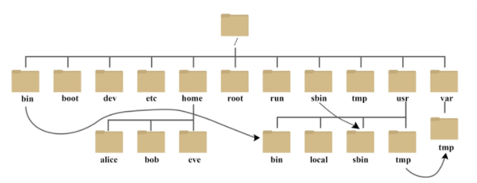
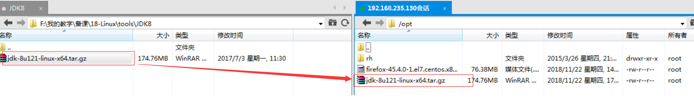
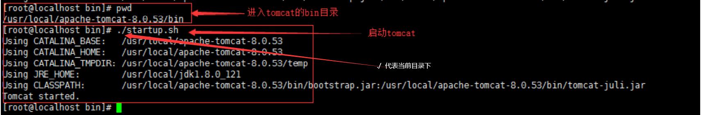
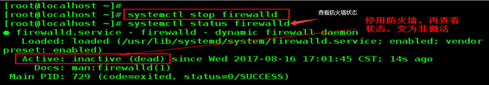
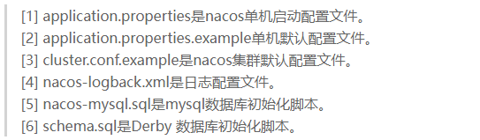

## Linux目录



- /bin

  bin是Binaries（二进制文件）的缩写，这个目录存放着最经常使用的命令。

- /boot

  这里存放的是启动linux时使用的一些核心文件，包括一些连接文件以及镜像文件。

- /dev

  dev是Device（设备）的缩写，该目录下存放的是linux的外部设备，在linux中访问设备的方式和访问文件的方式是相同的。

- /etc

  etc是Etcetera（等等）的缩写，这个目录用来存放所有的系统管理所需要的配置文件和子目录。

- /home

  用户的主目录，在linux中，每个用户都有一个自己的目录，一般该目录名是以用户的账号命令的。

- /lib

  lib是Library（库）的缩写，这个目录里存放着系统最基本的动态连接共享库，其作用类似于Windows里的DLL文件，几乎所有的应用程序都需要用到这些共享库。

- /opt

  opt是optional（可选）的缩写，这是给主机额外安装软件所摆放的目录，比如你安装一个mysql数据库则就可以放到这个目录下。默认是空的。

- /usr

  usr是unix shared resources（共享资源）的缩写，这是一个非常重要的目录，用户的很多应用程序和文件都放在这个目录下，类似与windows下的program files目录。

- /usr/bin

  系统用户使用的应用程序。

- /usr/sbin

  超级用户使用的比较高级的管理程序和系统守护程序。

- /usr/src

  内核源代码默认的放置目录。

- /var

  var是variable（变量）的缩写，这个目录中存放着在不断扩充着的东西，我们习惯将那些经常被修改的目录放在这个目录下，包括各种日志文件。

- /run

  是一个临时文件系统，存储系统自动以来的信息。当系统重启时，这个目录下的文件应该被删掉或清除，如果你的系统上有/var/run目录，应该让它指向run。

- /root

  该目录为系统管理员，也称作超级权限者的用户主目录。

- /tmp

  tmp是temporary（临时）的缩写，这个目录是用来存放一些临时文件的。

- /lost+found

  这个目录一般情况下是空的，当系统非法关机后，这里就存放了一些文件。

- /media

  linux系统会自动识别一些设备，例如U盘，光驱等等，当识别后，linux会把识别的设备挂载到这个目录下。

- /mnt

  系统提供该目录是为了让用户临时挂载别的文件系统的，我们可以将光驱挂载在/mnt/上，然后进去该目录就可以查看光驱里的内容。

- /proc

  proc是Processes（进程）的缩写，/proc是一种伪文件系统（也即虚拟文件系统），存储的是当前内核运行状态的一系列特殊文件，这个目录是一个虚拟的目录，它是系统内存的映射，我们可以通过直接访问这个目录来获取系统信息。

- /sbin

  s就是Super User的意思，是Superuser Binaries（超级用户的二进制文件）的缩写，这里存放的是系统管理员使用的系统管理程序。

- /selinux

  这个目录是RedHat/CentOS所特有的目录，Selinux是一个安全机制，类似与windows的防火墙，但是这套机制比较复杂，这个目录就是存放selinux相关文件的。

- /srv

  该目录存放一些服务启动之后需要提取的数据。

- /sys

  这是Linux2.6内核的一个很大的变化。该目录下安装了2.6内核中新出现的一个文件系统sysfs。sysfs文件系统集成了下面3种文件系统的信息：针对进程信息的proc文件系统、针对设备的devfs文件系统以及针对伪终端的devpts文件系统。该文件系统是内核设备树的一个直观反映。当一个内核对象被创建的时候，对应的文件和目录也在内核对象子系统中被创建。
  
  >在 Linux 系统中，有几个目录是比较重要的，平时需要注意不要误删除或者随意更改内部文件。
  >
  >/etc： 上边也提到了，这个是系统中的配置文件，如果你更改了该目录下的某个文件可能会导致系统不能启动。
  >
  >/bin, /sbin, /usr/bin, /usr/sbin: 这是系统预设的执行文件的放置目录，比如 ls 就是在 /bin/ls 目录下的。
  >
  >值得提出的是，/bin, /usr/bin 是给系统用户使用的指令（除root外的通用户），而/sbin, /usr/sbin 则是给 root 使用的指令。
  >
  >/var： 这是一个非常重要的目录，系统上跑了很多程序，那么每个程序都会有相应的日志产生，而这些日志就被记录到这个目录下，具体在 /var/log 目录下，另外 mail 的预设放置也是在这里。

## 常用命令

> systemctl

```
systemctl enable service                # 开机自启服务
systemctl disable redis                 # 取消开机自启
systemctl start service			       # 启动redis服务
systemctl stop service　          	   # 停止服务
systemctl restart service　             # 重新启动服务
systemctl status service                # 查看服务当前状态
systemctl list-units --type=service     # 查看所有已启动的服务
systemctl daemon-reload                 # 加载服务配置文件
```

> tar

参数解析

解压相关：

- -z:有gzip属性
- -x:解压档案
- -v:显示所有过程
- -f:使用档案名字，切记，这个参数是最后一个参数，后边只能接档案名

压缩相关：

- -c:建立压缩档案

```
# .gz是gzip属性的缩写
tar -zxvf ****.tar.gz -C /**
```

> yum

## 1 JDK安装

- 通过xftp上传到 /opt 下
   

- 解压缩到  /opt  下
  

- 配置环境变量的配置文件   vim  /etc/profile

  ```
  JAVA_HOME=/opt/jdk1.7.0_79  # 需要修改jdk的路径
  PATH=$JAVA_HOME/bin:$PATH
  CLASSPATH=$JAVA_HOME/lib:.
  export JAVA_HOME PATH CLASSPATH
  ```

- 使配置文件生效

   

- 测试安装是否成功

   

## 2 tomcat安装

- 通过xftp上传到 /opt

   

- 解压缩到 /opt 下

   

- 启动tomcat

   

- Linux访问tomcat

   

- windows访问tomcat

   

- 关闭linux防火墙

  ```
  systemctl stop firewalld   #关闭防火墙
  systemctl start firewalld   #开启防火墙
  systemctl disable firewalld #永久关闭防火墙
  ```
  
  

## 3 Redis安装

- 通过xftp将redis.tar.gz传递到/opt/soft目录

- 解压到/opt

  tar -zxvf redis-6.2.6.tar.gz -C /opt

- 编译并安装

  ```
  #进入redis目录
  cd redis-6.2.6
  #编译
  make
  #进入src目录
  cd src
  #安装
  make install
  ```

- 创建供redis运行的目录

  分别存放redis日志和数据

  logs：存放日志

  data：存放快照数据

  ```
  #进入根目录
  cd / 
  #创建data/redis文件夹
  mkdir data/redis
  #进入data/redis
  cd data/redis
  #创建data和logs文件
  mkdir data
  mkdir logs
  ```

- 修改配置文件

  ```
  # 进入redis目录
  cd /opt/redis-6.2.6
  # 配置redis.conf
  vim redis.conf
  ```

  配置项

  >  绑定访问的ip
  >  bind **

  > 以守护进程启动运行
  >
  > daemonize yes

  > 日志保存记录
  >
  > logfile "/data/redis/logs/redis.log"

  > 数据保存记录
  >
  > dir /data/redis/data/

- 设置redis.service

  ```
  # 创建并编辑
  vim /lib/systemd/system/redis.service
  # 内容
  [Unit]
  Description=Redis
  After=network.target
  
  [Service]
  Type=forking
  PIDFile=/var/run/redis_6379.pid
  ExecStart=/自己安装的redis目录/redis-server /自己安装的redis目录/redis.conf
  ExecReload=/bin/kill -s HUP $MAINPID
  ExecStop=/bin/kill -s QUIT $MAINPID
  PrivateTmp=true
  
  [Install]
  WantedBy=multi-user.target
  ```

- 设置开机自启动

  ```
  # 设置redis开机自启
  systemctl enable redis
  # 启动redis
  systemctl start redis
  # 停止redis
  systemctl stop redis
  ```

## 4 mysql安装

> 通过rpm方式安装mysql

- 通过xftp将mysql上传到/opt/soft/mysql

- 解压到/opt/soft/mysql

  tar -zxvf mysql-8.0.27-1.el8.x86_64.rpm-bundle -C /opt/soft/mysql

  > mysql-8.0.27-1.el8.x86_64.rpm-bundle.tar是有关mysql所有服务的rpm包。

- 卸载mariadb

  mariadb与mysql会有冲突

  ```
  # 检查是否安装了mariadb数据库
  yum list installed | grep mariadb
  # 卸载
  yum -y remove mariadb
  ```

- 通过rpm方式安装

  ```
  # 按照顺序安装
  rpm -ivh mysql-community-common-8.0.18-1.e17.x86_64.rpm
  rpm -ivh mysql-community-libs-8.0.18-1.e17.x86_64.rpm
  rpm -ivh mysql-community-client-8.0.18-1.e17.x86_64.rpm
  rpm -ivh mysql-community-server-8.0.18-1.e17.x86_64.rpm
  ```

- 启动mysql

  systemctl start mysqld

- 修改数据库密码

  ```
  # 查看密码
  cat /var/log/mysqld.log | grep password
  # 登录mysql
  mysql -u root -p
  # 修改密码为1qaz@WSX
  alter user 'root@localhost' indentified with mysql_native_password by '1qaz@WSX';
  ```

- 设置访问权限

  ```
  # 修改mysql可以允许任意访问
  > use mysql;
  > alter user set host='%' where user = 'root';
  > commit;
  > exit;
  
  #重启mysql
  systemctl restart mysqld;
  ```

## 5 nacos安装

- 通过xftp将nacos上传到/opt/soft

- 解压到/opt

  tar -zxvf nacos-2.0.1.tar.gz

- 修改nacos数据库连接

   

  执行conf下的nacos-mysql.sql

  ```
  # 进入nacos目录
  cd /opt/nacos/conf
  # 编辑application.properties
  vim application.properties
  修改db.url ,db.username , db.password为自己的数据库连接
  ```

- 修改nacos启动文件

  ```
  # 进入nacos目录
  cd /opt/nacos/bin
  # 编辑配置start.sh
  vim start.sh
  # 修改Java_HOME
  [ ! -e "$JAVA_HOME/bin/java" ] && JAVA_HOME=/opt/jdk1.8.0_311
  ```

- 配置nacos开机启动

  ```
  # 编写nacos.service
  vim /lib/systemd/system/nacos.service
  # 内容
  [Unit]
  Description=nacos
  After=network.target
  
  [Service]
  Type=forking
  ExecStart=/opt/nacos/bin/startup.sh -m standalone
  ExecReload=/opt/nacos/bin/shutdown.sh
  ExecStop=/opt/nacos/bin/shutdown.sh
  PrivateTmp=true
  
  [Install]
  WantedBy=multi-user.target
  
  # 设置开机启动
  systemctl enable nacos
  
  其中/opt/nacos为本机安装的nacos文件路径，-m standalone表示作为单机启动，不加的话表示集群启动，目前先作为单机启动。
  ```

- 测试

  访问192.168.93.129:8848/nacos 


