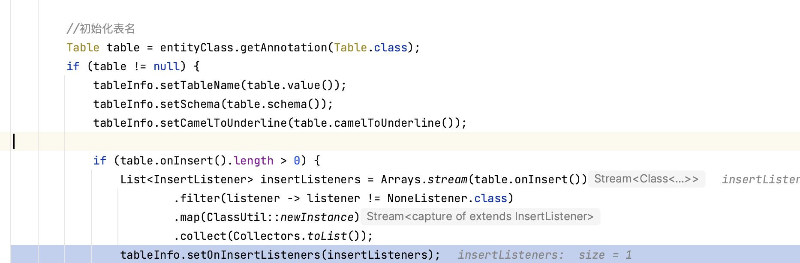

## ​​LambdaGetter​

mybatis-flex使用方法引用的lambda表达式`LambdaGetter`​获取实体类的字段名称，并不执行Lambda表达式。

```java
public class LambdaUtil { 
    public static <T> QueryColumn getQueryColumn(LambdaGetter<T> getter) {
	// 获取类加载器
        ClassLoader classLoader = getter.getClass().getClassLoader();
	// 获取序列化的lambda
        SerializedLambda lambda = getSerializedLambda(getter);
	// 获取方法名称
        String methodName = lambda.getImplMethodName();
	// 获取实体类
        Class<?> entityClass = getImplClass(lambda, classLoader);
	// 获取实体类的表注解信息
        TableInfo tableInfo = TableInfoFactory.ofEntityClass(entityClass);
	// 通过set方法获取查询列
        return tableInfo.getQueryColumnByProperty(PropertyNamer.methodToProperty(methodName));
    }
}
```

## TableInfoFactory

在项目的数据源初始化后，TableInfoFactory的init()会被调用，处理@Table注解

​​

由于InsertListener的实现类被创建出对象，所以无法被spring管理。

onInsert()方法只能被newInstance的对象去触发执行，通过Spring创建的bean无法触发此方法。
