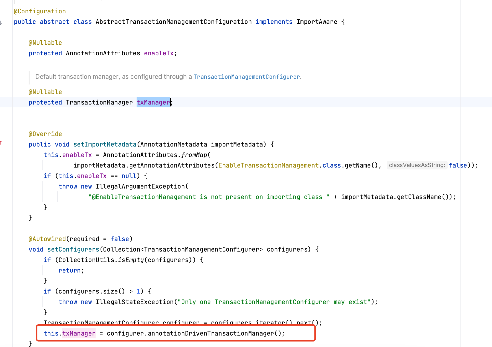
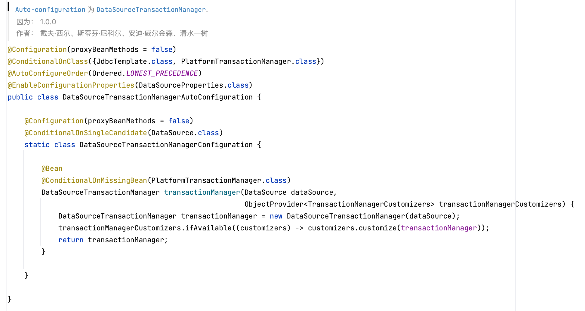

事务方法执行顺序，`TransactionAspectSupport`​为事务的基类。

1. `TransactionInterceptor.invoke()`​:事务拦截器执行service方法
2. `TransactionAspectSupport.invokeWithinTransaction()`​:通过事务调用
3. `determineTransactionManager()`​:确定事务管理器
4. `completeTransactionAfterThrowing(txInfo, ex)`​：处理事务抛出的异常

## 配置默认的事务管理器

​`TransactionManagementConfigurer.annotationDrivenTransactionManager()`​: 默认的事务处理器

​​

​`AbstractTransactionManagementConfiguration.setConfigures()`​配置事务管理器为默认，通过`annotationDrivenTransactionManager`​方法指定。

## 自动配置

​`DataSourceTransactionManagerAutoConfiguration.transactionManager()`​：注册一个transactionManager的bean

​​

当如果项目中缺少`PlatformTransactionManager`​的Bean时，注册一个`DataSourceTransactionManager`​。自动配置顺序为`LOWEST_PRECEDENCE = Integer.MAX_VALUE`​：最后执行自动配置。**仅在单数据源下生效**
