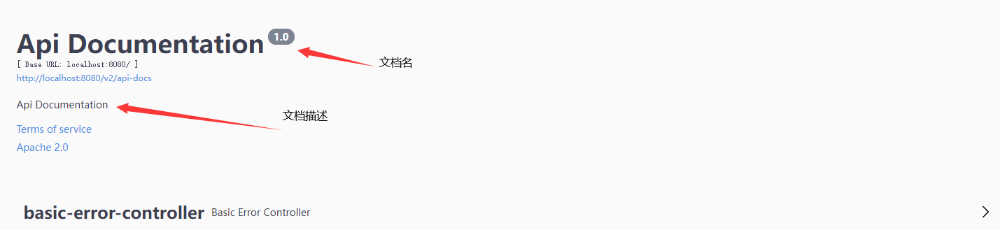
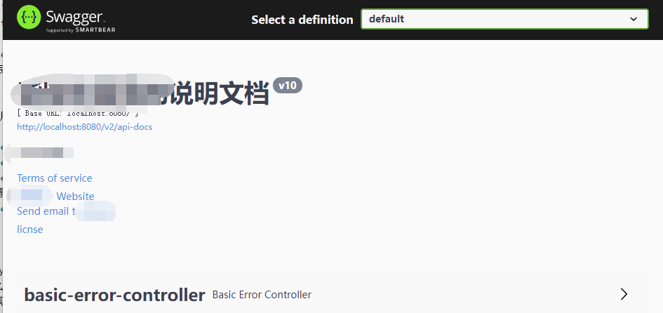

## Swagger配置

### Docket实例

> Docket:摘要，记事本。是swagger生成的文档信息的核心对象，一个实例化的docket代表一个api文档。

Docket类只有一个有参构造方法：

```java
//需要DoucmentationType对象
public Docket(DocumentationType documentationType) {
   this.documentationType = documentationType;
}
```

DocumentationType类，文档类型类，在DocumentationType类中，维护了三个final变量：

```java
public static final DocumentationType SWAGGER_12 = new DocumentationType("swagger", "1.2");
public static final DocumentationType SWAGGER_2 = new DocumentationType("swagger", "2.0");
public static final DocumentationType OAS_30 = new DocumentationType("openApi", "3.0");
```

因为使用的是swagger2，选择使用swagger_2这个类型。 否则会打不开swagger-ui界面，也就是生成不了这个api文档。

接下来就是通过构造函数创建一个docket实例

```java
//通过@Bean的方式将默认的Docket注入到spring容器
@Bean
public Docket docket(){
    return new Docket(DocumentationType.swagger_2);
}
```

运行查看效果：访问 localhost:8080/swagger-ui/  



这样就创建好了一个swagger的docket实例，展示的是swagger默认的文档信息

### apiInfo()方法

通过docket对象的 apiInfo()方法配置

```java
public Docket apiInfo(ApiInfo apiInfo) {
    //如果传入了ApiInfo对象就使用apiInfo 否则就使用this.apiInfo 也就是默认的apiInfo信息。
    this.apiInfo = defaultIfAbsent(apiInfo, this.apiInfo);
    return this;
}
```

ApiInfo.class 维护了swagger文档的文档信息描述，可以通过自定义apiInfo配置swagger文档。

ApiInfo默认维护了一个final常量作为一个默认的apiInfo，也就是默认的swagger文档信息。

```java
public static final ApiInfo DEFAULT
    = new ApiInfo(
    "Api Documentation",
    "Api Documentation",
    "1.0",
    "urn:tos",
    DEFAULT_CONTACT,
    "Apache 2.0",
    "http://www.apache.org/licenses/LICENSE-2.0",
    new ArrayList<>());
```

我们可以编写一个方法维护我们自己的apiInfo，然后传递为docket对象，实现自定义swagger文档。

> 方法解释：private限制本类也就是 swagger的config类可以访问就可以了。模仿默认的实现去new一个apiInfo对象

```java
private ApiInfo getApiInfo(){
    return new ApiInfo(
        //title
        "订单模块",
        //description
        "订单模块的相关api方法",
        //version
        "v10",
        //termsOfServoceUrl
        "www.baidu.com",
        new Contact("柴卓杰","http","17318381029@163.com"),
        "licnse",
        "sss",
        new ArrayList<>());
}
```

将自定义的apiInfo，通过docket.apiInfo();方法，应用到docket实例。

```java
@Bean
public Docket docket(){
    return new Docket(DocumentationType.swagger_2)
        //调用自定义的apiInfo
        .apiInfo(this.getApiInfo());
}
```

运行实例：

 

可以看出swagger的文档信息已经变成自定义的内容。

### select()

> 通过传入自定义的选择器选择生成`哪些类，或者哪些方法`的api文档。
>
> 通过docket的select()方法返回了一个ApiSelectBuilder对象，通过ApiSelectbuilder.build();方法，建造一个docket实例。

```java
@Bean
public Docket docket(){
    return new Docket(DocumentationType.SWAGGER_2)
        .apiInfo(getApiInfo())
        .select()
        .build();
}
```

> ApiSelectBuilder：是api的建造器，通过api(),path()方法选择需要生成文档的api方法。
>
> 注意：多个选择器的条件求交集

```java
ApiSelectBuilder api(Predicate<RequestHandler> selector) : 需要一个请求处理选择器；
ApiSelectBuilder path(Predicate<PathHandler> select) : 需要一个路径处理选择器；
```

> RequestHandlerSelectors 通过 .any() .none() .withMethodAnnotation() .withClassAnnotation() .basePackage() 生成RequestHandler作为selector进行扫描
>
> PathHandlerSelectors 通过 .any() .none() .regex() .ant() 生成PathHandler作为selector进行扫描

```java
@Bean
public Docket docket(){
    return new Docket(DocumentationType.SWAGGER_2)
        .apiInfo(getApiInfo())
        .select()
        //扫描 com 包
        .apis(RequestHandlerSelectors.basePackage("com"))
        //扫描标注了类注解RestController
        .apis(RequestHandlerSelectors.withClassAnnotation(RestController.class))
        //扫描标注方法注解GetMapping
        .apis(RequestHandlerSelectors.withMethodAnnotation(GetMapping.class))
        //扫描hello开头的uri
        .paths(PathSelectors.ant("/hello"))
        .build();
}
```

### groupName()

docket的groupName方法为此docket配置一个组名，一个docket实例只有一个组名，可以在swagger-ui界面通过切换group，查看不同组的api文档。

```java
@Bean
public Docket docket(){
    return new Docket(DocumentationType.SWAGGER_2)
        .apiInfo(getApiInfo())
        .groupName("dev")
        .select()
        .apis(RequestHandlerSelectors.basePackage("com"))
        .apis(RequestHandlerSelectors.withClassAnnotation(RestController.class))
        .apis(RequestHandlerSelectors.withMethodAnnotation(GetMapping.class))
        .paths(PathSelectors.ant("/hello"))
        .build();
}
```

## Swagger使用

Swagger文档通过一些swagger自己的注解去添加类和方法的描述信息。

- @Api(tags="类的描述信息")
- @ApiModel("VO对象的描述信息")
- @ApiModelProperties("VO对象的属性的描述信息")
- @ApiOperation("接口方法的描述信息")
