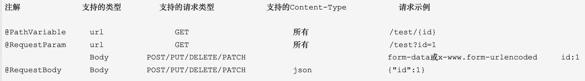

## http请求的方式

> Get请求

get请求的参数 拼接在url中，在地址栏可见。只要是get请求，无论请求头设置为任何方式，参数都会被拼接在url地址栏中。

> post请求

` x-www-form-urlencoded`:form表单的默认请求头，会将传递的参数编码为键值对形式， id=xxx&name=xxx 方式，但是在地址栏不可见，参数在请求体中

` form-data`:multipart/form-data; boundary=----WebKitFormBoundaryvKNAZeSEeXmiCSEV将参数封装为一条消息，常用于传输二进制，比如文件，也可以传递参数，每个参数之间有分割线进行分割。boundary的内容就是分割线

` application/json`:通过json对象传递参数，后端通过@RequestBody注解接收。

## 常见情况

### 1.后端不写注解

> 简单类型

Get方式,Post方式均正常接收参数

> 采用对象接受参数时，

可以接受get地址栏传参，也可接受post使用urlencoded传参和form-data传参，springmvc会自动封装为参数键值对对应的对象。

> 使用map接收

Get方式，Post方式均无法接收参数

### 2.使用@RequestParam注解

> 使用简单类型接受参数

正常接收urlencode和form-data，以及url传递，格式的参数，`可以通过@RequestParam指定参数名`，即@RequestParam("sss")String sss;

>使用对象接受参数。

get方式报400错误；

post方式，400错误

> 使用map接收

正常接收urlencode和form-data，以及url传递，格式的参数，`不能通过@RequestParam指定参数名`，即@RequestParam Map map；

**总结：@RequestParam 用来接收并指定简单类型的参数。！！！ @RequestParam注解不可用在java对象前，会报400错误**

### 3.使用@RequestBody注解

只可以接收content-Type=`application/json`格式的参数，且只可以接收map和java对象的形参。如果不是json格式，会出现415错误。

eg：

 

## 2.@RequestHeader

从http请求头中获取数据

@RequestHeader("token") String token ：从请求头中获取token的值。
