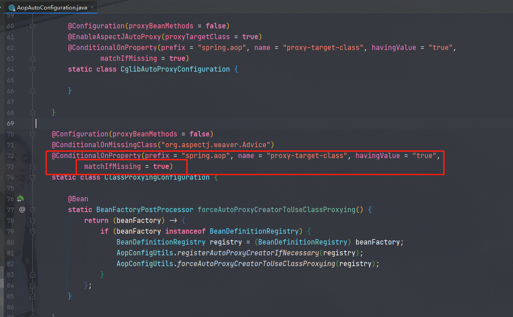

> 用来记录一些在工作中遇到的问题以及解决方案

## 一、@DateTimeFarmat和@JsonFormat

> @DataTimeFarmat 是 spring框架自带的注解，用来处理时间格式转换。

用来接收前端传递的`键值对形式`的日期字符串，并且需要按照DateTimeFarmat执行的pattern格式进行接收，然后将字符串按照pattern格式转换为Date类型。@DateTimeFormat(pattern="yyyy-MM-dd")作用相当于以下代码。(无法处理前端传递json字符串)

```java
//前端传递的字符串
String date="2018-12-30 13:20:20";
//注解指定的格式
String pattern="yyyy-MM-dd";
//将前端字符串按照pattern格式化
SimpleDateFormat format = new SimpleDateFormat(pattern);
//将字符传转换为Date类型
Date parse = format.parse(date);
System.out.println(parse);
//输出
Sun Dec 30 00:00:00 GMT+08:00 2018
```

> @JsonFormat 是 JackSon 的注解，用来处理json字符串与日期类型格式转换

用在@RequestBody接收，@ResponseBody返回参数的场景。

**@JsonFormat的用处**

1.将数据库的时间类型数据序列化为json字符串，返回`json`格式对象给前端。（出参）

2.将前端传递的json字符串按照pattern转换为Date类型，（与DateTimeFormat类似）(入参)

**注意**：使用JsonFormat需要指定时区Timezone="GMT+8"。因为默认的时区是GMT,与我们的时区CST相差8个小时。

## 二、Mysql函数

### 1. Date_Format()

用于将标准日期按照一定的模式格式化输出

语法

```mysql
date_format(date,format) //date为标准的日期，format是规定的日期/时间的格式
```

format对应表

| 格式 | 描述                                        |
| ---- | ------------------------------------------- |
| %a   | 缩写星期名                                  |
| %b   | 缩写月名                                    |
| %c   | 月，数值                                    |
| %D   | 带有英文前缀的月中的天                      |
| %d   | 月的天，数值（00-31）                       |
| %e   | 月的天，数值（0-31）                        |
| %f   | 微妙                                        |
| %H   | 小时（00-23）                               |
| %h   | 小时（01-12）                               |
| %I   | 小时（01-12）                               |
| %i   | 分钟，数值（00-59）                         |
| %j   | 年的天（001-336）                           |
| %k   | 小时（0-23）                                |
| %l   | 小时（1-12）                                |
| %M   | 月名                                        |
| %m   | 月，数值（00-12）                           |
| %p   | AM或PM                                      |
| %r   | 时间，12-小时（hh:mm:ss AM或PM）            |
| %S   | 秒（00-59）                                 |
| %s   | 秒（00-59）                                 |
| %T   | 时间，24-小时（hh:mm:ss）                   |
| %U   | 周（00-53）星期日是一周的第一天             |
| %u   | 周（00-53）星期一是一周的第一天             |
| %V   | 周（01-53）星期日是一周的第一天，与%X使用   |
| %v   | 周（01-53）星期一是一周的第一天，与%x使用   |
| %W   | 星期名                                      |
| %w   | 周的天（0=星期日，6=星期六）                |
| %X   | 年，其中的星期日是周的第一天，4位，与%V使用 |
| %x   | 年，其中的星期一是周的第一天，4位，与%v使用 |
| %Y   | 年，4位                                     |
| %y   | 年，2位                                     |

实例

```mysql
DATE_FORMAT(NOW(),'%b %d %Y %h:%i %p')   //Dec 29 2008 11:45 PM
DATE_FORMAT(NOW(),'%m-%d-%Y')			//12-29-2008
DATE_FORMAT(NOW(),'%d %b %y')			//29 Dec 08
DATE_FORMAT(NOW(),'%d %b %Y %T:%f')		//29 Dec 2008 16:25:46.635
```

### 2. Replace()

用法：replace( 'field', 'param1', 'param2')，将field字段中的param1替换为param2

踩坑：若 param2 为null，则函数返回值为null。

## 三、IDEA结构记录

.idea标识一个project   .iml标识一个module。 一个project可以是一个module

Empty project 只有一个 .idea文件夹。 

> .idea

一个java project目录

> .idea
>
> src
>
> moduleName.iml

## 四、mybatis

### 1. ResultMap

`<id>`与`<result>`标签的区别：在`使用association / collection 标签封装结果`时，在列结果数据相同的情况下，id标识一条记录，行记录不会合并，也就是后面的记录不会覆盖前面的记录。反之如果没有id标签标识，则记录会进行覆盖。

例如：

```tex
name | age
张三  | 18
张三  | 18
张三  | 18
张三  | 18
张三  | 18
```

有id的情况下，结果集如下：

```
name | age
张三 | 18
张三 | 18
张三 | 18
张三 | 18
张三 | 18
```

没有id的情况下，结果集如下：

```tex
name | age
张三 | 18
```

### 2. ResultSet

> 当查询结果是一个对象时，如果查询结果数为 0 ，则该对象为 null。
>
> 当查询结果是一个list，且查询到的结果数为 0 时，mybatis的处理机制

 

 

从测试结果可以看出，在mapper接口返回值是list时，如果mybatis查询总数为 0 ，返回值还是一个list集合，只不过这个集合是一个Empty，里边没有元素。

### 3. 批量update

> 场景：需要批量修改，dao的参数是一个`List<Object>`集合，需要修改的信息也在集合中。

```mysql
//使用case when then end 语法 
update table set column = case id when ? then ? when ? then ? end ，set column = '' where id in ( ? )
```

case 代表情况，when then 代表 当case后的列等于when的值时，修改 column为 then 值。这里的when后边的值，应该是与当前行的case列对应的值进行匹配，与where的条件列没有关系，where只是筛选修改的行。

> 总结：首先根据where条件找出需要修改的行记录，然后取得case列的值，比如case id when 1 then 0：先取得id的值，当id的值为1时，也就是匹配when的值时，才会修改为then的值。

**mybatis进行批量操作时，只能是一条sql。**：也就是说一条mysql的`<select>,<update>,<insert>,<delete>`脚本中，在参数拼接完后，只能是一条sql，否则会报错。

> 结合mybatis：

Mapper方法为

```java
/*
  批量修改学生
  假设 User：id，name，age，
  根据学生id，修改学生的name，和age
  返回值为成功修改的数量
*/
int update(@Param("users")List<User> users);
```

sql脚本为

```xml
<update id="update">
	update t_user
    <set>
    	name 
        <foreach collection="users" item="user" open="= case id" close="end ,">
            when #{user.id} then #{user.name}
        </foreach>
        age
        <foreach collection="users" item="user" open="= case id" close="end ,">
            when #{user.id} then #{user.age}
        </foreach>
    </set>
    where id in 
    <foreach collection="users" item="user" open="(" close=")",separator=",">
        #{id}
    </foreach>
</update>
```

### 4. PageHelper

#### 1.total

pageHelper获取的总条数, 是在sql执行前使用count函数统计此次结果的总数. 如果使用collection进行一对多进行映射会出现total与结果对不上的情况.

1.采用collection的嵌套子查询解决

2.使用group_concat函数进行重复行聚合

## 五、字符串相关

### 1. 中英文字符判断

一个中文字符占两个字节，一个英文占一个字节。

```java
public static boolean isEnglist(String str){
    byte[] bytes = str.getBytes();
    //字节的长度
    int byteLen = bytes.length;
    //字符的长度
    int len = str.length;
    return byteLen==len;
}
```

### 2. 特殊字符判断

使用正则表达式

```java
  //判断特殊字符
	Pattern p = Pattern.compile("[`~!@#$%^&*()+=|{}':;',\\[\\].<>/?~！@#￥%……&*（）——+|{}【】‘；：”“’。，、？_]");
	Matcher m = p.matcher(str);
	String dealedStr = m.replaceAll("").trim();
	if (!dealedStr.equals(str)){
        return false;
    }
```

### 3. 首字符是否为数字

使用正则表达式

```java
//判断是否为数字开头
Pattern pattern = Pattern.compile("[0-9]*");
Matcher matcher = pattern.matcher(str.charAt(0)+"");
if (matcher.matches()){
    return false;
}
```

### 4. isBlank与isEmpty

> isBlank ：string是否为空白，包括 "",null,"   ";
>
> isEmpty ：string是否为空，包括 "",null;

区别：如果字符串是空格的情况下，也就是没有实质内容，isBlank返回true，isEmpty返回false；

isNotBlank表示有实质内容，isNotEmpty表示不为空。

```java
// string str = "   ";
StringUtils.isBlank("   ");//true
StringUtils.isEmpty("   ");//false
StringUtils.isNotBlank("   ");//false
StringUtils.isNotEmpty("   ");//true

//string str = null;
StringUtils.isBlank(null);//true
StringUtils.isEmpty(null);//true
StringUtils.isNotBlank(null);//false
StringUtils.isNotEmpty(null);//false

//string str = "";
StringUtils.isBlank("");//true
StringUtils.isEmpty("");//true
StringUtils.isNotBlank("");//false
StringUtils.isNotEmpty("");//false

//string str = "abc";
StringUtils.isBlank("abc");//false
StringUtils.isEmpty("abc");//false
StringUtils.isNotBlank("abc");//true
StringUtils.isNotEmpty("abc");//true
```

## 六、Token

### 1. 实现原理

> 基于redis实现token

用户经过系统认证后，生成一个与用户绑定的uuid，然后以uuid为key，用户信息为value，过期时间为30分钟，存储到redis，然后再将uuid通过jwt进行加密，然后传递给前端，形成token。之后前端每次请求都需要在请求头中携带token，才能正常请求。

## 七、List.sublist()

### 1. list.subList(fromIndex,toIndex)

该方法是将一个集合根据下标进行截取，有两个参数，形成的子集合从fromIndex开始，到toIndex结束，子集合含头元素不含尾元素。

基于list的sublist实现数据内存分页

```java

```

## 八、MySQL判断数据是否重复

> 场景1：查询用户名不能重复

老方法：select count(*) from table where username = '1';

if（count > 0）return '重复' else '不重复'

劣势：这种查询在查询到已经有数据之后还会继续查询，如果数据量非常大的话，就非常浪费性能

解决办法：select primaryKey from table where username = '1' limit 1;

if（ '查询结果' ！= null ）return '重复' else '不重复', 查询主键是索引覆盖, 没有回表效率更高.

> 方法命名

selectUsernameIfRepeat：查询用户名是否重复。也可解释为，查询用户名如果重复，**重复的情况下，返回不为null**。 返回为null 则不重复，反之重复。

```java
    /**
     * 检查名称
     */
    private Boolean checkMachineUsername(String username, Long compId) {
        // 不为 '' 校验用户名
        if (StringUtils.isNotEmpty(username)) {
            return machineUserMapper.selectMachineUserIfRepeat(username, compId) == null;
        }
        return true;
    }
```


## 九、Spring事务

### 1. Aop

​	spring事务主要是通过aop的环绕通知置入事务，在目标方法执行前后织入事务实现。Aop是一种编程思想，主要应用的有springAOP和AspectJ。Aop的原理是动态代理，而动态代理又分为基于接口的JDK动态代理，以及cglib动态代理。所以Aop的本质还是动态代理。

### 2. Spring Boot默认的动态代理

首先，动态代理的默认实现方式如下

- 如果目标类实现了接口，采用JDK动态代理。     ` 代理类是目标类实现接口的一个实现类`
- 如果目标类没有实现接口，会采用cglib动态代理。`代理类是目标类的一个子类`
- 如果要求采用cglib进行动态代理，可以配置 proxy-target-class = true。（默认为false表示采用默认实现方式）

然而，在springboot2.x版本后，通过aopAutoConfiguration的默认配置得知，springboot将proxy-target-class这一属性默认改为true，也就是说，如果不配置该属性，那么springboot默认通过cglib进行动态代理，无论目标类是否实现接口。



如果想使用默认的动态代理的实现方式，将该属性配置为 false 即可。

还有一点，如果是JDK动态代理的话，@Autowired实现类对象是会启动报错的，还是与代理类有关。JDK的代理对象是与接口实现类平级的，只有接口类型的才能注入。而Cglib就没有这个限制，因为代理类是子类，子类注入父类没有一点毛病。

------

### 3. Spring事务失效场景

通过不同的动态代理方式划分为 **JDK动态代理失效的场景**，**Cglib动态代理事务失效场景**。

> JDK动态代理事务要求，事务方法为接口实现的方法; Cglib动态代理事务要求，事务方法为可继承的。这与代理对象是通过何种方式产生的有关。

- 一个非事务方法内部`this`调用 B方法，无论 B方法有无事务，是否为接口覆盖的方法，事务都是失效。

​	因为事务生效在于目标方法调用的那一刻，只有代理对象执行的方法才能让有事务的方法生效，而`this`指向的始终不是代理对象。

- 一个非事务方法调用事务方法，调用方触发异常，被调用方正常执行，事务失效

​	因为调用方的异常与被调用方无关。

> 一个有事务的方法，无论如何调用其他方法，其他方法也是有事务的。

------

## 十、Aspect

### 1.执行顺序

> 正常执行顺序

Around1 -> Before -> Method -> Around2 -> After -> AfterReturning

> 异常执行顺序

Around1 -> Before -> Method -> Around2 -> After -> AfterThrowing

> 总结

Around 是入口，除了Around, 其他advice都依赖于method的执行，如果method没有执行的话，那么before，after等等都不会执行，但是Around会执行。

Around 是依赖于切入点的；Before和其他advice是依赖于Service，Method的执行的。

